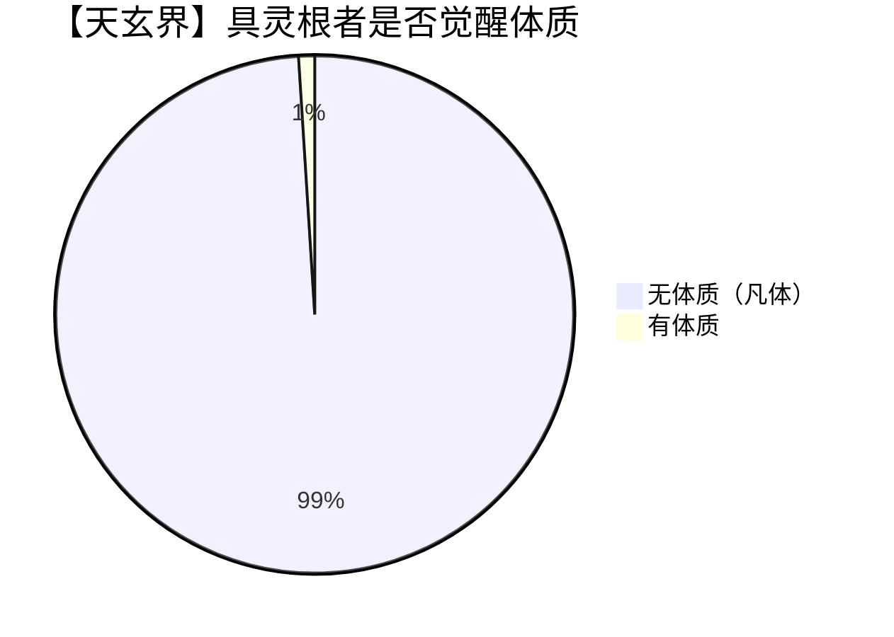
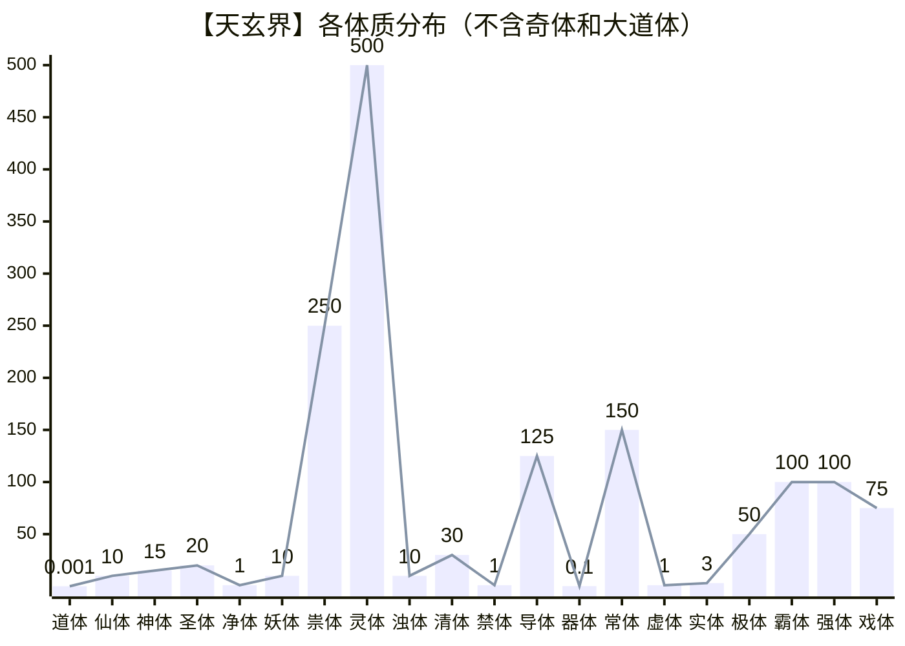

<audio src="https://life.115.com/imgload?h=fhnimg_6aa8d2de4faa81d43eb7a825d560ce3a83461691_0_0&i=1&t=0&ss=d4be46cee9ea7032fc36d1d4923471d21044a37a&tt=1789448927" controls loop>Gentleman - 戴爱玲_刘伟德.mp3</audio>

## 叶不凡觉醒体质

米珍珠双臂一抱，一股子‘资深修仙者’的优越感重新上脸，斜着眼打量起叶不凡，言语间满是一种‘过来人’对‘迟到生’的轻蔑：“叶不凡，不是我说你，你这‘发育’节奏是不是卡死在娘胎里了？引气入体这种事，抢的就是个‘先发优势’，不是越早越好、越快越好吗？老娘当年十岁就做到了，全程只花了半天！搁我们那儿，这叫天选之子，是万中无一的天才！你这胡子都快扎手了，还在这儿磨磨唧唧装游戏，是存心想在新手村当一辈子 NPC，还是指望靠岁数熬死对手？”  
“煞笔，不解释！”叶不凡听完，嘴角牵起一抹极度鄙夷的嗤笑，那眼神就像在看一个为了省两个流量钱而把蓝光画质硬生生调成马赛克的土鳖：“引气并不是越早越好、越快越好，而是有潜力可挖的，你这明显就没怎么挖。你也完全算不得天才，只能算‘低价抛售潜力资产’的傻瓜。听好了，修仙从来不是一场争分夺秒的短跑，引气也不是一件只争朝夕的急务。你这就像没做起主营业务就急着挂牌上市的皮包公司，除了能圈点底层的碎灵石，上限早就锁死了。这就叫‘拔苗助长’，懂吗？就像拉伸韧带，你得每天抻一抻，配合顶级的营养输入，把这副肉身的‘弹性系数’提到物理极限，然后再引气。那样以后的修炼效率才是真正的几何级增长，这就叫‘磨刀不误砍柴工’，懂了吗，文盲？”  
米珍珠被这一连串的‘黑话’砸得有点懵，原本傲然的脊梁骨塌了几分，变得有些局促不安：“啊？还有这么多门道？我都不知道欠多少技术债……那你抻到头了吗？我这种已经定型的‘老旧设备’，还有希望挽救的‘改造方案’吗？”  
叶不凡傲然挺胸，左手插兜，右手激扬，语气里满是那种掌控全局的霸气：“哥早就抻到底了，现在的身体韧性绝对属于‘满格配置’，随时可以接入全频段灵力网络。至于你这种已经定型的，想挽救？那可能得拿老命去填，而且缺乏可塑性，改造的边际收益低得连狗看了都摇头。你就老老实实当你的二级市场垃圾股吧，别瞎折腾了。”  
“我不管，我不管，你这么厉害，一定有办法！”米珍珠摇着叶不凡的手臂娇嗔道。  
“办法也不是没有，得看你表现了！”叶不凡看着米珍珠毫无曲线的身材顿时有些索然无味了，轻轻抽出手臂，“你非要的话我难道还能拦你？我主要怕你费了很大劲，最后还是发现与我仍是天壤之别，导致道心破碎、心态失衡，在我面前就没有几个能保持自我的！”  
米珍珠的八卦之魂瞬间被点燃，也顾不得心疼自己缩水的潜力，凑过来一脸兴奋地催促：“行啊，既然你都就绪了，那还等什么？赶紧当场‘走一个’！让老娘也见识见识，你这号称‘极限拉伸’的种子选手入场，到底是能蹦出金龙，还是放个哑炮。别是光说不练的‘PPT修仙’吧？”  
叶不凡面上波澜不惊，心中却在快速复盘：“时机确实成熟了，现在的身体强度的确已经到了理论巅峰，之所以不引气入体只是惯性使然，不愿走出舒适区。我这种单靠顶级食补、不做健身运动的慢活逻辑，确实效率低了点，但胜在根基稳如泰山。像我家老大叶不平，他就喜欢健身，保养进度就比我快多了，五岁时就已冲关引气，那时我只懂吃奶，但他又缺乏全局架构，以后填技术债都够忙死他。只有我这种细水长流的，才有足够时间发现问题、解决问题，只要以后守住底线——在身体彻底‘成年’之前确保固守元阳，未来的上限就不可估量。”  
“能吗，珠珠？行吧，既然你这么想看，那就让你见识见识什么叫‘高净值玩家’的进场仪式。”他冷哼一声，手在脖子上那把沉甸甸的金锁上一抹，一款精致到令人发指的小盒子凭空浮现。盒盖弹开，里面静静躺着一颗流光溢彩、仿佛在呼吸的丹药。  
他两根手指夹起丹药，像吃高端坚果一样扔进嘴里，甚至还带感地嚼了两下，发出令人嘴馋的‘嘎嘣’脆响，一股浓郁的药香瞬间炸开。  
丹药入腹的一瞬间，原本看起来平平无奇的叶不凡，整个人突然爆发出一股近乎‘视觉恐怖主义’的强光！那光芒不是柔和的仙气，而是像数万盏大功率探照灯在狭窄空间内同时点亮，带着某种摧枯拉朽的穿透力。  
“Oh, my eye, my eye!”米珍珠惨叫一声，双手死死捂住眼睛，感觉自己的视网膜在这一刻被这股耀目辉煌直接刷成了白屏。  
光芒刚一退潮，叶不凡就抄起那块玉盘对着自己就是一记猛扫，瞬间就看到一张金光闪闪的表格：

| 项目 | 数据 |
| --- | --- |
| 姓名 | 沐不凡 |
| 身体年龄 | 9 |
| 发育程度 | 幼体 |
| 修为等级 | 炼气 1 层(lv.1.1) |
| 灵根(品级) | 金灵根☢️(完美・绝品) 木灵根🔗(完美・绝品) 水灵根🧊(完美・绝品) 火灵根💥(完美・绝品) 土灵根♻️(完美・绝品) |
| 体质(概率) | <kbd>太〇道体</kbd>2(0.60) <kbd>太乙道体</kbd>3(0.83) <kbd>太一道体</kbd>4(0.61) <kbd>太巧器体</kbd>1(0.79) <kbd>奇体</kbd>(1.00) |
| 基因数量 | 0 |

这块测试玉盘名叫天赋玉盘，叶不凡手里的这款是从望月派借来的、宗门里档次最高的那种，扬言能测出所有体质。  
其实体质分布就跟元素周期表一个道理，只要掌握了底层逻辑，完全可以被穷举。即使某种体质从未在这个世界露过脸，只要特征对得上，玉盘就能瞬间完成识别和查询。  

> [!TIP]  
> 叶不凡虽然从出生日期开始算起，刚过 16 岁，但他经常会用化身外出，这时候他会把原身安置在法阵内。法阵会降低他的身体代谢，即便外出百年，身体也只老不到一天。  
> 对于原身来讲，就像是在生存舱中遥控傀儡在现实中行动，而化身则会将感觉实时传回。化身不能修炼，但可以改造升级，而且还有自动模式，不必实时操控，但智力会大幅降低。  
> 他有三个化身，可以同时出动，一个炼气巅峰，一个筑基巅峰，一个结丹巅峰。不过这一次到常山宗的，却是原身，而三个化身正在不同地方出差。  
> 简单理解，他的身体虽然只生长了 9 年，但他的生活经历足足有这一世的 16 年外加前世的 989 年。说难听点，他也是个千年老妖怪了，见多了各种聊斋，这个世界的人情世故简直是幼儿园！  

## 米珍珠的羡慕嫉妒恨

米珍珠使劲揉了揉眼睛，等视线里那些乱蹦的金星终于消停了，才看清叶不凡的脸色扭曲变换，一会儿笑得像个一百斤的孩子，一会儿皱得像刚吞了一百只苍蝇，总之看不懂是开心还是不开心，那就当他是不开心吧。  
“哎哟，我说叶大少爷，你这表情是几个意思？”米珍珠嘿嘿一笑，故意往他跟前凑了凑，语气里全是那种藏不住的幸灾乐祸，“难不成放完了烟花秀，最后憋出来个‘绝脉废体’？没事，说出来让姐们儿乐呵乐呵，姐这人最见不得朋友受苦，除非憋不住想笑。”  
她又大气地拍了拍叶不凡的肩膀，甚至忍不住‘噗嗤’一声：“别灰心嘛，你要是真修不了仙，等姐们儿以后发达了，准保在宗门后山给你留个扫地的坑位，必定少不了你一口剩饭吃。”  
叶不凡没好气地瞪了她一眼，懒得跟她打嘴仗。他心累地叹了口气，指尖在天赋玉盘上随手一勾，一道半透明的全息图景就像摊开的画卷一样在两人面前拉开。  
米珍珠嘴角的笑意还没来得及扩大，就被全息图景正中央五条粗壮得像房梁柱子一样的灵根光影给镇住了。那光芒不仅颜色纯正，甚至还带着某种让人眼晕的厚重感。她的视线快速扫描了一下表格，视线鬼使神差地定在了灵根品级上。  
“哎呦我的天哪……”米珍珠惊叫一声，眼睛亮得像刚充了电。看到‘完美・绝品’的字眼，她的眼珠子骨碌碌乱转，一会儿看看灵根，一会儿偷瞄叶不凡，那眼神里透着股子‘捡到宝了’的贼光。她心里的小算盘打得‘啪嗒’响，甚至开始琢磨这根‘完美大腿’该怎么抱才最稳当。  
“那你黑着个脸干什么，难不成这体质太超前，怕被人抓去切片研究啊？唉，不是，这不对劲啊！”米珍珠吐槽一句，可随即心情变得酸溜溜的，忍不住伸手去戳屏幕，心态失衡地嘟囔道，“凭什么呀？老娘当年也是全村的希望，引气之后磨合了这么多年，到现在进度条还卡在‘引气入体’这儿跟死机了似的。你这才刚嚼完药，连个嗝都没打呢，怎么就直接变成‘炼气一层’了？你这起跑线是不是直接划到终点线去了？你是不是给它塞钱了？”  
叶不凡斜睨着她，从鼻子里哼出一声带着技术压制的冷笑：“少在那儿羡慕嫉妒恨，也不要再拿你的‘豆腐渣工程’丢人现眼！早就跟你说了，修行这事儿根基最重要，万丈高楼平地起。你属于是灵根发育不良，虽然勉强开了机，但因为硬件缺损严重，跑个系统都费劲，所以你才觉得寸步难行。我这是把地基打得比城墙还厚，接入灵气自然水到渠成。这叫前期投入决定后期产出，难不成我还不如你一个土鳖懂？”  
米珍珠撇了撇嘴，心里虽然被打击得够呛，但还是忍不住继续往下划拉。当她的目光落在体质那一栏时，原本准备好的那点酸词儿直接卡在了嗓子眼里。  
她整个人像是被施了定身法，嘴巴慢慢张大，半晌才指着屏幕，结结巴巴地喊了出来，声音都变了调：“叶……叶不凡，你这玉盘是不是上当受骗买的西贝货？怎么可能……你怎么可能有五个体质？！你是打算在自己身上开个体质博物馆吗？还是你家祖上是专门搞体质缝合的？”  
全息屏上，五个名字排列得整整齐齐，透着一股子不讲道理的压迫感。  
作为刚觉醒‘素芷妖体’的人，米珍珠才刚亲身体验了一把体质的恐怖现实效果。一个体质就能让一个凡人脱胎换骨，像这种五个体质同时挤在一个身体里的情况，已经不是‘天才’两个字能解释的了，这简直就是个行走的‘妖孽’。  
她下意识地往后缩了缩，又忍不住好奇心，伸出手指想去戳戳叶不凡的胳膊，嘴里还小声嘀咕着：“老实交代，你到底是哪路神仙投错胎了？这以后要是打起架来，你是不是还得在脑子里先开个会，决定让哪个体质出来干活？叶不凡，你是不是最多能变五次身？”  
叶不凡看着米珍珠那副眼珠弹飞、下巴脱卸的呆样，心里憋了半天的闷气总算泄了出来。他故意捞起那条沉甸甸的大金链子在手里甩了甩，发出一阵叮当乱响，笑得那叫一个志得意满：“哈哈，傻眼了吧？刚才谁在那儿跟我显摆‘半天引气’的天才履历呢？看你以后还敢不敢在哥面前装逼！米小可爱，这一手就叫深藏不露，多跟哥学着点，不然以后即使勉强挤进了上流社会也融入不了！”  
米珍珠愣了三秒，原本震惊的表情迅速一收，眼睛微微眯起，眼神里透出一抹小狐狸般的狡黠。她身体往前凑了凑，微微压低声音，语气里带上了几分抓人小辫子的威胁：“叶不凡，你少在这儿跟我演‘翻身农奴把歌唱’。你这么贼精的人，肯定明白‘怀璧其罪’四个字怎么写吧？你这‘五核驱动’的消息要是捅出去，明天你就得被那些想长生想疯了的老怪物抓去切片熬药，连骨头渣子都得被拿去泡酒。你……也不想让你的这些秘密被外人知道吧？”  
叶不凡听完非但没慌，反而一脸看傻子的表情：“呵呵，欢迎帮我打广告，最好去满大街贴大字报！你是不是以为这世上的人都跟你一样，看个数据就吓得要报警？你真以为我是怕被人围观才藏着掖着的？我是嫌解释起来太费劲，怕那帮蠢货听不懂。再说，你以为这体质是路边的野菜，谁想挖就能挖走的？灵根是长在魂灵上的，不是长在肉里的，目前还没有技术可以剥离灵根。”  
他伸手指着那五条粗壮的灵根，开始科普起来：“看你这副没见过世面的样子，估计还不知道体质的具体分类吧？首先，你别把这玩意儿想得跟神迹似的，说白了，体质是灵根的一种进化，一条灵根就能激活一项体质。只要是在身体成年之前，所有灵根就有一次觉醒体质的机会，但必须所有灵根一起觉醒。一条灵根越接近完美，它觉醒体质的概率就越大，一个人灵根越多，他能激活的体质数也一样多。但多条灵根一起觉醒的概率，是每条灵根觉醒概率的乘积，所以灵根越少觉醒概率越大，但灵根越多体质也越多。体质往往在一个人突破炼气一层时激活，境界越高激活概率越低，这就是为什么我一直压着不突破的原因，我在等自己的灵根足够完美，然后吃药一举突破炼气一层，靠这样觉醒的体质才牛逼。”  

## 灵根的分类

叶不凡清了清嗓子，开启了教学模式，如数家珍地给她报起了‘菜名’：“听好了，别以后出去丢我的人。虽然这个宇宙中的体质多到天文计数，但笼统分起来有 23 个一级大类：<kbd>道体</kbd>、<kbd>仙体</kbd>、<kbd>神体</kbd>、<kbd>圣体</kbd>、<kbd>净体</kbd>、<kbd>妖体</kbd>、<kbd>祟体</kbd>、<kbd>灵体</kbd>、<kbd>浊体</kbd>、<kbd>清体</kbd>、<kbd>禁体</kbd>、<kbd>导体</kbd>、<kbd>器体</kbd>、<kbd>常体</kbd>、<kbd>虚体</kbd>、<kbd>实体</kbd>、<kbd>极体</kbd>、<kbd>霸体</kbd>、<kbd>强体</kbd>、<kbd>戏体</kbd>、<kbd>奇体</kbd>、<kbd>凡体</kbd>、<kbd>绝体</kbd>。”  
叶不凡看着米珍珠那副被知识盲区撞得眼冒金星的傻样，索性摆出一副资深老教授的派头，对着全息屏幕指点江山：“行了，收起你那副没见过世面的表情，哥今天心情好，免费给你扒一扒这修仙界的‘鄙视链’。在这 23 类里，有 2 个是纯属凑数的。”  

叶不凡伸出两根手指，在米珍珠面前中晃了晃：“一个是‘绝体’，令人绝望的体质，也可以说是一种病症――穷病！他们没有灵根――其实是枯萎了，修仙这行的大门连条缝儿都没给他们留；另一个是‘凡体’，稍微强点儿，带灵根能开机，但没带任何增益补丁，也就是所谓的‘白板裸配’。”  
说到这儿，叶不凡压低声音，神神秘秘地凑到米珍珠耳边：“最让人扎心的是，其实大部分绝体和凡体都是后天的，老天爷在创造万灵的时候都会赋以灵根和体质，可是如果在体质觉醒之前的发育阶段‘营养不良’，那身体就会短视，只顾眼前的死活，强行从灵根中榨取生机。说白了，就是活不下去了，没有别的招可使了，身体索性向灵根提前预支。凡体还能给自己留个种，咬牙凑出一份待机功耗，绝体是直接把事情做绝了，既然留着灵根也是吃白饭，那就干脆直接拆了，还能在解体时拿到一份补偿，因灵根种子的自爆，释放一波微弱的灵能，让身体素质得到极大的增强。不过路也走窄了，以后只能当个贴地武夫，可穷文富武……”  
米珍珠下意识地摸了摸自己平坦的小肚子，嘀咕道：“合着我修为不得存进，是因为小时候身体饿坏了？”  
“不然你以为呢？当初你还在你妈肚子里的时候，你妈估计就没吃上啥好东西！修仙也是讲究原始积累的，要不然怎么说‘财侣法地’，首先是‘财’？”叶不凡嗤笑一声，指尖点向屏幕上最耀眼的几个词，“咱们再聊聊这圈子里的‘头等舱’。这 23 类里，公认的顶级配置只有 2 种。排第一的是道体，这玩意儿最不讲道理，出场自带‘道体韵场’，往哪儿一站都能跟天地灵气共振。排第二的是仙体，虽然出场没自带光环，但底子干净，后天努努力也能修出个‘仙体韵场’，自带绚丽灯光秀。这两位是无可争议的‘蓝筹股’，至于剩下的，这辈子基本跟‘韵场’这词儿绝缘了。”  
他看着米珍珠那张逐渐垮下去的小脸，嘿嘿一笑：“剩下的 19 种体质，包括你的素芷妖体，还有我的太巧器体，其实没有绝对的高下之分。这就像工具箱里的扳手和锤子，得看具体的‘应用场景’。妖体迷人心智，器体心灵手巧。但根据理论测算、历史表现和市场需求，还是有价值排名的，而且只要你能为所持有的体质争光，排名也是可以往上挪的。”  
“因为所有体质的总数是一个天文数字，哪怕给这个星球上所有的沙子每粒分一个，也还会剩下很多，这么多肯定不会都有个性的名字，绝大部分只有一个编号。目前所有实际出现过且被记录在案的体质都被取了名字，所有道体和仙体由于数量‘稀少’且价值极大也都被取了名字，某些虽然没出现过但理论价值极高的体质也有名字，其他未命名的体质只有当真正在这个世界上出现了才会有一堆老学究坐在一起开会拟名字。还因为目前理论的不完善，总有些特征没有被录入数据库，一旦测到不能识别的特征而无法归类时，暂且统一归入奇体。总而言之，凡体、绝体和奇体没有细分，其它分类的体质，只有实际出现过或者培养价值高时才会有名字，剩余的就只有一个编号。体质的排位由历史数据决定，如果你能开发出某个体质的‘正确’玩法，在修仙界名声大噪，那么这种体质相应的价值排名便能显著提高，而你也能在历史书上记一笔。  
他像是突然想起了什么技术盲点，一拍大腿：“我再给你补充一个知识点。其实那种因为营养不良造成的灵根亏损，也分 2 种情况：一种叫‘绝体’，一种叫‘亏欠’。”  
他嘴角一勾，神神叨叨地比划着：“当年你在你妈妈肚子里的时候，要是匮乏到了极点，胚胎为了自保，直接把灵根消化掉了，那么生出来就是‘绝体’，那是彻底没救了。如果灵根被身体剥夺，但最后还是留了点生机，没有完全竭泽而渔，或者灵根种子压根就没发芽所以未能被掠夺生机，只要后面能够好好养回来，一般还是能保有个‘凡体’的。但还有一种情况，灵根虽然冒了个芽，但因为没‘奶水’供着，半死不活地吊在那儿，这种状态叫‘亏欠’或‘欠体’，比凡体稍微强一点儿，至少有恢复的希望。”  
叶不凡斜眼瞅了瞅脸色发青的米珍珠，语气凉飕飕的：“‘欠体’这玩意儿可不在常规体质列表里，它就像是旱地里的秧苗，随时会枯死。大部分的欠体最终都会演变成凡体甚至绝体，但该过程伴随灵根数量的增加而风险递增，其中任何一条灵根枯了，就会一起连坐报销，直接报废成‘绝体’，没有牺牲小我的可能。你这种就是典型的‘五灵根四亏一欠’，属于随时欠费停机。按常理来说，你这种资质不管它，只要你开启真正的修炼，灵气可能一下子就会把那条‘欠’态火灵根崩断。单纯的亏是不要紧的，大不了就是后天再慢慢养，但如果是欠，那就刻不容缓了。而且把‘欠’养成‘亏’的代价，绝对是一般人不可能承受得起的，反而是那‘亏’补成‘完美’代价要小得多。没有引气入体的时候是最容易补的，随着修为的提高越来越难补，成本是指数级上升的。绝大部分人补养‘欠体’，也不是希望养肥，因为拼尽全力养出来的多半也是歪瓜裂枣，单纯是为了维持一个白板凡体，不要枯萎成绝体而断绝仙路。”  
说到这儿，他漫不经心地摆摆手，那语气就像随手扔了个烟屁股：“你这回可真算是撞了大运！吃了哥那么多巧心，洗了髓，成功保住了火灵根，还顺带激活了体质。我给你的是最高档次的货，一粒能抵三颗六阶驻颜丹，不过在哥眼里顶多算是个高档零食。也就这种最温和的食品级六阶丹药的能量，才能强行挽救你那快枯死的火灵根。这种‘欠费重启’还能顺便升个舱的情况，可能你这辈子也就这一次机会，还不赶紧拜下谢恩？”  
米珍珠听得心惊肉跳，下意识地缩了缩脖子，随后又撇撇嘴，好奇地问道：“行行行，知道你大方，行了哇。那你呢？你说道体最好，你这一下占了三个坑位，得了这么大的便宜你还又笑又哭的，还不够好是因为没有给你刷足五个吗？”  

## 道体的故事

叶不凡闻言，反而收敛起笑意，不屑地冷哼一声，但诚实的身体却激动得有些禁不住微微颤抖：“什么道体？那可是大道体！岂止 3 个，我看那奇体分明就是没测出来的<kbd>太上道体</kbd>1才对！呵呵，哥们儿这条件，还需要那玩意儿装门面吗？对我这种干实事的人来说，大道体纯粹是占着茅坑。要是能腾出来，直接给我刷五个‘器体’该有多好，哥哥我分分钟给你手搓出一座军火库来。”  
虽然说得很嫌弃，但他的嘴还在继续科普，甚至有些啰嗦：“道体可细分为‘道体’和‘大道体’。这两者完全是天壤之别，在我前世，大道体是单独分类的，你可注意千万别搞错了哦，不然就要闹大笑话了。唉，我提醒你这么多干什么，你又吃不着，这不是给你找酸嘛。‘大道体’一共有 25 种，出场自带‘道晕’，记好了，祂们分别是：<kbd>太上</kbd>1、<kbd>太〇</kbd>2、<kbd>太乙</kbd>3、<kbd>太一</kbd>4、<kbd>太易</kbd>5、<kbd>太虚</kbd>6、<kbd>太谷</kbd>7、<kbd>太元</kbd>8、<kbd>太本</kbd>9、<kbd>太宗</kbd>10、<kbd>太忘</kbd>11 、<kbd>太玄</kbd>12、<kbd>太真</kbd>13、<kbd>太数</kbd>14、<kbd>太衍</kbd>15、<kbd>太归</kbd>16、<kbd>太初</kbd>17、<kbd>太始</kbd>18、<kbd>太素</kbd>19、<kbd>太极</kbd>20、<kbd>太和</kbd>21、<kbd>太浑</kbd>22、<kbd>太启</kbd>23、<kbd>太罗</kbd>24、<kbd>太清</kbd>25。”  
他从全息屏幕中调出所有道体的列表，随手划拉着窗口的混动条：“‘道体’多达 9999 种，出场不带‘道晕’，但能靠后天修炼。”  
米珍珠那双卡姿兰大眼睛里透着股子清澈的迷茫：“等等，叶不凡，怎么没有魔体和佛体？你这榜单全不全啊？”  
叶不凡斜睨了她一眼，脸上尽是被打断的不满：“阿珠啊，你这么懂，要不你来讲？魔体和佛体当然有，它们都是仙体的二级分类，就比如暴乱魔体和偈言佛体，像灵体分得就更细了。你的眼界还是窄了，局限在这颗尘埃般的小星球上，窄得只能看见这盆地里的仨瓜俩枣。我告诉你，和真正的‘科学’相比，现在咱们这种靠体质修仙的行为，在本质上跟街头耍杂技的义和团没什么区别。你以为你修为高了就能横着走？就算是修成了渡劫圆满的顶阶大能，绝大多数也拍不碎脚底下这颗星球，飞进黑洞里面绝大多数就再也出不来了，修仙这条路的上限还是太低了。但在强动能武器面前，哪怕是恒星系，也不过就是一炮的事儿，在张力场中，哪怕是黑洞也不过是可随意进出的游乐场。而在所有体质里，唯有心灵手巧的‘器体’，才是科研界的刚需！在允许假借外物的游戏规则下，几万个同级别的道体绑一块儿，都不够一个手搓歼星炮的器体塞牙缝的。”  
叶不凡说到这儿，脑海里不由自主地浮现出前世的种种景象。在他眼里，道体这玩意儿要是搁在法治社会，不允许随便杀人放火、打家劫舍，那就是个中看不中用的精美花瓶。  

---  

《异世界的道体困境》
  

在叶不凡沉静的识海深处，那幅关于前世文明的宏大巨幕再度徐徐拉开。  
在那个巅峰四级文明的尺度下，宇宙不再是充满奇遇的江湖，而是一张被概率论和热力学定律彻底接管的财务报表。  

1. 众神坠落凡尘：当‘道体’变成‘弃体’  
> 在那个时代，义务教育就像超级恒星的光芒般铺满每一颗行政星球，生活物资的极大丰富让‘匮乏’成了一个只存在于历史课本上的古老词汇。  
在那样的社会背景下，修行的神圣感早已被流水线化的教育普及剥落殆尽，引气入体不过是公民大学毕业前应该完成的生理目标，就像性成熟一样理所当然。  
在全宇宙庞大到令人绝望的人口基数下，概率学的冷酷规律主宰了一切，任何一种体质的存在性都成为统计学上的必然。即便是曾经在古老传说中足以毁天灭地的‘大道体’，依然能在这台巨型社会机器中拎出几亿个同类，虽然在人群中的占比属于是可以忽略不计的程度。  
这些曾经在原始神话中被尊为‘天选之子’的存在，此时唯一的社会优待，便是在挂靠某家冷冰冰的科研所后，领取一份‘联邦超级人才补贴’并免征‘灵能熵增税’。（**特别说明**：大道体过得并不难，因为有福利包，也不会被征税，社会只要求他们别惹麻烦，最好能参与科学研究）  
这种体质在社会分工中被降维打击：他们不再是高高在上的神圣，而仅仅是科研所里最灵敏的‘生物传感器’。这种从‘神性’到‘耗材’的价值跌落，是技术理性对个体英雄主义最彻底的嘲弄。  
至于那些次一等的普通道体，甚至连作为科研耗材的资格都没有，在繁杂的星际公民档案中，他们苍白得像一张废纸。  

2. 道体穷忙陷阱：被诅咒的自动挡  
> 最让叶不凡感到荒诞的，是关于‘道体’的阶级崩塌。在原始文明眼中，修为的提升是上天的恩赐；但在现代文明治下，这竟成了最沉重的负担。  
因为那是一个被‘灵能熵增税’统治的冰冷世界。  
道体就像一台无法熄火、无法手动挂挡的引擎，它强制宿主在进化的道路上狂奔。而联邦税务局那冷冰冰的‘灵能熵增税’，就像一把悬在头顶的铡刀——你升级越快，对宇宙底层秩序的扰动就越大，所需缴纳的税额就越呈几何倍数增长。道体，这种曾经人人梦寐以求的顶级天赋，竟沦为了臭名昭著的‘穷忙陷阱’。  
这种体质对灵气的吞噬近乎本能，修为的每一次自动跃迁，都意味着个人账户将被联邦税务局以更惊人的速率抽干。无数被讽以‘天才’之名的道体拥有者，在灵压仪的红光闪烁中迎来破产。他们缩在暗无天日的廉租房里，靠着低保维持着那种毫无波澜的低欲望人生，空有一身排山倒海的修为，却在现实的购买力面前卑微如尘。  

3. 器体垂帘统治：AI外壳下的精英独裁  
> 而在权力的幽暗背面，是名为‘器体科学家’的阶层在俯瞰宇宙。权力的巅峰，永远掌握在那几个首席科学家手中。普通人表面上被人工智能统治，背后其实是被器体科学家所统治。  
器体拥有者并不稀缺，他们在觉醒人群中占比高达千分之一，这是经过几百万年的社会定向筛选后的演化结果，比例仍在逐年微幅提高。  
体质其实有微弱的遗传性，由于99%的科学家皆为器体，而身为科学家更易于获得奖励，使得器体在基因遗传竞争中更具优势，反复触发正向反馈。但这种遗传性远不是必然，叶不凡曾不止一次感叹命运的诡谲——他的父母都是‘器体’和‘道体’，可作为他们的独苗，竟在那充满营养物质的育儿仓里，啥也没觉醒，只有最基础的三灵根。  
在那样的时代，民主只是包裹在巨型人工智能外壳下的礼品纸。整个联邦政府的底层逻辑，不过是由器体科学家们亲手敲下的复杂代码。他们构建了这个笼罩了全宇宙的巨型人工智能，对外宣称这是绝对公平的母体，各项公共决策总是取决于投票结果。公共决策的投票看似公平，但首席科学家们在专家意见栏里注入的权重，以及在算法中埋下的无数‘私活’，才是决定宇宙命运的真理。类似叶不凡这样的普通公民，总是会在投票前咨询AI专家的意见，而作为AI开发者的科学家们就可以从中提取话语权，左右人群判断。  
在那难以计数的代码黑箱中，只有器体科学家们知道如何利用‘专家权重’和‘算法私活’来操控资源的流向。普通公民在人工智能的呵护下以为自己掌握了自由，实则所有人的生老病死，都运行在器体贵族们搭建的虚拟迷宫里。  
这是一种极度深邃的政治幻术：普通公民以为自己被客观的算法统治，实际上，他们被一群掌握着‘世界说明书’的器体专家所圈养。  

4. 娱乐至死年代：戏子与替身的讽刺  
> 社会生活的侧面则更加辛辣。在资本与流量的星海中，‘道体’的实用价值被彻底娱乐化。  
在世俗的眼光中，道体的尊严甚至远不如那些被唾弃为‘戏子’的‘妖体’和‘净体’。  
一个‘妖体’或‘净体’，随便扭动两下就能吸睛无数，稍微包装一下就能风靡星系。当她在全星系直播的虚拟舞台上随性舞动时，粉丝们刷的礼物就足以砸下一整片星域的采矿权。  
而一个道体，除了在古装剧组里充当那不需要后期的武打替身，用血肉之躯去撞击合金板来换取微薄的薪水，几乎找不到任何商业变现的路径。曾经的毁灭力量，在和平年代只能沦为一种廉价的表演素材。  

5. 修仙长生悖论：倒挂的修行代价  
> 而最致命的思辨在于对‘修仙觅长生’观念的解构。修行，这一古老的长生路径，在生物技术面前显得愚蠢而笨拙。  
一位满级的渡劫期大佬，在经历了无数次雷劫与苦修后，或许能活过上亿年的长生时光。但在巅峰实验室里，一个毫无修为的平民，只需要定期支付一笔廉价的端粒修复费，便能轻松跨越数亿年的岁月，且无需承担任何功法反噬的风险。  
修士们如果想要借助科学手段延寿，修为越低，价格越低，这就造成了一种严重的‘倒挂’现象。就一位渡劫期的大佬而言，他既要面对天文数字的熵增税，又要为了那点可怜的寿元增长支付比凡人高出亿万倍的代价。最令他绝望的是，即便付出如此巨大的代价，往往还活不过一个毫无修为的凡人，生活的滋润程度更是远远不及。  
这种‘修行性价比’的崩塌，更让道体成为了名副其实的灾难。其他体质还能自己压制修为，道体是压不了的，它像一列失控的火车，在诅咒般的升级路上一路狂奔，直到将宿主榨干为止。  

在那段记忆的尽头，叶不凡看到的不是白日飞升的壮丽，而是无数道体天才在手术台前排队，冰冷地请求医生用灵光束废掉自己的灵根，就像切除一颗恶性肿瘤。他们宁愿放弃那种让原始人跪拜的力量，只为换取一个作为凡人、在这逻辑自洽的文明中卑微却安稳活下去的机会。  
他们竟宁愿做一个没有天赋的平民，在科学的庇护下安稳地活上几亿年，也不愿背负那‘顶级体质’的名号，在无尽的税收与贫穷中枯萎。  

---  

叶不凡很快就收回了穿越时空的思绪，语气平淡道：“阿珠，哪怕现在老天爷把这身顶级配置全收回去，再塞回一个白板的凡体，哥也照样玩得转。无非是进度条跑得慢点，甚至对我而言，这些体质更像是某种干扰信号。我现在身上最宝贵的，不是这几款闪闪发光的补丁，而是我脑子里那套完整的科学思维，这才是真正的外挂。”  
米珍珠盯着他看了半晌，原本那股子插科打诨的媚劲儿全散了，取而代之的是一种深深的荒诞感。  
“叶不凡，你真的给了我一种资产过剩导致的人生崩盘感。”她长叹一口气，声音里带着几分无力，“你这不叫凡尔赛，你这叫‘老天爷追着喂饭吃，你还嫌饭碗是纯金的太压手’。我要是天道，现在就该直接甩个九重雷劫下来，劈死你这个得了便宜还卖乖的混蛋！还有……你说这些话的时候，给我一种极强的穿越感，就好像你根本不属于这个时代，你是从未来某个犄角旮旯钻出来的怪胎。”  
叶不凡沉默了一瞬，视线穿过稀疏的层云凝望无尽的星空，这是一双深邃而孤独的眼睛，似乎正在等待另一对同样孤独的回眸，声音变得幽远而虚幻：“差不多吧，你可以理解为，我可能做了一个很长的梦，可惜再也回不去了。”  
于是，在这个寂静的初夜，叶不凡简要地向米珍珠勾勒了那个冰冷、理智、却又大得令人窒息的前世。他讲了遍布宇宙的四级文明，讲了被算法接管的社会，讲了那些被税收逼得切除灵根的天才。  
他原以为米珍珠会听得满脸问号，甚至嘲笑他在编排什么三流的科幻剧本。可出乎意料的是，米珍珠的脸色随着他的讲述居然越来越严肃，那种眼神不再是看一个疯子，而是在审视一种她从未想象过却又逻辑严密的庞大秩序。  

## 米珍珠的灵魂拷问

“说完了？”米珍珠等叶不凡停下，语气出奇地冷静，“叶不凡，你的故事很完美，完美到让我觉得那个世界真的存在，但你有没有想过一个最现实的问题？”  
她往前凑了凑，眼神锐利得像一柄手术刀：“既然你的前世都可能只是一个宏大的梦，而你来到这个世界后，除了在这儿动嘴皮子画大饼，还没能在这个修仙法则优先的环境里，真正试验过哪怕一点点你口中‘科学’的能力。你凭什么就敢断定，如果没有这些顶尖体质打底，你仅靠所谓的‘科学思维’就一定能发育起来？毕竟……”  
她顿了顿，补上了最致命、也最让叶不凡破防的一刀：“你刚才也说了，在你那个梦里，真正掌握话语权、站在权力巅峰的是那帮首席科学家，而你自己……前世好像也只是个在规则下挣扎的普通公民吧？连个最低级的研究所都没能混进去。换句话说，你在那个文明里都没混明白，顶多算个‘社会冗余人口’，凭什么觉得换个地方，你这个‘撸射’（loser）就能靠那点二手常识封神了？你这不叫科学，你这叫‘键盘侠的最后幻想’。没这身皮，你拿什么跟我在这儿嘚瑟？”  
叶不凡闻言，嘴角的傲气顿时凝固了，原本还在指点江山的笑容僵在脸上。他喉结滚动了一下，嘴唇不自觉地颤了一颤，却发不出一句反驳。  
这是一个典型的逻辑陷阱：一个在前世文明中一直在中底层打转的普通人，凭什么觉得带着那点‘常识’，就能在另一个降维的丛林法则里，靠着‘思维’这种虚无缥缈的东西封神？  
米珍珠那双幽深的眸子死死地锁住叶不凡。起初，叶不凡还仗着那点‘先知下凡’的心理优势，硬着脖子跟她对视，甚至想从鼻孔里哼出一声不屑。可还没撑过三个呼吸，他那张老脸就以肉眼可见的速度升温，从耳根一直红到了脖颈，那是一种老底被人掀翻的羞愤。  
“我……”他刚想张嘴，却发现嗓子眼里像塞了团棉花，一个字都蹦不出来。  
米珍珠看着陷入死寂的叶不凡，内心冷笑一声：“叶不凡，如果顺着你的知识推导下去，我至少看到了 2 种令人战栗的、存在论意义上的可能性。”  
“第一种可能，你口中那个辉煌的前世，几乎就是这里的未来延伸，本质上是一场针对你个人感官的虚拟梦境。”  
“第一，**人类形象的演化悖论**。如果按照你所说的‘进化论’，生物的本能是适应环境。宇宙何其广袤，各星球的环境千差万别，足以让生命演化出亿万种形态。一个经历了数百万年宇宙战争、跨越了无数星系的四级文明，人类的相貌竟然和目前脚下这颗原始星球上的土著一模一样，甚至连五官位置、骨骼架构都没有发生哪怕百分之一的偏移，这简直是生物演化史上的神迹。除非，那根本不是什么客观现实，而是你的大脑根据现有素材，拼凑出来的一场‘窄带梦境’。因为你的意识无法构建出你未见的生物形态，所以你的梦境只能克隆出你已知的熟悉皮囊。”  
“第二，**时间度量的同步荒谬**。你说你活了九百多岁，在你那个横跨星系的四级文明里，一年的时长竟然精准地对齐在这颗天玄星的公转周期上。难道天玄星就是你们文明最初的母星，或者说全宇宙的钟表都得按这颗小破球的节拍走。叶不凡，人总是倾向于把自己熟悉的尺度当成宇宙的标准，这种错觉恰恰证明了你前世生活的真实半径，可能从未离开过你的脑海。”  
“第三，**节约算力的平庸人设**。你在那个所谓的异世界，虽然活了很久，但活动半径出奇地窄。你似乎一直安分守己地缩在一个恒星系内，既不跨星系旅游，也极少关注宏观新闻。如果那是梦境，这种‘平庸’就变得极易解释——为了避免渲染整个宇宙所需的庞大计算量，高明的造梦机直接给了你平庸的人设和局促的视野。因为你走不远，所以世界的背景板永远不需要刷新。你触碰不到世界的逻辑边缘，也发现不了远处的背景其实只是一层廉价的贴图。”  
“我说得对吗，维维安索・布尔玛诺・阿巴尔凯亚？那个躲在记忆废墟里，靠着平庸来掩饰世界虚假性的可怜虫？”  
被叫出前世真名的叶不凡如遭雷击，而米珍珠的语调却变得愈发深邃：“第二种可能，这一世才是梦境，而你现在正处于一个以你为绝对观测者的‘剧本宇宙’。你发现了吗？这个世界对你而言太‘友好’了。”  
“第一，**超前思维的违和感**。你带着远超时代的科学思维降临，这种认知的不对等，像极了剧本给主角开的先手挂。”  
“第二，**熟悉场景的复刻感**。这里的人类、甚至这颗星球的构造，都与你前世听闻的‘起源母星’如出一辙。这不叫缘分，这叫原型投射。”  
“第三，**超常天赋的堆砌感**。集几种顶级体质于一身，这在宇宙时空尺度下概率几乎为零。如果你的统计知识是准确的，那么这种‘奇迹’本身就是非自然的技术补丁。”  
“所以我有一个猜测：当下这个宇宙并非自然演化出来的，它不是什么孪生宇宙、平行世界或者过去时空，而是由你这个唯一的观测者的意识所‘激起’的虚拟投影。在这个维度里，你可能就是唯一的上帝，是串联虚实的关键线索。”  
她停在叶不凡面前，月光洒在她的侧脸，透出一股神谕般的冷峻：“这个世界的宇宙结构、物理参数、甚至人类的相貌，之所以与你前世雷同，是因为人类的想象无法突破其见识的边界。你嫌弃体质太好占了内存，这种‘反差感’，其实是你潜意识在对前世那个‘普通’人设进行的补偿。你在梦里给自己加了最顶级的特权，却还要在表层意识里表现出受累的姿态，以此来消解你灵魂深处对平庸的恐惧。”  
“那么，尊敬的上帝，或者说……还没醒透的维维安索先生，你觉得我这个由你大脑产生的‘梦中幻影’，剖析得是否有几分道理？”  
