  

## 叶不凡，竟被自己帅到了  
  
叶不凡终于还是体力不支、累瘫在地，一脸生无可恋地仰躺在冰冷的泥地里，泥淖淹没了他的半个身子，而他也任由泥浆没过耳根、灌进耳朵。  
此时，远处的米珍珠刚刚和迎面而来的敌人交上了手，汹涌的飓风更加狂暴起来，原本安全的距离现在又变得不那么安全了，可叶不凡依旧深陷在自己的情绪中难以自拔。  
狂风如铁鞭在耳畔凄厉抽打，风沙铺天盖地呼啸而过，偶有碎石和烂泥披头盖脸地砸下，发出‘劈劈啪啪’的闷响，像极了这片天地所伸出的无情巴掌，肆意地嘲弄着他当下的狼狈，并将他活埋。  
不过很快他就想通了，自己才十六岁，还有大把年华，发完了火，就要收拾好心情，毕竟日子还得照过，只要自己想得开，日子一定过得嗨……  
叶不凡张开大嘴，先把嘴上覆盖的泥巴呼走，再深吸一口气，猛地一个仰卧起坐，然后从身旁的泥坑里挖出玉盘，打起精神来，打算将上面显示的那六个体质的详细介绍挨个、认真地点开来研读了一遍。  
“不凡不凡，成就非凡，加油，奥利给~！”叶不凡握拳屈臂，连续短促挥出上勾拳 fist pumps，“加油~！加油~！加油~！”  
“这……”不看不知道，一看吓一跳。仅仅看了两条，他那颗差点碎成渣的大心脏，就得到了几分实打实的安慰，原本死灰一片的漆黑瞳孔里，竟极其诡异地重新亮起了光芒。  
“好像有点儿东西啊？”叶不凡小声嘟囔着，眼珠子却是越瞪越大，甚至连呼吸都开始急促起来，内心的阴霾一扫而空。  
其实这套体质真的相当哇噻，绝对不是什么阿猫阿狗出门就能捡到的烂白菜！甚至可以说，这底蕴，这潜质，简直恐怖如斯！哪怕出去应酬，也完全可以和册婡妩同桌吃席，并让她站起来敬酒！  
就算此时此刻册婡妩当真莅临现场，估计也会两眼放光，忍不住伸出手摸摸叶不凡的头，流露出少有的温和笑意，带着三分赏识与七分挑逗：“小伙子长得不赖，潜力更佳，真是前途不可限量。好好努力，只要你足够拼命，以后未必不能给你一个光明正大地追求本姑娘的机会……”  
讲道理，论长相，他原本的真实面貌，已经远远甩开隔壁那个风流倜傥但被打成死狗的大才子马恪愢九条街了，就是吴彦祖对比渣渣辉的差距。  
而这样的绝色底子，如今居然还叠加了主打气质加成的<kbd>太灵道体</kbd>和颜值顶配的<kbd>观音净体</kbd>，这还让别人怎么玩儿？简直是不给别的妖艳男人留活路啊！  
双重超级美颜 buff 强强联手，瞬间将他颜值的上限拉到了一个极其恐怖的高度。可以预见的是，只要他接下来顺其自然地发育，根本不需要刻意修饰打扮，仅凭这张俏脸和浑身散发出的极致道晕，杀入人族修仙界美男榜前十，绝对是不费吹灰之力，甚至未必不能争一争那头把交椅！  
“唉，差不多就行了，帅成这样又是何必呢……”  
想到这里，叶不凡仰天长叹，摸了摸自己那张精致绝伦却仍沾满黄泥的脸颊，心中五味杂陈。如果真的成了天下第一美男，惊艳了一个时代，真就一定是好事吗？自己还是自己吗？  
上辈子的自己只是个闭门造车的肥宅，怎么到了这辈子，居然摇身一变成了帅到惊天动地的绝世美男子？  
这前后的变化幅度实在是太大了，大到了违反生物进化规律，感觉已经远远超出基因表达能力的极限！这事儿要是传出去，以后就别想再过安生日子了，自己靠什么去抵挡那些流满口水的血盆大口？想到这里，叶不凡禁不住打了个冷颤，却又隐隐有些飘飘然。  
自己只想低调，毕竟，钱，自己从来不缺！奈何实力不允许，看来已经没办法和一般人正常地交朋友了！帅到令人发指的烦恼，就是一旦暴露真容，便是诲淫诲盗，馋你身子的人会舍得一身寡，直接无视各种法律，更何况这个修仙界压根就没有法律可言……  
“还让不让人活了，以后一定不能把美貌给别人看到，‘丑颜’滤镜必须时刻开着！”叶不凡对自己谨慎地提醒道。  

## 恢复自信的叶不凡  

啪――！  
又是一块夹杂着碎石的腥臭烂泥从高空尖啸而下，精准地扣在了叶不凡的脑门上，顺着他那张哪怕糊满烂泥也难掩风华的脸颊缓缓滑落。  
“靠，第几次了……”  
叶不凡眼角抽搐，在心里狠狠骂了一句。天上的飞石烂泥像冰雹一样时不时朝他头上招呼，完全讲不了一点儿道理，这种动不动就被高空抛物爆头的感觉，逼得他不得不咬着牙，以艰难的姿势从冰冷的泥坑里挣扎着站起身来。  
“再见了，黑历史！”  
他只是随意地回过头，扫了一眼刚才容身的那块极不体面的‘大’字型凹陷，微微撇嘴，就拔开腿，头也不回地往远处相对安全的地方跑去。  
一边狂奔，叶不凡一边发狠似地用手指疯狂点击着玉盘上方悬空的半透明数据窗口，指尖几乎划出一道道残影，就像一整个拆弹部队。  
失去了前世随叫随到的顶尖 AI，他现在只能化身为一台高负荷运转的肉身超算，一目百行地疯狂检索、清洗、交叉比对眼前这浩如烟海的修仙界词条。  
“数据输入……逻辑构建……建模推演……”  
叶不凡的瞳孔里各种字符疯狂闪烁，数据在眼帘狂飙，逻辑在脑海轰鸣。悬浮的文字在他面前飞速滚动，一行行冰冷的自然语言文本在他眼中被瞬间剥离、重构、转化成前世最熟悉的数学模型与物理参量。突然，他的脚步猛地一刹，整个人如遭电击般僵在原地，随即长舒一口气，眼底闪过一丝醍醐灌顶的精光！  
“原来如此！底层逻辑终于给老子对上了！”  
他恍然大悟，可算是把纷杂的底层逻辑，给解构梳理明白了。根据目前的数据比对与交叉验证，米珍珠真正的体质，恐怕根本就不是上次这块破盘子测出来的那些！  
“当时我刚给她做完‘灌顶’就立即进行测试，我那些未消散的体质余韵完全有可能强行接管了她的周身能量场。可能是这块破盘子的扫描精度太低，又不做滤波，抓取到了我残留的同源波段，这才误把我的<kbd>观音净体</kbd>和<kbd>五行灵体</kbd>挂到了她的名下！甚至连我自己的<kbd>太灵道体</kbd>，此前可能都被这低端传感器给错误识别成了<kbd>太巧器体</kbd>！话说，这两个差得也太远了，果然还是不能太高估古代人的科技啊！”  
在叶不凡之前的认知里，以为只有<kbd>太清道体</kbd>和<kbd>太一道体</kbd>这样的大道体，才能帮别人传功洗髓。但经过这一会儿的学习，才知道自己以前真是井底之蛙了。其实只要频段兼容，就可以传功，而有相当一部分体质可以给任何人传功，就像 O 型血能给所有人输血一样，例如大部分虚体便能如此，不愧是修仙充电宝！  
只不过，绝大多数体质，哪怕是虚体，但凡遇到‘灵根亏欠’这种严重的底层硬件损伤，能量传输系统就会像过载的电路一样瞬间‘宕机’，更别提去催熟别人的灵根了。唯有极少数虚体才不受此种限制，而他身上刚刚测得的<kbd>源流虚体</kbd>，恰好就在此白名单之中！  
“怪不得我能催熟灵根，但功率输出那么低，这就完全解释得通了！”叶不凡兴奋地捏紧了拳头，指关节发出‘咔咔’异响。  
不只如此，还有个名字听起来就阴气森森的<kbd>九灵祟体</kbd>，也是强到令人头皮发麻！  
他之前之所以能随心所欲地调动混沌灵力，甚至能从双眼中射出激光，根本就是<kbd>九灵祟体</kbd>所涵盖的庞大功能矩阵中，两项基础原力罢了！  
所谓‘九灵’，即指九种在传说中纵横荒古的神兽：烛阴、黄中、青龙、白虎、朱鸟、玄龟、提丰、利维坦、斯芬克斯。  
按照玉盘的说明，将这九种神话中的神兽法象全部在肉身中凝练出来，才仅仅算是将这种体质修炼到了‘小成’境界！听起来，简直就像是要把九种撕裂星海、掌控宇宙基本力的终极生物兵器，强行封装在了一具凡胎之中。  
而想要修炼到大成，更是必须能把九种类型法象灵活组合、搭配运用，根本上讲，这就是一套可以自由组合的兵器库！  
叶不凡喃喃自语：“所谓的九种神兽，其实应该是九种质能的运作模式，反映了波粒二相、质能守恒、阴阳互化、动态平衡。我认为实际运用必须如同回风流水，随遇而形、避实击虚，如果真的演绎神兽法象，恐怕毫无益处，而且徒耗算力，就像机器人不是非得做成人形。9 种神兽，从技术角度来看，应该可以进一步按【转换】归类，去掉重复后应该就只留下 3 种了吧？”  

| 神兽 | 对应 | 解释 | 转换 | 精通 |
| --- | --- | --- | --- | --- |
| 烛阴🌓 | 和 | 量子谐振 | 冲和☯ | 混沌 |
| 提丰🔭 | 阳 | 量子湮灭 | 阳化🔥 | 向实 |
| 利维坦🔬 | 阴 | 量子激发 | 阴化💧 | 向虚 |
| 斯芬克斯👁️‍🗨️️ | 衍 | 量子计算 | 冲和☯ | 衍易 |
| 黄中🌳 | 土 | 化汽为块 | 冲和☯ | 精土 |
| 青龙🐲 | 木 | 积小成大 | 冲和☯ | 精木 |
| 白虎🐯 | 金 | 化块为汽 | 冲和☯ | 精金 |
| 朱鸟🐦 | 火 | 化实为虚 | 阳化🔥 | 精火 |
| 玄龟🐢 | 水 | 化虚为实 | 阴化💧 | 精水 |

而最后一个<kbd>对待实体</kbd>，似乎更厉害一点。所谓‘对待’，即是天地间一切二元对立与互因的法则统称——  
正反、阴阳、有无、虚实、奇偶、是非、刚柔、强弱、远近、先后、大小、内外、明暗、动静、贵贱、美丑……据资料来看，似乎相当于<kbd>齐物仙体</kbd>的低配版，但在部分领域又有所加强。  
“二元对立？互因互导？这不就是宇宙最底层的布尔逻辑与阴阳阵爻吗？！真是天助我也，我应该可以更早地造出超算引擎了。”叶不凡的眼里迸发出无与伦比的狂热。  
他前世学了太多的科学知识了，在这个时代中最接近的对应物，可能就是阵法了。古人的阵法，在自己这位掌握科学方法和高级算法的学霸眼里，完全就是耍杂技，太过玄学，动不动就是术高莫用，简直不堪一击！而自己需要组建超算阵列，也需要在阵法上做研究，这体质对自己来讲，完全是如虎添翼。  
此刻，站在漫天沙尘与狂风的交界处，他眼里的自信，彻底复苏了！  

## 遇事不决量子力学  

现在，各种知识和线索，终于在叶不凡的脑中拼凑出了一套差强人意的逻辑自洽，好像一切古怪都能勉强解释通了，可是若细细盘算下来，疑点仍存，总感觉好像差了点意思。  
例如刚才在和米珍珠互动时，叶不凡分明隐约地感知到，自己周身曾短暂地泛起过一层如梦似幻、玄奥莫测的光晕。按理说，这根本不应该是<kbd>太灵道体</kbd>激发时的太灵道晕，因为一般的道体道晕，得等体质修炼到‘小成’阶段才可能有这么明显的显化。自己才激活体质多久，怎么可能这么快就解锁？  
况且，他前世曾在全息影像里见过一些道体的道晕，也了解过不同道体的道晕存在一些共性，然而比之记忆中刚才自己周身那层光晕，无论从频率还是律动来看，都有着明显的区别，甚至可以说大相径庭。  
会是仙韵吗？更属扯淡了。首先自己根本没有测出仙体，这破盘子再垃圾总不至于连仙体特有的波段都不能识别，而且仙韵的视觉特效往往非常夸张，要么完全收敛不见，要么彻底缭绕而出，一旦激发就断不会这么‘朴实无华’。  
除外的其它体质也得考虑，感觉应该也有可能，尚待进一步的研究，但叶不凡的心底仍怀揣着一丝希望，但愿那是大道体的表征，这也就能解释，为什么一开始他能测得三个大道体。  
“万一呢……我想也不是完全没有可能。”  
但若是如此，大道体现在又何故会消失不见了呢？实在是让人感到匪夷所思、百思不得其解啊。要么干脆不要冒出来，等人家适应了就玩消失，不是搞人心态嘛……渣体！  
思来想去，他不由得（在某种主观愿望的指导下）做出了几个大胆的猜测：因为自己的灵根目前是亏欠状态，所以大道体自主掩藏起来蕴养了。大道体或许并不是体质，而是灵根的某种异变，它们并不会阻碍体质的激活，但因为太强了，便会遮蔽本身体质的测定。自己或许并非三个大道体，而是满编的五个，现在它们一起商量好躲起来了，等到合适时机便会再度英雄出现。  
可以说，脑洞没有最大只有更大。  
其实要验证也很简单，只要等灵根恢复圆满后，再用天赋玉盘多测几次，用大数据来应对随机性即可。科学，不就讲究一个‘大胆假设，小心求证’嘛。  
不过冷静下来仔细想一想，又觉得太理想主义了。虽然主观上倾向于自己有至少三个大道体，但理性上，叶不凡还是认为极有可能只是看错了。要都不然，只能归于玄学了，玄学问题向来不讲逻辑，是根本解决不了的，大不了就‘遇事不决量子力学，脑洞不够平行宇宙’。只要抛开不理，就能强行自洽，因为天然如此，所以不讲道理。想不通是吧？那就别想了！  
其实还有一些违和的地方，就例如，似大道体那般传说中的造物，真要是挂在自己身上，其能量输出与法则压制想必是毁天灭地、炸裂至极的！怎么可能只是给区区一个米珍珠充个电，就把自己给榨得油尽灯枯，甚至还没填满？  
哪怕自己体内的灵能储量不够，凭大道体那般霸道绝伦的掠夺机制，随便从虚空中抽上一抽，也该眨眼间就将周围方圆十里的游离灵能一扫而空才对，如此什么烂账填不平，何至于落得那般狼狈？  
想来还是因为源流虚体的档次较大道体差上太多，所以才会浪费的多、灌进的少。  
一念至此，叶不凡的胸中竟不由得涌起一股深深的无力感。  
“数据没有说谎？算了，不管了！活命要紧，先补窟窿！”他猛地摇了摇头，将所有纷乱的杂念甩出脑海。  
嗡——！  
两组交相辉映、蕴含着精纯五行本源的五行灵珠倏忽出现，就在叶不凡的翻手之间，璀璨的五色光华动人心魄。  
亡羊补牢，未为迟也！  
当务之急，是必须赶快把身上那五条濒临崩溃、处于严重‘亏欠’状态的灵根给修复好。  
倘若真有大道体，那么也不用急了，灵根废了也就废了，反正会自动逐渐恢复圆满，一分钱也用不着花。但他现在这情况敢赌吗，万一没有大道体呢？恐怕是没有的。  
灵根脆断，可不是闹着玩的！‘亏欠’状态看着不会死人，但就像是一条被拉扯到极限的橡皮筋，万一何时运气不好，被游走的法力一冲，一不小心崩断了其中一条，就会瞬间引发连锁反应，直接退化成毫无起色的绝体废人——到那时，可就真成了修仙界史上最短命的笑话了！  
不过，如果真那样倒霉，也不是无路可走，还可以修武，只不过上限太低，或者干脆告别修炼，直接走上科学大道。  
“夸张了，不至于，再说修炼和科学并不冲突……”  
时间紧迫，顾不得满身泥泞，叶不凡飘身而起，离地五米有余，双腿盘膝、双手合十。十颗灵珠就悬于其身周自转，并上下分层做着公转，这已是他最后的存货了——他一共就得到了三组，之前曾在米珍珠身上用掉一组，要不是怀疑米珍珠身上有妖体，压根就不会给她用——这玩意儿可太值钱了，毕竟是能给灵根升级的东西，就算放在九级宗门也是大宝贝。  
极其庞大而猛烈的五行本源瞬间被引爆，如浩瀚甘霖般源源不断地渗入他那百孔千疮的灵根之中，五行回路一遍遍地往复冲刷，争分夺秒地弥补着他那濒临崩盘的底层道基。  

## 米珍珠，动手  


就在叶不凡蜷缩在死角，战战兢兢、如履薄冰地修破补漏时，另一边的天空之下，也正上演着一场与时间的赛跑！  
轰——！轰——！轰——！  
一波波的狂暴灵力，来自于一攻一守的两个人，两个人相互辉映，光芒胜过夜晚繁星。  
此刻的夜空，已被映照得像蓝丝绒一样美丽，而追亡逐北的，却是修为极低的米珍珠。  
米珍珠竟以一种极其惊悚、极其残暴的姿态，围着那位风驰电掣赶来的结丹境老祖，在百丈高空中发疯般地血虐暴打，而对方竟无力从任一方向突围！  
幸好叶不凡此时正忙于自身，根本没空抬头。不然，目睹这超越其认知极限的梦魇一幕，他那套刚建立起来的科学修仙观恐怕会当场坍塌，进而经历一场能彻底颠覆其三观的心灵洗礼，道心彻底崩碎！  
起初，面对那般巨大的修为鸿沟，米珍珠确实被巨大的死亡阴影所笼罩――结丹境强者不断逼近的恐怖威压，势如天倾，周围毁天灭地的景象，更令她浑身透骨冰凉。  
很快她就慌了，但由于被锁定了，她试过逃，可却怎么也逃不掉。  
然而，场面并未如一般故事那样发展，走向英雄救美或者香消玉殒的烂俗剧本。米珍珠很快就发现了，自己似乎天生克制对方。周围飞沙走石的每一次擦过都似乎要将她娇小的身躯碾成齑粉，可实际上只是绕着她走。  
真正的考验来自于自身的恐惧和无知，其实一点儿都不危险，全是自己吓自己！  
于是，她选择了飘在原地静静等待对方的到来。可当真正交上手后，看到对方迎着自己的攻击毫不防守，而自己竟丝毫奈何不得对方时，她再一次地从慌乱到镇定，而这一次的调整仅在电光石火之间。  
在极致的死亡压迫之下，在不知道躲掉了对方多少次擒拿之后，米珍珠体内沉睡的野兽竟被硬生生撕开了枷锁。  
忽地顿开金绳，这里扯断玉锁，钱塘江上潮信来，今日方知我是我！  
一记搏击，两记闪避……随着打斗的延续，米珍珠非但没有气血衰竭，反倒在生死厮杀中越打越熟练，战力以指数级疯狂飙涨！  
她周身流转的幽蓝仙韵越来越亮，荡漾的领域范围越扩越广，在她的领域范围内，各种灵力场正进行着近乎和谐完美的共振。从起初只能疲于奔命、被动防御，到后来游刃有余、蹈虚避实，甚至开始见缝插针、主动出击。明显可以看到，她防御的时间越来越短，反击的时间越来越长。  
不过是短短半个小时，形势就迎来了惊天逆转！天地间维持了不知多少年的‘炼气不可撼结丹’的旧观念，在此刻竟被她用无数铁拳轰然砸得粉碎！  
那位向来高高在上、本以为信手就能捏死蝼蚁的结丹老祖，脸上的狞笑早已荡然无存，取而代之的是极度的惊恐与绝望――从最初傲慢的厉声呵斥，到后来抛下尊严的嘶声求饶，再见求饶无果后的狼狈逃窜，他竟是彻底吓破了胆，开始燃烧本命精元疯狂遁逃！  
逃掉？逃不掉！  
不好意思，速度不够！他的逃跑与他的来时一样的可笑，一样的低效，一样的把大部分能量浪费在抵抗风阻上。  
苍茫夜穹之下，一场单方面游猎开始了！  
米珍珠如同一尊失控的荒古凶物，每一次的身形闪烁，都伴随着结丹老祖护体罡气隐隐作碎的脆响！  
这绝对是足以载入修仙界史册的癫狂奇观——  
若不是亲眼所见，你绝对无法想象，一个区区炼气一层的小修士，在直面一位仿佛泰山压顶的结丹境大修士时，竟会悍然选择率先偷袭！  
不仅没有如世人预料般在刹那间灰飞烟灭、化为尘埃；恰恰相反，她竟凭着潜滋暗长的战力渐入佳境，以蒸蒸日上的强势姿态，在愈演愈烈间不断磨灭着一位结丹大能的滔天生机！  
这种完全践踏了修仙界常识的狂暴反杀，究竟是如何发生的？  
难道这位堂堂结丹期的大佬，竟然是泥捏纸糊的不成？米珍珠的身上，究竟隐藏着怎样的禁忌秘密？  
为了剥开这层笼罩在血色狂潮下的重重迷雾，理清这场惊世骇俗、颠覆常理的来龙去脉，让我们不妨把时间的齿轮重新拨回到半小时前。  

## 为什么炼气一层会飞？  

当时，望着尽头那道迎面而来的人影在视线中越来越大，米珍珠立刻意识到自己可能摊上大事了。  
她深吸一口气，眼底闪过一丝狠戾，当即做出了果断的积极应对。  
她没有选择盲目硬抗，而是迅速观察四周，捕获起了身周那些被弹射过来高压空气块。  
一枚、十枚、百枚……这些空气块被捕获后就只是静静地围绕着她旋转，里面挤压的狂暴能量竟无一丝一毫的泄漏。  
她咬着牙死死按捺着内心的躁动，面上却不动声色，她知道自己必须先等，以便出其不意地给敌人砸上一波狠的！  
轰隆隆——！  
破空声骤然尖啸，来人带着排山倒海的威压已经轰然撞入了自己的百米范围内。  
就是现在！  
米珍珠清眸暴张，积蓄已久的杀招如火山喷发，周身累积到过万枚的爆炸性高压气块，如同铺天盖地的暴雨流星一般，带着毁天灭地的呼啸声，对准来人一次性倾泻而出。  
烟尘炸裂，虚空震颤，就连地面也被掏出了一个个大洞。然而，从漫天硝烟之中，却飞出了一道闲庭信步的身影。  
来者是一位看起来三十多岁的中年男修。他面如冠玉，目若朗星，三缕长须在风中飘逸舞动。身上穿着一件看似样式简朴、却隐隐流转着云纹道韵的青灰道袍，整个人立于天地之间，透着一股不染尘嚣的威严与傲慢。  
“年轻人不讲武德，偷袭我一个两百多岁的老同志。”中年男修随口一句，甚至连眼皮都没眨一下。  
面对米珍珠拼尽全力的狂轰滥炸，他只是从容地单手负后，意念微动，周身便张开了一重薄如蝉翼的护体罡气。  
轰！轰！轰！  
一番炮火连天之后，那些足以将钢筋铁骨砸成粉碎的狂暴气块轰击在罡气罩上，只是发出些震耳欲聋的爆响，实际好似蚍蜉撼岳，那层看似一触即碎的薄膜竟连半丝涟漪与波动都未曾泛起！  
男修最终悬停在离米珍珠十米外，表面云淡风轻，内心却掀起了滔天巨浪——当他近距离真正看清米珍珠的修为时，就再也无法古井无波了。  
其实早在数公里之外时，他就已经用神识在扫描了。虽然米珍珠的衣服成功隔绝了他的窥探，但泄漏的修为气息明明白白显示，这位小姑娘应该只是个连炼气一层境界都不稳的菜鸡。可是，令他感到相当古怪的是，明明没有看到任何借力，为什么这个小姑娘居然能稳稳地飘在空中。  
就在刚才赶来的路上，他是一边飞一边想，第一时间就抛开了米珍珠的修为不谈，不合理的东西未免太假，想让我陪你玩扮猪吃虎，门儿都没有！  
他的大脑疯狂运转，短短几分钟，他的脑海中就已经进行了一场激烈的头脑风暴：他先是怀疑眼前这个神秘小姑娘隐藏了绝顶修为，故意引他上钩，可是这修为气息也太真实了点；又关注到对方身上穿着的法衣不简单，流转的波纹非常高级，修为低点的恐怕根本看不到；随后又从功法、体质、宝物等各个维度，把有机会造成这种低修为、高表现的所有可能，在脑子里罗列了个七七八八。  
可当他真正停定，在近距离用神识将米珍珠反复扫描了数遍之后，终于不得不确认一个令他震碎三观的事实——眼前这个少女，确实只是一个连炼气一层境界都极其不稳的绝对菜鸡！  
“嗯，炼气一层会飞，太正常了！”  
才怪，一点儿都不正常好吗？！炼气一层不会飞，这是常识，可什么样的飞行宝物竟是连她这种都能驾驭的？现在最让男修感到惊奇和不解的是，米珍珠的修为之低、悬飞之稳，完全不合正常人的逻辑。  
此时此刻，这位男修只感觉自己真是个乡下土包子，两百多年的岁月都活在狗身上了。可他又不敢开口问，怕丢脸，毕竟自己吃过的盐可比人家吃过的饭还多。  
其实最难懂的，并不是米珍珠能悬浮在空中，而是她刚才面对二十级台风时也岿然不动的姿态，可对方的关注点却只停留在为什么会飞上。就好比，我说自己杀人不眨眼，你却问我眼睛不干吗！  
男修的内心 OS：她的脚下没有飞剑，身周也没有任何功法、阵法、符箓、丹药的气息，那就只有可能是其它法器或者体质的原因了。可是据我所知，每一阶修为都应当有其承载的上限，任何法器、功法、阵法、符箓、丹药、体质等，都会有使用的最低要求和相应代价。炼气一层的修为，小马拉大车，按常理，她的存量应当早就被抽干了。可是见她已经在天上飘了这么久，现在脸上除了有点紧张外竟看不到一丝疲态，怎会有这种咄咄怪事？！  
经验主义最常犯的错误之一，就是过度信赖常识，可是常识也得屈从现实。无知不可怕，任何人都会有他的知识盲区，可怕的是，将基于自身匮乏经验总结出的狭隘偏见奉为圭臬，甚至在遭遇事实冲突时拒不变易。傲慢是认知最大的障碍！  
他以安之若素的表面掩盖着翻江倒海的内心，瞳孔却越来越涣散，认知被打破并不可怕，也不失为一个成长的机会，可若是在打破后却未能建立起新的认知，可能从此就会脑洞大开、踏上玄学的不归之路。  
如果遇不到米珍珠，可能他只会抱着那点儿可怜的常识，这辈子也就稀里糊涂地过去了。所以说他乡巴佬，真是一点儿也不冤枉！这个世界上有太多东西是可以无视等级的，巧心丹是，缥缈仙体也是，不胜枚举。他也从来没听说过，还有可以自动充能的法器――米珍珠身上穿着的那件法衣，就是这种不需要耗费宿主半点法力、能自动汲取游离能量的好宝贝，不仅能防御，还能带她飞。  
但是米珍珠现在之所以能如此肆无忌惮地凌空而立，根本就不是靠着法衣，而是自身的力量，飞行不过是缥缈仙体最基础的本能。  

## 你究竟是谁？

看着男修那副两眼发直、三观尽碎的愣神模样，米珍珠大惑不解，于是便把两手往腰上一叉，下巴一扬，拉长了嗓音猛地脆喝一声：“OA~！”  
这一声挑衅，仿如平地砸下一记重炮，当场就把男修游离的三魂七魄给硬生生地轰回了脑壳里。  
他浑身一抖，冷不丁回过神来，抬眼就撞上了米珍珠脸上那副丝毫不加掩饰的看傻子表情。他眉头微微一皱，面色陡然一沉，瞬间压下内心的惊疑，强行整了整身上那袭云纹青灰道袍，俨然一副世外高人的威严气度，主动上前半步，拱手开腔：“本座归元化。刚才在百里之外感知到这边动静惊人，唯恐有邪魔外道作祟，这才特意急速赶来查探。请问这位姑娘，刚才这里究竟发生了何事？”  
这话表面客客气气，内里却裹挟着居高临下的审视与威压。  
米珍珠眼珠子滴溜一转，当即将脸上的社会气一收，秒变无辜小白花，装模作样地叹气：“唉，别提了！我也是被动静吸引过来的，可惜腿脚慢，好像也来晚了，赶到时这儿就一片狼藉，啥也没瞧见，其实……也没比你早来。不过……我刚才隐约看见，有人往那个方向飞过去了！”  
说着，她抬手随便指了个方向，娇躯一转，拍拍衣袖就准备往相反方向开溜：“唉，没意思，我还是回去睡觉吧！”  
然而，还没等她迈出两步，归元化的身形竟如鬼魅一晃，已然横在她的面前，抬手拒止，面无表情，语气平淡却带着股子不可忤逆的强硬：“不急！来都来了，不如随去本座山头喝杯热茶再走。”  
归元化一边拿话扣人，一边将自己的神识铺展开来，呼吸间便将方圆数十里地毯式扫寻了十数遍——这老江湖精明得很，必须先反复确认周围是否有高手隐匿。  
在确定周围干干净净、绝无高阶气息后，他眼底的精光陡然亮起，底气瞬间拉满。  
米珍珠心里咯噔一下，脸上却演出了几分慌乱失措，连连摆手退后：“不用了，不用了！家里管得严，再不回去，该挨打了！”  
见这丫头不上道，归元化嘴角扯出一抹横肉，撕下仙风道骨的伪装死死盯住她，冷笑道：“呵呵，小姑娘，你这就有点儿不通人情世故了。不喝一杯就走吗？是不是看不起本座？确定要不给面儿是吗？那本座可是要发飙的哦！”  
虽然不知道他会如何发飙，但威胁之意呼之欲出，死死锁定了米珍珠的周身气机。  
米珍珠‘吓’得小脸煞白，结结巴巴道：“这…这么复杂的吗？我…我也想留下来，但我出来时候已经报备了，若是回去太晚了，老人家脾气暴，指不定以为我出事了，肯定会顺着我的气味儿找过来的！要不下次？下次一定！”  
归元化眼睛微微一眯，缝隙里闪烁着老辣而贪婪的光芒。他在脑海中极速评估着当下的局面，很快就嘿嘿一笑，抬手豪迈地说：“无妨，那就请前辈一起来做客！我常山宗虽然穷，但是灵茶却是一绝……”  
说到一半，他的嘴角却残忍地一勾，目光如狼般死死咬住米珍珠，眼底迸发着灼热而贪婪的光芒，步步紧逼地冷笑道：“反正这茶你是喝定了！你最好现在就发短信让他来！呵，小丫头片子，套路太老了知道吗？我看你根本就不是急着回家，而是做贼心虚急着逃跑吧？！老实交代，你刚才在这里到底捞着啥好东西了？乖乖给本座交出来！”  
米珍珠强撑着气势梗着脖子道：“哪有什么好东西，不信你搜！”  
本以为能用高手架子拿捏住这老家伙，谁承想归元化完全不要老脸，二话不说，伸出双手毫无顾忌就要往米珍珠衣服里面掏。  
“卧槽？！你来真的啊？！”米珍珠吓得眼珠子差点瞪出来，浑身毛发炸裂，捂着胸尖声大叫着弹开半步，“让你来，你还真不客气啊？！你堂堂一个宗门大佬，连身份脸面都不要了吗？对我这么一个小姑娘耍流氓，完全不按套路出牌？！”  
归元化伸出的爪子在空中微微一滞，斜着眼像看脑瘫儿似的睨着米珍珠，嘴角扯起一抹冷酷的谑笑：“小丫头，你现在可真是‘此地无银三百两’啊！本来本座还只有三分怀疑，但你这么一叫，我已确信你身上绝对藏着大宝贝！不过你放心，本座好歹是得道高人，怎么会来抢你的东西？不过是热心帮你这没见过世面的年轻人掌掌眼，免得你眼界太浅，错把垃圾当宝贝，徒惹人觊觎，平白引来杀身之祸！”  
这番话说得冠冕堂皇，把硬抢说成‘掌眼’，真是把社会老油条的无耻展现得淋漓尽致。  
米珍珠的脑门瞬间沁出一层冷汗，强作镇定道：“大叔，我看是你想多了！我这区区炼气一层的修为，真要有什么宝贝破空出世，你们这些路过的大能吹口气就能把我碾成飞灰，还能轮得到我上去抢？你放着刚才跑掉的那个正主不去追，搁这儿跟我一个虾米瞎耗什么？”  
“修为低怎么了？修为低就不能运气好捡漏了吗？你所谓的‘那个人’该不会就是你自己吧？哼，想跑？门儿都没有！”归元化满脸不屑地嗤笑一声，眼神如毒蛇般在她身上巡视，“况且，谁知道你现在是不是胡乱一指，想将我调虎离山？少废话，乖乖举起手来让本座搜个身！只要确定宝贝不在你身上，本座自然会放你离开，再去追那个不知道早跑哪去的家伙。”  
这套强盗逻辑，直接把米珍珠逼到了悬崖绝壁。她眼珠子狠厉地一绞，一贯的泼辣劲儿也上来了，冷森森地低吼道：“老帮菜，出门抢劫你都不打听打听盘口的吗？！你知道我是谁吗？也不怕踢到铁板惹到不该惹的人！”  
“我管你是哪路货色！”归元化仰天猖狂大笑，“经常杀人的朋友都知道，这荒郊野外，正是毁尸灭迹的绝佳作案地，本座今天就算是把你生吞活剥掉，天王老子也不会知道！敢拿背景吓唬老子，真当我是三岁小孩？！”  
米珍珠死死盯着对方，暗暗感叹这老家伙果然不好糊弄，但她深知与这种打滚摸爬多年的社会老油条过招，绝对不能急，越是亮底牌越显得底气不足，必须反其道而行之，硬生生逼着对方自己脑补！  
她深吸一口气，瞬间收敛了所有慌张，眼神变得极度冷漠与高傲，甚至透出一丝高高在上的怜悯，压低声音冷笑道：“话不要说得这么满，你就这么确定我身上一定没有长辈赐下的留影定位宝物？就这么确定我的长辈没有藏在天上地下观看我的直播？至于我的背景，你心脏怎么样，心脏不好还是别知道的好。有些名号说出来，就凭你这小小的筑基期？反正你只要知道，我是你祖宗十八代都惹不起的存在！”  
归元化被她这突如其来的诡异眼神看的心头莫名一跳，脊梁骨竟有些微微发凉，没想到还真被这股毫无道理的傲慢给唬住了几分，心中升起一丝惊疑。他双眼微眯，试探性地激将道：“吆喝？口气还挺大！铺垫半天，你倒是说啊，你越是推三阻四，就越说明你心里有鬼！我心脏很好，求你快用背景吓死我吧！”  
米珍珠双手往后一背，胸脯一挺，下巴高高抬起，用一种不可一世、睥睨天下的冷傲语气，傲然吐出几个字：“听好了！老娘乃是望月派亲传弟子！识相的就快点放本姑娘离开，否则定叫你吃不了兜着走！”听到‘望月派’三个字，归元化如遭雷击，整个人剧烈一震，瞳孔猝然缩成针尖大小，收敛了周身狂暴的杀气，连忙深深躬下腰去，无比恭敬地拱了拱手：“哎呀！原来是望月派的尊驾！原谅小人有眼不识泰山！不知……是哪一峰的师姐莅临？”  
米珍珠一见对方态度一百八十度大转弯，心里暗自狂喜：“这老小子还真特么被老娘唬住了！”  
她脸上的嚣张横劲儿登时翻倍，往地上狠狠地啐了一口，昂着头冷笑呛道：“喟~唾！你个小死筑基，修为低得跟狗似的，心眼子倒挺多！这么不老实，还想给老娘挖坑下套？听好了，老娘是炼药堂的！”  
归元化低着头、搓着手，假装随口一问：“炼药堂……那可真是前途无量啊！既然师姐是亲传弟子，不知您师从哪位高人长老？”  
米珍珠一挑眉，冷哼一声：“凭你也配问家师名讳？！”  
“又来这套？！”归元化讨好的面具瞬间撕裂，伪装的卑微恭顺荡然无存。他眼中精光暴起，杀意与暴怒交织，上前一步猛然踏碎空气，咆哮声如雷霆在耳膜炸裂：“给脸不要脸！真当本座是刚入社会的雏儿不成？！是我不配知道，还是你这黄毛丫头只会满嘴喷粪，其实压根就报不上来？！”  
这轰然炸响的喝骂震得米珍珠脑壳嗡嗡地疼。  
“你动一个试试！”米珍珠暴喝一声，声音陡然尖锐，她不仅没退，反而踏前半步，指着归元化的鼻子就破口大骂，口水星子喷了他一脸：“你个小死筑基，也配打听化神境强者的名字？！我老师姓柯！整个望月派都是柯家的天下！你今天动老娘一根汗毛试试？明天我老师就会点齐人马，屠你满门，必要让你为今天的狂妄付出九族的代价！”  
“炼药堂，柯……柯洁离长老？！”  
归元化顿时五雷轰顶，惊骇欲绝！‘望月派’、‘炼药堂’、‘柯姓长老’这几个词组合在一起，如同一柄万钧重锤重重砸在他的灵台之上！他脑子里嗡地一声，脑补出自己宗门被一掌拍成废墟、连门口蚯蚓都被挫骨扬灰的绝望画面！柯洁离杀人什么时候还需要摇人？她从来都是狂轰滥炸，为了杀一个人甚至可以屠灭一个国家，哪怕是更高的出窍境，她也是照杀不误！  
扑通——！  
归元化吓得面如土色，脑子里一片空白，浑身灵力大乱，一个趔趄失去平衡，从几十米高空直挺挺地栽落下去！  
他惊恐万状地扑腾着手脚，好不容易才从泥坑里挣扎起来，反复深呼吸好久，才颤颤巍巍地运起灵力抬起身形。  
此刻的他，惨脸如纸，冷汗如泼，抖如筛糠。他哪里还敢有一丝一毫的傲慢与架子？连滚带爬地将自己的身形乖乖降到米珍珠脚下三寸处，低头哈腰，卑微到了尘埃里：“不知竟是柯长老高足！小人罪该万死！罪该万死！那……那师姐您请自便！今日若是在这儿执行宗门秘密公务，小人绝不敢多看一眼，但只要您一句话，小的必定全力配合，肝脑涂地、万死不辞！”  
看着刚才还不可一世的一宗老祖此刻竟跟条哈巴狗似的戳在脚下，米珍珠直接被整得茫然失措，心底翻起了滔天巨浪：“我到底说出了个什么禁忌妖怪？有这么恐怖吗？至于这样吗？”  
她对望月派的了解不过皮毛，还全是从叶不凡嘴里顺耳朵听来的碎片。她只知道望月派有个炼药堂，堂主柯某是叶不凡的奶奶，其实是姥姥，还知道整个望月派是柯家独揽大权，再多就触及知识盲区了。她根本不知道这位（二八少女面貌的）奶奶在外界的凶名到底残忍到什么地步，准确来说，根本连个概念都没有。  
如今这危局算是解了，可米珍珠悬在半空，心里却莫名涌起一阵空落落的惆怅。  
走？往哪儿走？这破宗门肯定是待不了了，外面的世界又那么危险。亏她刚才好不容易才做足了心理建设，想着这阵子先凑合着跟叶不凡谈个恋爱得了，跟在他身边好歹能蹭波资源，结果这死渣男纯过头了，自己主动一撩居然就跑没影了！也不提醒一下，把她一个人硬生生扔在这凶险无比的吃人深坑里。  
米珍珠又斜眼瞥着缩成一团的归元化，眉头一皱、计上心头，半开玩笑、半打趣道：“不是，帅哥，望月派到底怎么你了？至于吓成这损色样吗？”  
“哎哟！师姐说笑了！说笑了！”归元化浑身一抖，双手连连摆动，脸上的谄媚笑意浓得都能刮下一层油来，“柯大长老神威盖世、名动八荒，普天之下谁人不服？谁人不怕？小人当年有幸得柯大长老亲口‘垂训’过几句，那真是……获益匪浅、刻骨铭心呐！”  
说到‘垂训’两个字时，归元化后槽牙都快咬碎了，冷汗顺着鬓角刷地挂了下来。他眼珠子一转，压低声音试探道：“师姐这次下山，想必还是为了‘那位’的事情吧？在下……小人有个不情之请……劳烦师姐回山之后，替小人在柯大长老面前问个安，小人携常山宗上下感激不尽！”  
米珍珠挑了挑眉，翻了个白眼喝问道：“呵，空口白话就想让老娘帮你带话？还懂不懂点规矩了，不知道意思意思？老娘这次的任务只是随手接的，目前事也差不多办完，随时可以回山复命了。我对你很不满意，所以我师父应该也不会满意，你懂我意思吧？”  
归元化一听，内心滴血，可脸上的横肉褶子却绽放得像一朵盛开的菊花：“明白！明白！不愧是柯大长老调教出来的高足，这话说的就是有水平、有艺术，令人高山仰止！只是……师姐您有所不知，小人这常山宗地处穷乡僻壤，实在也拿不出什么像样的土特产来孝敬柯大长老她老人家啊……”  
一听这话，米珍珠的俏脸当场就拉下来了，柳眉倒竖，破口大骂：“我操你妈，我看你还是不明白！听你这意思，只想孝敬我师父，老娘难道就不需要你孝敬了吗？！怎么着，老娘不配是吗？想让老娘给你白跑腿是吗？！”  
“哎呦我的亲师姐！哪能啊！哪能啊！您真是折煞小人了！”归元化吓得亡魂大冒，恨不得当场给米珍珠磕两个，面如死灰地哀求，“师姐想要啥，直接开金口！只要小人砸锅卖铁能凑出来的，一定双手奉上！”  
米珍珠眼珠子一转，图穷匕见地脱口而出：“行了行了，别整那些虚头巴脑的，不如你直接给我钱吧，有钱我自己会买！嗯……就是你们这儿叫的那个灵石！你有多少给我拿多少，只要心意到位，回了山，老师面前我肯定少不了为你美言几句！”  
说着，米珍珠为了证明自己是‘懂行’的，手往内衣服口袋里一掏，摸出几粒黑不溜秋且残缺不全的灵石废料。她跟街头耍宝似的在归元化眼前显摆地晃了晃，随后飞快地重新塞回了口袋里——整个过程中，就没见她动用储物法宝！  
原本归元化还心惊胆战，以为这次非得被这个狮子大张口的饕餮给榨干底蕴不可，一对三角眼死死盯着她的手，生怕错漏了一丝细节。  
然而，当全程目睹完米珍珠那一连串令人窒息的操作后，归元化那双阴狠的眼珠子已经瞪得几欲裂开！  
现场的气氛，在这数秒内彻底死寂。  
轰――！  
一股狂暴的杀气再无保留地冲天而起！归元化身形一拔，瞬间腾空而起，身躯如同一座大山般高高悬在米珍珠头顶，足足高过她一个头！他居高临下地俯视着米珍珠，脸上的谄媚与卑微在百分之一秒内撕得粉碎，取而代之的是极致的森然与残忍，阴测测地冷笑道：“一口一个‘死筑基’，闹了半天……你连老子是结丹期都没看出来？掏灵石用手拿，连个储物袋都没有，拿几颗废料当宝贝……不得不说，你这小丫头片子是会装腔作势的，刚才老子还真差点被你这出戏给空手套白狼了！”  
“小小年纪崩老头就这么熟练了，以后职业生涯还这么长，得有多少像我这样的受害者啊？！”归元化缓缓抬起粗糙如鹰爪的手掌，指节间灵光爆闪，语气阴森得如同地狱爬出的恶鬼，“说吧，你到底是谁？！说得痛快点，也能让你走得安详点！”  

---  

<center>《修行界笔记――常识篇》</center>  

宇宙不仅创生万物，还同时赋予了他们各种超越的机会。宇宙也是不公平的，每个人的天赋不同，路也不同，好运者乘风破浪，厄运者胎死腹中。  

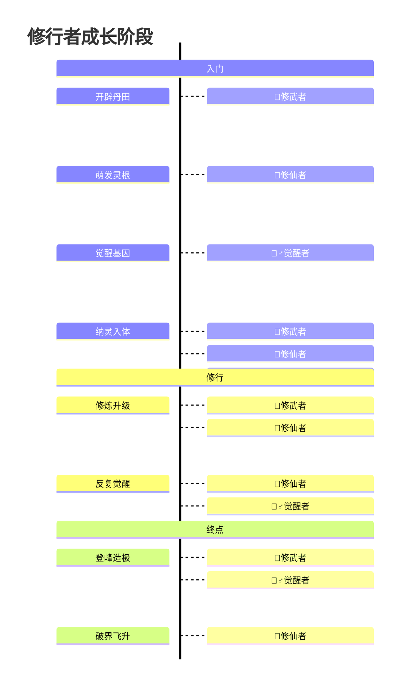
```mermaid  
timeline TD  
    title 修行者成长阶段  
    section 入门  
      开辟丹田: 👊修武者  
      萌发灵根: 🧚修仙者  
      觉醒基因: 🦸‍♂️觉醒者  
      纳灵入体: 👊修武者 
                     : 🧚修仙者  
                     : 🦸‍♂️觉醒者  
    section 修行  
      修炼升级: 👊修武者  
                     : 🧚修仙者  
      反复觉醒: 🧚修仙者  
                     : 🦸‍♂️觉醒者  
    section 终点  
      登峰造极: 👊修武者  
                     : 🦸‍♂️觉醒者  
      破界飞升: 🧚修仙者  
```  

倘若有幸具备相关条件，则可踏上修行之路。宇宙绝不会藏私守秘，但人却常常吝传靳授，道不远人，人自远道。  

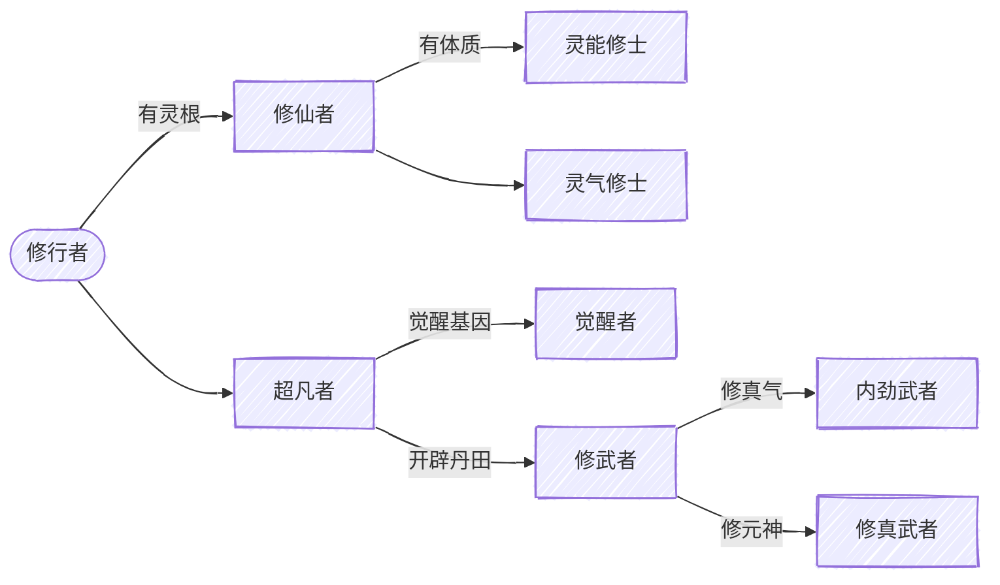
```mermaid  
---  
config:  
  look: handDrawn  
  theme: default  
---  

flowchart LR  
    R([修行者])  
    R --> |有灵根|X[修仙者]  
    R --> C[超凡者]  
    X --> |有体质|X1[灵能修士]  
    X --> X2[灵气修士]  
    C --> |觉醒基因|C1[觉醒者]  
    C --> |开辟丹田|C2[修武者]  
    C2 --> |修真气|C2.1[内劲武者]  
    C2 --> |修元神|C2.2[修真武者]  
```  

修行的本质就是纳灵入体，只要环境中存在灵能或灵气，就有各种办法将其吸收或利用。纳灵需要载体，或以丹田，或以灵体。  

<center>表1. 4 类修行者以及相关的功力细分</center>  

修行者 | 来源 | 实体力 | 精神力 | 要求 | 战力指数  
--- | --- | --- | --- | --- | ---  
灵能修士🦹 | 灵能✨ | 原力💥 | 玄力🌀 | 灵根+体质 | ≥ 10000  
灵气修士🤹 | 灵气🌟 | 灵力🔥 | 法力🌪️ | 灵根 | ≥ 100  
觉醒者🧙 | 异能🦸‍♂️ | 怪力🦾 | 念力👁️‍🗨️ | 基因 | ≥ 100  
修武者🤺 | 真元🏃 | 真气🏋 | 元神🧘 | 丹田+（下方至少选一）<br />1) 疏通奇经八脉<br />2) 冲破九关七窍 | ≤ 100  

> [!TIP]  
> `觉醒者`远远强于`修武者`，堪比`修仙者`，每觉醒一次基因就升一级，上不封顶，九次觉醒基因就相当于普通渡劫境，再觉醒就会将其超越，但由于觉醒基因的概率极低，觉醒九次的人数远远少于九级的渡劫境，前者一个宇宙都未必有一个，后者随便一个星球就一抓一大把。另外，纯粹的觉醒者不能破界飞升，哪怕战力已可秒杀渡劫境圆满。  

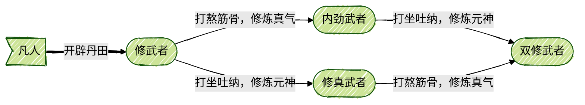
```mermaid  
---  
config:  
  look: handDrawn  
  theme: forest  
---  

flowchart LR  
    A>凡人] ==>|开辟丹田|B([修武者])  
    B --> |打熬筋骨，修炼真气|C([内劲武者])  
    B --> |打坐吐纳，修炼元神|D([修真武者])  
    C --> |打坐吐纳，修炼元神|E([双修武者])  
    D --> |打熬筋骨，修炼真气|E  
```  

开辟丹田后，就是`修武者`了，有两个修炼方向，`内劲武者`修真气、炼武功，`修真武者`修元神、炼真经，两者兼修则是`双修武者`，修至登峰造极，皆可移山倒海、御风飘举，然而上限也就到这了，延年益寿不过千载。  

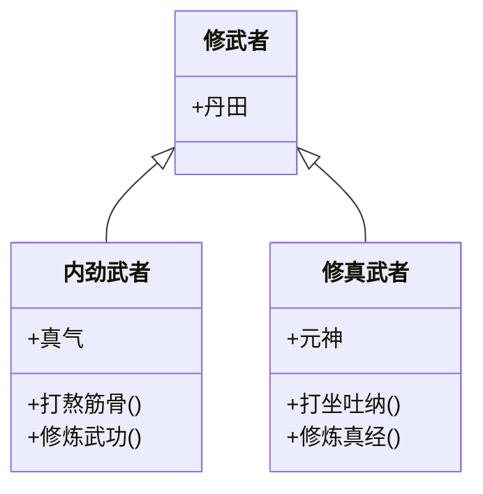
```mermaid  
classDiagram  

class 修武者{  
  +丹田  
}  

class 内劲武者{  
  +真气  
  +打熬筋骨()  
  +修炼武功()  
}  

class 修真武者{  
  +元神  
  +打坐吐纳()  
  +修炼真经()  
}  

修武者 <|-- 内劲武者  
修武者 <|-- 修真武者  
```  

若想长生久视，则必须借助灵体。或觉醒基因，或萌发灵根，两者虽可叠加，但会在很大程度上相互排斥，即若已觉醒其中一项，则另一项觉醒的概率会极大减小。  

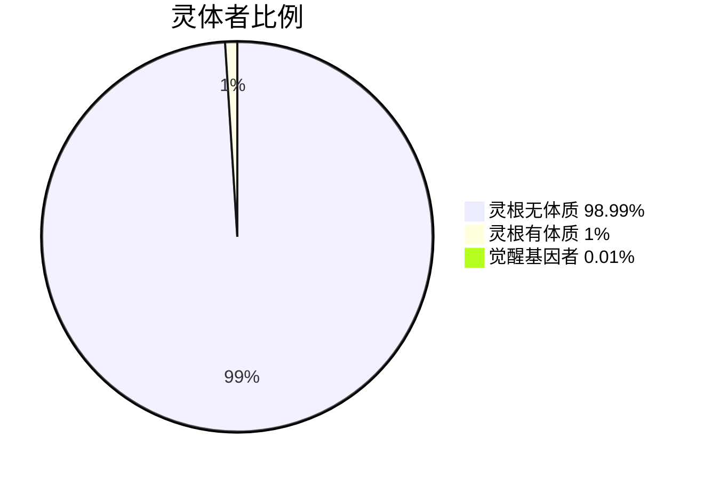
```mermaid  
pie title 灵体者比例  
    "灵根无体质 98.99%": 98.99  
    "灵根有体质 1%": 1  
    "觉醒基因者 0.01%": 0.01  
```  

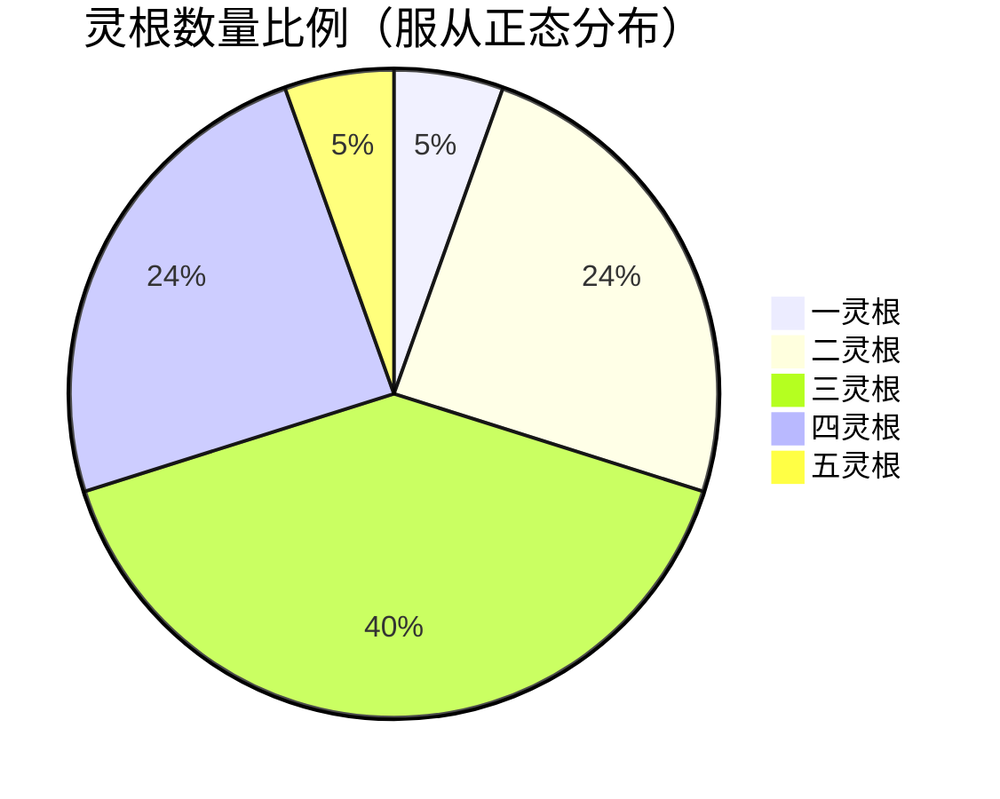
```mermaid  
pie title 灵根数量比例（服从正态分布）  
    "一灵根": 0.053991  
    "二灵根": 0.241971  
    "三灵根": 0.398942  
    "四灵根": 0.241971  
    "五灵根": 0.053991  
```  

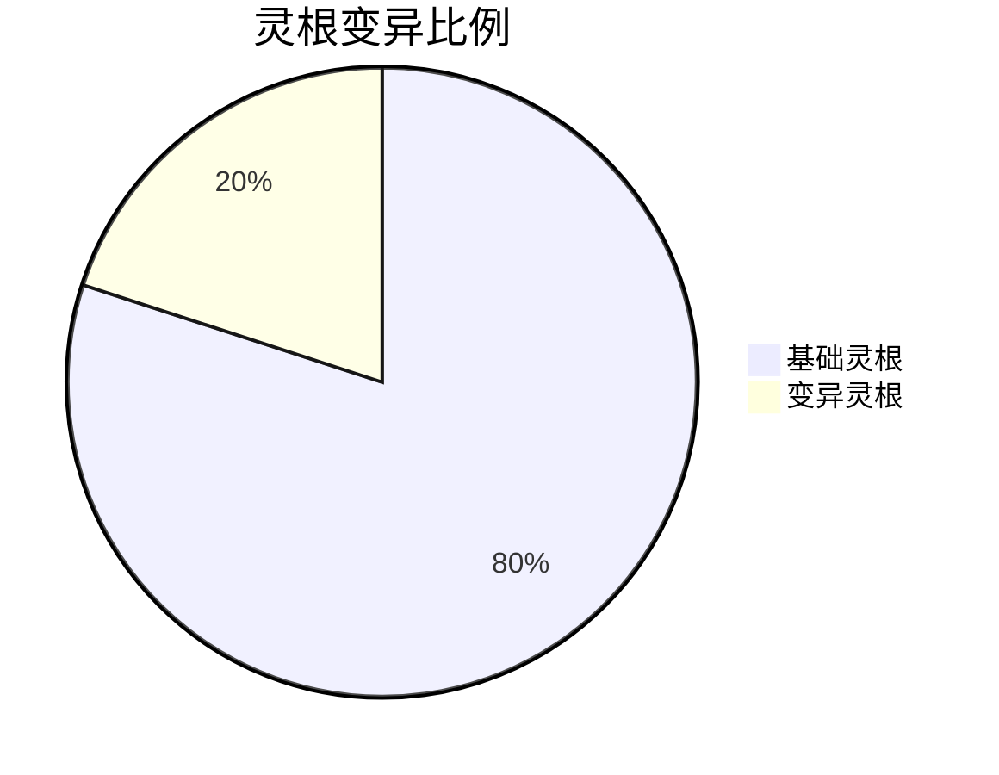
```mermaid  
pie title 灵根变异比例  
    "基础灵根": 0.8  
    "变异灵根": 0.2  
```  

觉醒了基因后，就有灵体了，且有至少一项不定的`超能力`，基因可以多次觉醒，获得若干超能力，但觉醒越多后面再觉醒的概率会越小。再萌发灵根的话，那就会发生协同增强，每一种基因的提升效果都相当于一种体质。  

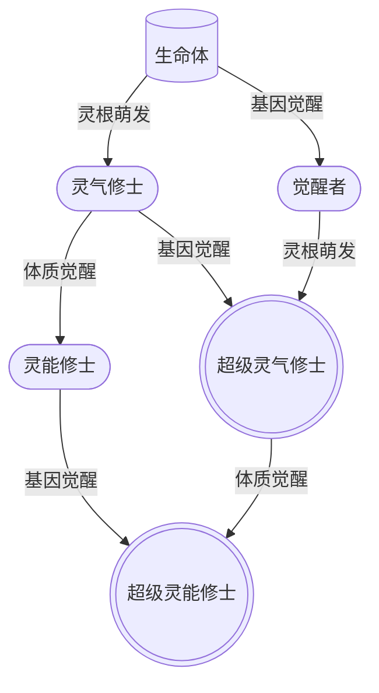
```mermaid  
flowchart TB  
    A[(生命体)] -->|灵根萌发| B([灵气修士])  
    A --> |基因觉醒|C([觉醒者])  

    B --> |体质觉醒|B1([灵能修士])  
    B --> |基因觉醒|B2(((超级灵气修士)))  
    C --> |灵根萌发|B2  

    B1 --> |基因觉醒|B1.1(((超级灵能修士)))  
    B2 --> |体质觉醒|B1.1  
```  

> [!TIP]  
> 一个人的灵根和基因主要来自遗传，少量来自变异，特定灵根的修士更可能有特定灵根的后代，但觉醒基因和体质完全取决于概率。  
> 灵根在母体孕育过程中萌芽和生长，若营养不足，则可能败种、枯萎、降级或休眠。休眠会导致耽误很多时间，休眠太久容易错过激活体质的时间窗口，且醒来时必定是极度亏损状态，很容易报废。一条灵根越接近完美（极品），觉醒体质的概率越大，最大可达0.95，但多条灵根需一次性觉醒，概率为它们各自概率的乘积，也就是说灵根越多、体质越难觉醒。能补充灵根的都是珍贵宝物，五行灵珠更是其中的神品，炼制要求极多、成本极高、产量极低、价值极大，即使是像望月派柯洁离这样的超级暴发户，也只给‘亲’孙子叶不凡弄到三组。若身体成熟时仍未觉醒体质，则以后也不会再觉醒了。体质没有遗传性，是纯随机的，但父母的体质越好，子女的体质也更有可能好。一条灵根可觉醒一项体质，具有完美的基础五行灵根时，在觉醒（至少）五项体质的同时还有机会额外觉醒五行灵体，而当有任一道体时，也叫五行道体，此时五行灵体会受道体感染而进化，生出特有道晕。觉醒体质的数量一般和灵根的数量完全相同，但有微乎其微的几率不等于灵根数，此时为了承载多余的体质，会立即觉醒相应次数的基因，因此觉醒的基因会远比一般觉醒的基因更强大。  
> 基因随时有机会觉醒，无论年龄和状态，只是概率极低，且无法靠修炼提升等级，觉醒几次就是几级，次数没有上限。觉醒基因本质上是一种暴烈的变异反应，某些极端高能的宇宙环境可大大提高觉醒概率，但死亡概率更高。  

体质和基因也会相互掣肘，觉醒其一便会抑制另一出头，反之亦然，但若能全觉醒，则此人的成长潜力将大到难以预料。  

<center>表2. 凡人修行体系、境界及其命名</center>  

| 觉醒者 | （双）修武者 | 内劲武者 | 修真武者 |
| --- | --- | --- | --- |
| <sup>lv.0</sup>凡人 | <sup>lv.0</sup>凡俗 | <sup>lv.0</sup>匹夫 | <sup>lv.0</sup>白身 |
| <sup>lv.1</sup>能人 | <sup>lv.1</sup>皮膜 | <sup>lv.1</sup>炼皮 | <sup>lv.1</sup>外物 |
| <sup>lv.2</sup>强人 | <sup>lv.2</sup>血肉 | <sup>lv.2</sup>淬血 | <sup>lv.2</sup>坐忘 |
| <sup>lv.3</sup>达人 | <sup>lv.3</sup>筋骨 | <sup>lv.3</sup>锻骨 | <sup>lv.3</sup>心斋 |
| <sup>lv.4</sup>过人 | <sup>lv.4</sup>脏脉 | <sup>lv.4</sup>通脉 | <sup>lv.4</sup>抱朴 |
| <sup>lv.5</sup>高人 | <sup>lv.5</sup>劲力 | <sup>lv.5</sup>凝劲 | <sup>lv.5</sup>虚生 |
| <sup>lv.6</sup>怪人 | <sup>lv.6</sup>罡气 | <sup>lv.6</sup>结罡 | <sup>lv.6</sup>齐一 |
| <sup>lv.7</sup>奇人 | <sup>lv.7</sup>真意 | <sup>lv.7</sup>离地 | <sup>lv.7</sup>归真 |
| <sup>lv.8</sup>异人 | <sup>lv.8</sup>玄元 | <sup>lv.8</sup>破空 | <sup>lv.8</sup>希夷 |
| <sup>lv.9</sup>超人 | <sup>lv.9</sup>宗师 | <sup>lv.9</sup>泰斗 | <sup>lv.9</sup>化境 |

> [!NOTE]  
> 上表只是等级的对应，不是实力的对应，登峰造极的九级修武宗师才堪堪能和最弱的一级觉醒者打成平手。`觉醒者`的等级取决于觉醒基因的次数，并没有上限，`修武者`的等级最高九级，但这是人为的划分，就像围棋段位一样，九级宗师之间的实力可能天上地下，因此还会细分 D、C、B、A、S、SS、SSS 等各级宗师。  

萌发灵根可成`灵气修士`，再觉醒体质可成`灵能修士`，萌发灵根是觉醒体质的必要条件，而灵能又是灵气的本原，灵能可（在`场`中）派生灵气。  

<center>表3. 灵根修行体系、境界及其命名</center>  

| 道士境界 | 修士境界 | 法修境界别称 | 兵修境界别称 | 拳修境界别称 |
| --- | --- | --- | --- | --- |
| <sup>lv.0</sup>炼体畜精 | <sup>lv.0</sup>修者 | <sup>lv.0</sup>上人 | <sup>lv.0</sup>武者 | <sup>lv.0</sup>武者 |
| <sup>lv.1</sup>炼精凝气 | <sup>lv.0</sup>宗师 | <sup>lv.0</sup>化人 | <sup>lv.0</sup>武道宗师 | <sup>lv.0</sup>武道宗师 |
| <sup>lv.2</sup>炼气化神 | <sup>lv.1</sup>炼气 | <sup>lv.1</sup>真人 | <sup>lv.1</sup>剑士 | <sup>lv.1</sup>斗者 |
| | <sup>lv.2</sup>筑基 | <sup>lv.2</sup>天人 | <sup>lv.2</sup>剑将 | <sup>lv.2</sup>斗佼 |
| | <sup>lv.3</sup>结丹 | <sup>lv.3</sup>灵人 | <sup>lv.3</sup>剑帅 | <sup>lv.3</sup>斗师 |
| | <sup>lv.4</sup>凝婴 | <sup>lv.4</sup>元人 | <sup>lv.4</sup>剑君 | <sup>lv.4</sup>斗宗 |
| | <sup>lv.5</sup>化神 | <sup>lv.5</sup>神人 | <sup>lv.5</sup>剑王 | <sup>lv.5</sup>斗祖 |
| <sup>lv.3</sup>炼神返虚 | <sup>lv.6</sup>出窍 | <sup>lv.6</sup>通人 | <sup>lv.6</sup>剑皇 | <sup>lv.6</sup>斗先 |
| | <sup>lv.7</sup>返虚 | <sup>lv.7</sup>至人 | <sup>lv.7</sup>剑帝 | <sup>lv.7</sup>斗尚 |
| <sup>lv.4</sup>炼虚合道 | <sup>lv.8</sup>合体 | <sup>lv.8</sup>完人 | <sup>lv.8</sup>剑道 | <sup>lv.8</sup>斗尊 |
| | <sup>lv.9</sup>渡劫 | <sup>lv.9</sup>圣人 | <sup>lv.9</sup>剑圣 | <sup>lv.9</sup>斗圣  
| <sup>lv.5</sup>聚鼎朝元 | <sup>lv.9</sup>大乘（渡劫圆满） | <sup>lv.9</sup>大圣（圣人巅峰） | <sup>lv.9</sup>剑仙（剑圣巅峰） | <sup>lv.9</sup>斗神（斗圣巅峰）   |
| <sup>lv.6</sup>羽化登仙 | <sup>lv.9</sup>飞升 | <sup>lv.9</sup>仙人 | <sup>lv.9</sup>大剑仙 | <sup>lv.9</sup>大斗神 |

> [!NOTE]  
> 在当前的天地环境中，因为各种相对缺陷，道士的修炼体系已经被淘汰。  

修行者之间的实力差距非常巨大，修武者已是世俗凡人中的高武精英，但面对觉醒者和修仙者只能望洋兴叹。只要条件具备，觉醒者也可以是修仙者，反之亦然。觉醒者不靠修炼，单纯依靠天赋，觉醒的次数决定等级，但由于觉醒基因太难，所以世界上还是修仙者更多一些。  

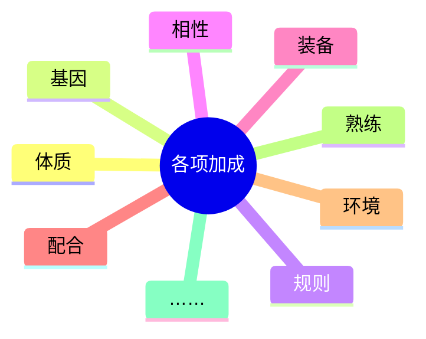
```mermaid  
mindmap
  root((各项加成))  
    体质  
    基因  
    规则  
    相性  
    装备  
    配合  
    环境  
    熟练  
    ……  
```  

修仙者之间的实力差距更是天壤之别，很多时候，境界和实力关系不大，低级修仙者若是有体质、基因、规则、五行生克、极佳的配合团队等的加成，是可以战胜高级修仙者的。理论上来说，一个白板的渡劫圆满，哪怕就要破界飞升，就算他耗到油尽灯枯，也难撼动一颗行星，掉进黑洞也会被压成一粒，但一个叠加了很多超级  buff  的炼气一层，却有可能毁灭整个恒星系，甚至手搓大黑洞和类星体，虽然这在现实中几乎不可能存在。  

  

在灵能潮涌之前，人族曾经是这片恒星系的绝对主宰，他们从其中一颗叫地源星的行星开始发展，最后殖民地布满整个恒星系的各大行星及其卫星，早已突破一级、接近二级宇宙文明。  

<center>宇宙文明分级</center>  

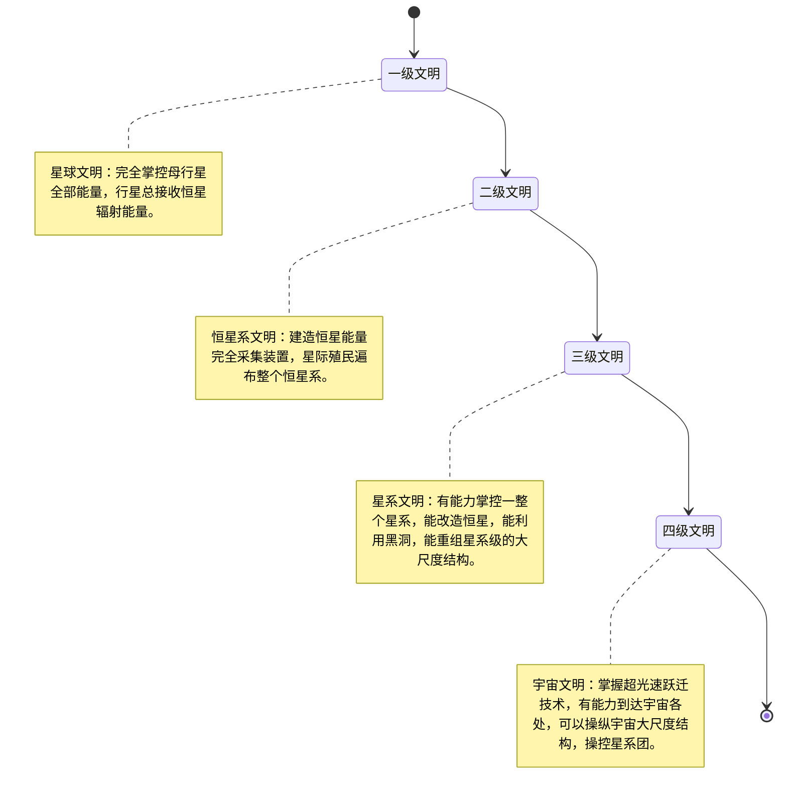
```mermaid  
stateDiagram-v2  
    State1: 一级文明  
    State2: 二级文明  
    State3: 三级文明  
    State4: 四级文明  

    note right of State1  
        星球文明：完全掌控母行星全部能量，行星总接收恒星辐射能量。  
    end note  

    note right of State2  
        恒星系文明：建造恒星能量完全采集装置，星际殖民遍布整个恒星系。  
    end note  

    note right of State3  
        星系文明：有能力掌控一整个星系，能改造恒星，能利用黑洞，能重组星系级的大尺度结构。  
    end note  

    note right of State4  
        宇宙文明：掌握超光速跃迁技术，有能力到达宇宙各处，可以操纵宇宙大尺度结构，操控星系团。  
    end note  

    [*] --> State1  
    State1 --> State2  
    State2 --> State3  
    State3 --> State4  
    State4 --> [*]  
```  

当时，天玄星没有卫星，还是边缘地带的小透明，道士们飞天遁地、独擅胜场。  

  

这一切在灵能潮涌之后都变了。灵能潮涌其实是这个恒星系，围绕所在星系的中央黑洞公转时，闯入了一片稠密的灵能星云所致。随后几千年，恒星系内发生了特别多的天体撞击事件，其它星球上的物种全部灭绝，甚至连运行轨道都被调整了，只有天玄星没有受到毁灭伤害，还因此增加了三颗硕大的卫星，以及一圈漂亮的行星环。  

  

灵能潮涌虽然带来毁灭，但也送来生机。在此之前，恒星系内灵能稀薄，差拟末法，人族作为灵能利用率最高的种族，五灵根的道士作为战力最强的势力，长期以来压得其他种族和势力无力抬头。  

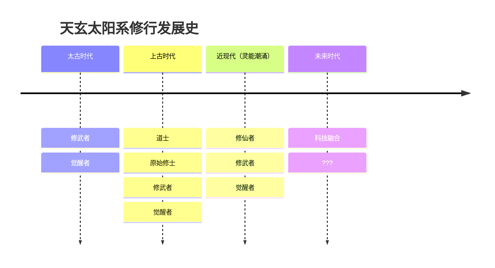
```mermaid  
timeline  
    title 天玄太阳系修行发展史  
    太古时代 : 修武者  
                    : 觉醒者  
    上古时代 : 道士  
                    : 原始修士  
                    : 修武者  
                    : 觉醒者  
    近现代（灵能潮涌） :  修仙者  
                                    : 修武者  
                                    : 觉醒者  
    未来时代: 科技融合  
                   : ???  
```  

但灵能潮涌后，直接大洗牌了：首先是灵能充沛后，利用率高反而优势不大了，浪费得多不要紧，吸收得又多又快就够了，精打细算的人族很快就被边缘化了；其次是，随着灵能浓度的增加，觉醒体质的概率大大增加，有了体质加持，玩法也更多样化，灵根数量和战力就不再是正相关了，道士也在人族中被祛魅，退出了历史舞台；最后是，当灵根越多时，修行越慢的相对劣势也被放大了，五级以下的宗门甚至按灵根数量划分三六九等，把单灵根叫做天灵根，很多一、二级宗门甚至还会直接拒绝五灵根候选者。  

> [!TIP]  
> 绝大部分五级及以下宗门没有条件测试体质，绝大部分三级及以下宗门没有条件测试灵根完美程度，绝大部分二级及以下宗门没能力培养五灵根。  
> <center>低级宗门的灵根黑话</center>  
> 
> ```mermaid  
> gitGraph  
>     commit id: "单灵根" tag: "天灵根"  
>     commit id: "二灵根" tag: "地灵根"  
>     commit id: "三灵根" tag: "凡灵根"  
>     commit id: "四灵根" tag: "伪灵根"  
>     commit id: "五灵根" tag: "杂灵根"  
> ```  
> 像常山宗这样的二级宗门，愿意收五灵根的极少，还保留挑粪、扫地这样活计的，更是少之又少，因为哪怕是几亿个凡人一年的工作，即使是炼气一层的修士也只需要眨眼间一个法术。修士们的五脏六腑和肉骨筋脉会被自己渐渐炼化掉（也可以留着不炼化，停留在低级生命层次），练气期已经可以用法力将摄入的杂质逼出体外，筑基期更是可以辟谷，靠灵合作用就能完成自养。得到一包灵药，直接用皮肤就能吸收，不需要入口，也能避免杂质入体。但口、舌和胃并没有因生命形式的进化而消失，而是更加强大，口腹之欲的要求也更高了。  
> <center>灵根完好程度</center>  
> 
> ```mermaid  
> gitGraph  
>     commit id: "绝体" type: REVERSE tag: "灵根败种或损毁"  
>     commit id: "亏体" type: HIGHLIGHT  
>     commit id: "欠体" type: HIGHLIGHT tag: "废品"  
>     branch develop  
>     commit id: "低劣" tag: "下品"  
>     commit id: "合格" tag: "中品"  
>     commit id: "良好" tag: "上品"  
>     commit id: "完美" tag: "极品"  
> ```  

道士的修炼体系本身就存在极大缺陷，例如他们需要修到炼神返虚后才能飞行，而在现行的体系下，筑基期就能飞了。本质上来讲，这种修炼体系是不自然的，是他们针对资源匮乏情况的一种极致优化，就像是仙人球适应沙漠环境，把蓄水做到了极致一样，到了热带雨林就直接出局了。一代版本一代神，换了版本神作尘😅。  

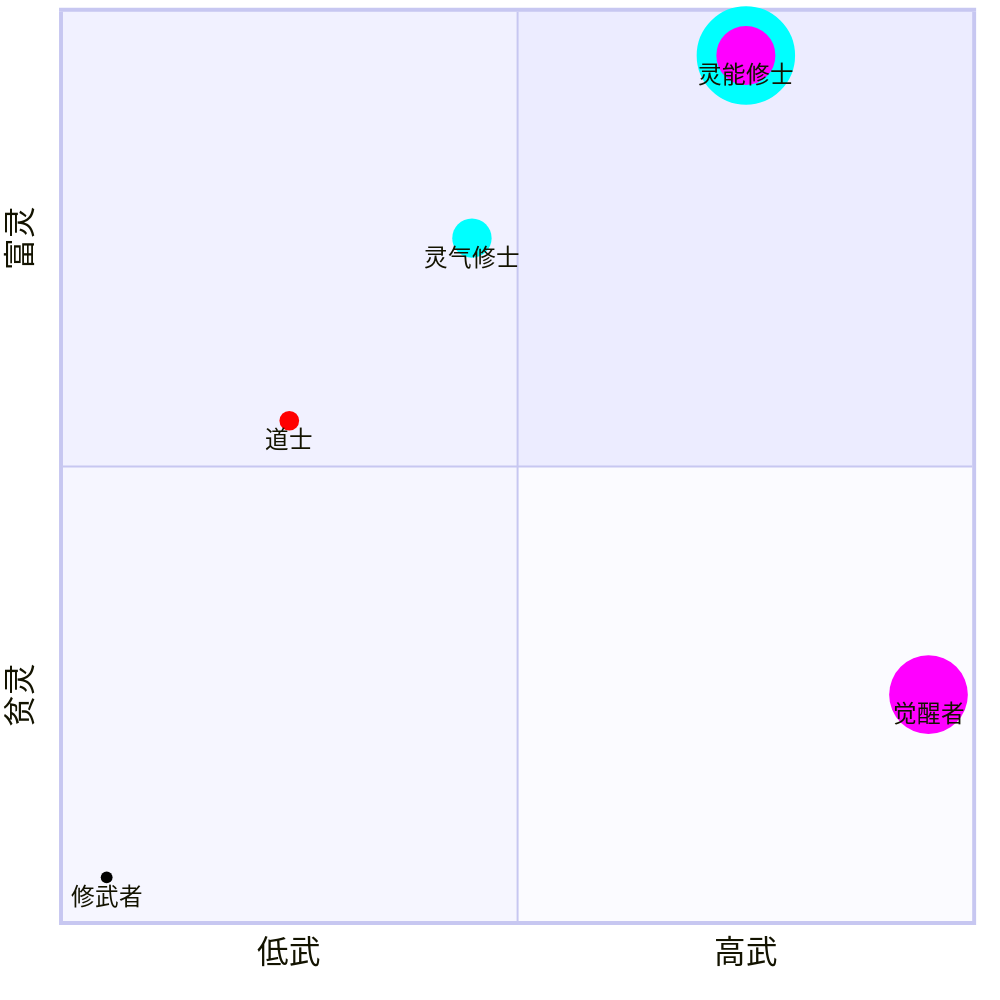
```mermaid  
quadrantChart  
    x-axis "低武" --> "高武"  
    y-axis "贫灵" --> "富灵"  

    "修武者":::class1: [0.05, 0.05]  
    "觉醒者":::class2: [0.95, 0.25]  
    "灵气修士":::class3: [0.45, 0.75]  
    "灵能修士":::class4: [0.75, 0.95]  
    "道士":::class5: [0.25, 0.55]  

    classDef class1 color: #000000, radius : 3  
    classDef class2 color: #ff00ff, radius : 20  
    classDef class3 color: #00ffff, radius : 10  
    classDef class4 color: #ff00ff, radius : 20, stroke-color: #00ffff, stroke-width: 10px  
    classDef class5 color: #ff0000, radius : 5  
```  

不过道士也并非一无是处，他们只选纯正的金木水火土五行灵根俱全的苗子。五行存在生克的关系，五行俱全则无所不生、无所不克，与任何法术都相性兼容，属于是全能型选手，缺点是修炼太慢，但大宗门还是养得起的。  

<center>表４. 五行生克关系</center>  

| 五行🎨 | 解释🔑 | 克👊 | 生🔋 | 阴阳四象☯ | 八卦🇰🇷     |
| ---- | ---- | --- | --- | ----- | ---------- |
| 水💧  | 固实🧊 | 火🔥 | 木🌱 | 太阴🌚  | 坎☵         |
| 土🔗  | 结合⛓️ | 水💧 | 金☢️ | 少阴🌒  | 坤☷<br />艮☶ |
| 木🌱  | 积蓄🌳 | 土🔗 | 火🔥 | 冲和☯️  | 震☷<br />巽☴ |
| 金☢️  | 裂解⚛️ | 木🌱 | 水💧 | 少阳🌖  | 乾☰<br />兑☱ |
| 火🔥  | 释放💥 | 金☢️ | 土🔗 | 太阳🌝  | 离☲         |

> [!NOTE]  
> 宇宙生气，太一生水，水以火反辅太一，是以成阴阳。阴阳复相辅也，是以成太极、两仪、三才、四象、五行、六合、七数、八卦、九宫、十方。而复相辅也，成万物乃止，是故万物者，太一之所生也。<br />太一藏于水，反于火，行于时，化为阴阳。周而又始，以己为万物母；一缺一盈，以己为万物经。阴水阳火，本于太一，合而成章，始作万物，知此之谓道，行此之谓德。  
> ```mermaid  
> graph LR  
>     A(((太一)))  
>     B((阴阳))  
>     C(万物)  
>     B ==> |火🔥|A  
>     A ==> |水💧|B  
>     C -.-> |火🔥|B  
>     B -.-> |水💧|C  
> ```  

所谓的五行，并不是五种基本元素，而是阴阳的五种转变形式，也叫相性，而更高级的阴阳，则叫极性。火不是一团火，水也不是一汪水，不是具体质能而是抽象运动。举例而言，高能γ射线在量子场中激发出电子、质子、中微子等的正反粒子对就是水，而正反粒子相遇湮灭重归光子就是火。  

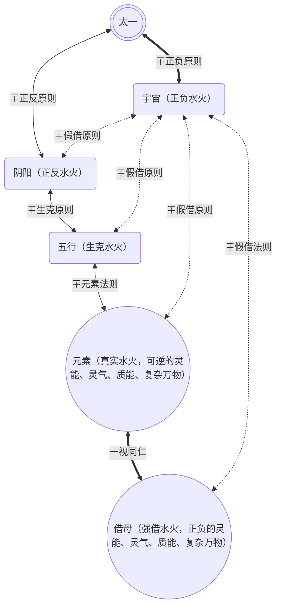
```mermaid  
graph  
    O(((太一))) <--> |∓正反原则|A("阴阳（正反水火）") <--> |∓生克原则|B("五行（生克水火）") <--> |∓元素法则|C(("元素（真实水火，可逆的灵能、灵气、质能、复杂万物）"))  
    O <==> |∓正负原则|a("宇宙（正负水火）")  
    a <-.-> |∓假借原则|A  
    a <-.-> |∓假借原则|B  
    a <-.-> |∓假借原则|C  
    a <-.->|∓假借法则|D(("借母（强借水火，正负的灵能、灵气、质能、复杂万物）"))  
    C <==> |一视同仁|D  
```  

而在更高级的原量子场中，凭空激发出正负能量也叫水，正负能量相遇归零也叫火，不过这是独属于大道体的天赋，真正的无中生有，不属于阴阳五行体系，此处只分水火不分阴阳和五行，而且这里所谓的能量是抽象的。因为阴阳五行根本上是把已经存在的东西从一种形式转变为另一种形式，是完全可逆的，而无中生有是直接把一无所有的 0，直接撕裂成 1 和 -1，如果是创造宇宙，则是一次创造正负两个宇宙，这两个宇宙除了底层的对称性外毫无关联，宇宙内部因为量子幺正性而有信息守恒的特点，哪怕是连黑洞也磨灭不了信息，但正负两个宇宙合并竟连信息都能直接清零，是真正的不可逆，而这和大道体能被抹灭的底层原理一致，但相对而言简单得多。  

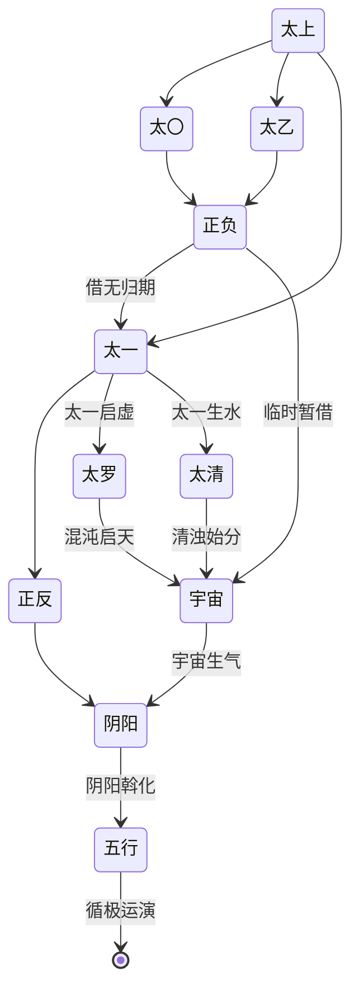
```mermaid  
stateDiagram  
    太上 --> 太〇  
    太上 --> 太乙  
    太上 --> 太一  
    太〇 --> 正负  
    太乙 --> 正负  
    正负 --> 太一: 借无归期  
    太一 --> 正反  
    太一 --> 太罗: 太一启虚  
    太一 --> 太清: 太一生水  
    正负 --> 宇宙: 临时暂借  
    太罗 --> 宇宙: 混沌启天  
    太清 --> 宇宙: 清浊始分  
    正反 --> 阴阳  
    宇宙 --> 阴阳: 宇宙生气  
    阴阳 --> 五行: 阴阳斡化  
    五行 --> [*]: 循极运演  
```  

值得一提的是，在更高层面上，存在绝对的时空，而一个具体宇宙中的时空与之完全天壤之别，因为后者只是前者的某种极低模拟，不仅存在最小象素和最大容量，而且是不可重叠、可逆和相对的，而绝对时空是极致数学化的难以想象之地，不仅是无穷大小、不可逆和绝对的，而且哪怕在同时同地几乎都碰不上彼此，因为里面有太多的层面和重叠，只要有任何一点没有对齐，就无法接触彼此，而又无法通信协调，所以相遇基本上是不可能的，或者说在绝对时空中，所有人都是一座孤岛，只要能够进入其中，就可独享属于他的绝对时空。  

<center>五行规则</center>  

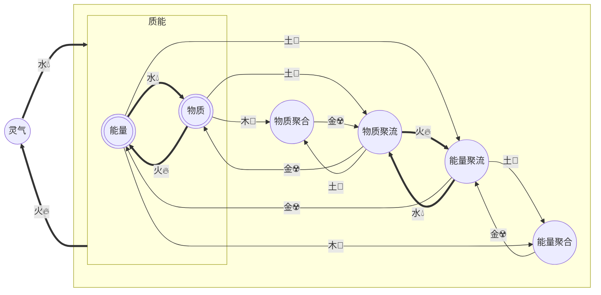
```mermaid
graph LR
    X((灵气))

    subgraph M [" "]
        subgraph Y [质能]
            A(((能量)))  
            B(((物质)))  
        end  
        C((能量聚流))  
        D((能量聚合))  
        E((物质聚合))  
        F((物质聚流))  
    end  

    Y ==> |火🔥|X  
    X ==> |水💧|Y  
    A ==> |水💧|B  
    B ==> |火🔥|A  
    A --> |土🔗|C  
    C --> |金☢️|A  
    C --> |土🔗|D  
    D --> |金☢️|C  
    A --> |木🌱|D  
    B --> |木🌱|E  
    F ==> |火🔥|C  
    C ==> |水💧|F  
    B --> |土🔗|F  
    F --> |金☢️|B  
    F --> |土🔗|E  
    E --> |金☢️|F  
```  

> [!NOTE]  
> 上面的**物质聚合**和**能量聚合**中的**聚合**是泛指，它可以简单到像少量沙子聚集成堆，也可以复杂到像大量分子组合成人。木🌱之规则若是练到出神入化，绝对能够手搓生命、克隆别人，但若想连灵根和基因都创造或复制出来，那你必须还掌握灵根和基因的底层规律，再组合木🌱之规则就可以了。一些传说中的大道体强者，甚至连宇宙都能抬手造出、翻手湮灭，那或许已经涉及到**五行原则**以上的规则了。  
> 
> ```mermaid
> ---
> title: 规则包含关系
> config:
>     look: handDrawn
>     theme: neutral
> ---
> 
> flowchart TB
> subgraph sg_rule ["规则"]
>     subgraph sg_law ["法则"]
>         subgraph sg_principle ["原则"]
>             A["…"]  
>         end  
>     end  
> end  
> ```  

<center>五行法则</center>  

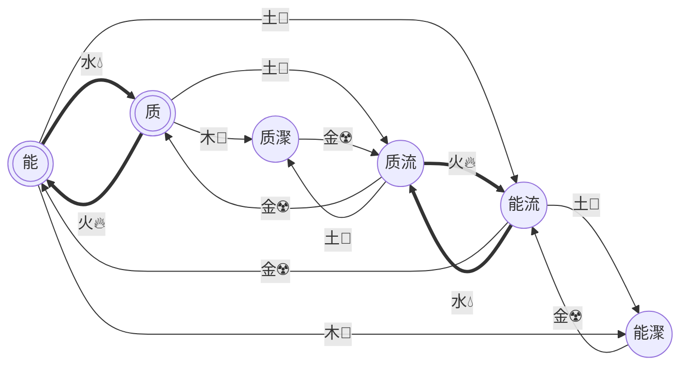
```mermaid  
graph LR  
    A(((能)))  
    B(((质)))  
    C((能流))  
    D((能㵵))  
    E((质㵵))  
    F((质流))  

    A ==> |水💧|B  
    B ==> |火🔥|A  
    A --> |土🔗|C  
    C --> |金☢️|A  
    C --> |土🔗|D  
    D --> |金☢️|C  
    A --> |木🌱|D  
    B --> |木🌱|E  
    F ==> |火🔥|C  
    C ==> |水💧|F  
    B --> |土🔗|F  
    F --> |金☢️|B  
    F --> |土🔗|E  
    E --> |金☢️|F  
```  

> [!NOTE]  
> 能和质是相对的，某个东西，对较高级是质，对较低级是能  
> ```mermaid
> graph RL
>     A([元炁])  
>     B([灵能])  
>     C([灵气])  
>     subgraph D [质能]
>         D1([能量])  
>         D2([物质])  
>     end  
> 
>     A --> |质|B  
>     B --> |能|A  
>     B --> |质|C  
>     C --> |能|B  
>     C --> |质|D  
>     D --> |能|C  
>     D1 --> |质|D2  
>     D2 --> |能|D1  
>  ```  

<center>五行原则</center>  

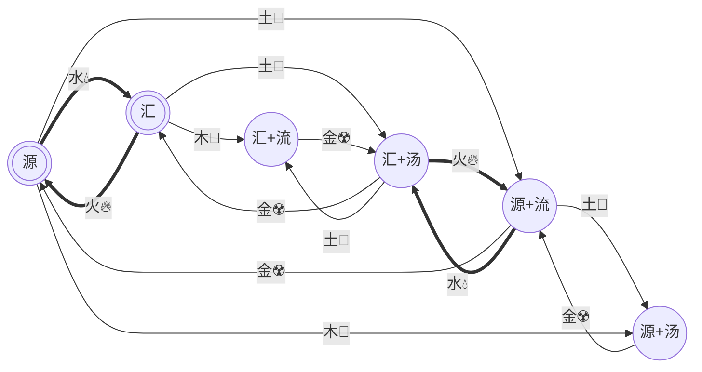
```mermaid  
graph LR  
    A(((源)))  
    B(((汇)))  
    C((源+流))  
    D((源+汤))  
    E((汇+流))  
    F((汇+汤))  

    A ==> |水💧|B  
    B ==> |火🔥|A  
    A --> |土🔗|C  
    C --> |金☢️|A  
    C --> |土🔗|D  
    D --> |金☢️|C  
    A --> |木🌱|D  
    B --> |木🌱|E  
    F ==> |火🔥|C  
    C ==> |水💧|F  
    B --> |土🔗|F  
    F --> |金☢️|B  
    F --> |土🔗|E  
    E --> |金☢️|F  
```  

> [!NOTE]  
> 源和汇分别是质和能的进一步抽象，流是聚合而成是动态平衡结构，汤（shāng）是聚合而成的稳定平衡结构。  

涉及现实层面的金、木、水、火、土元素时，属于是变异灵根，称为异金、异木、异水、异火、异土灵根，可以再度细分，例如鍂、林、沝、炎、圭灵根，以及鑫、森、淼、焱、垚灵根和𨰻、𱤏（$\begin{smallmatrix}\text{木}\kern-2pt\text{木}\\\text{木}\kern-2pt\text{木}\end{smallmatrix}$）、㵘、燚、㙓（$\begin{smallmatrix}\text{土}\kern-2pt\text{土}\\\text{土}\kern-2pt\text{土}\end{smallmatrix}$）灵根。  

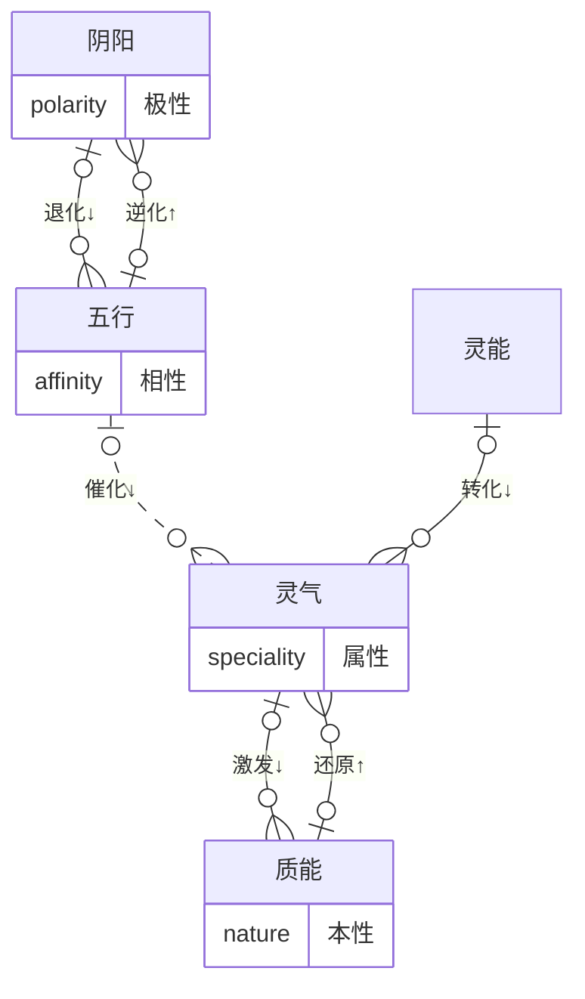
```mermaid  
erDiagram  
    阴阳 |o--o{ 五行 : 退化↓  
    阴阳 {  
        polarity 极性  
    }  
    五行 |o--o{ 阴阳 : 逆化↑  
    五行 |o..o{ 灵气 : 催化↓  
    五行 {  
        affinity 相性  
    }  
    灵能 |o--o{ 灵气 : 转化↓  
    灵气 |o--o{ 质能 : 激发↓  
    灵气 {  
        speciality 属性  
    }  
    质能 |o--o{ 灵气 : 还原↑  
    质能  {  
        nature 本性  
    }  
```  

五行生克妙用无穷，除了要懂克制关系，学会以长攻短，还要懂生助关系，学会定向增强。  
所谓定向增强，举个例子，水可扶持木，使相性为木的法术增强许多，若此环节木再扶持火，则可使相性为火的法术二段增强。值得注意的是，水克火，但只要中间有木，水也可以生火，其它二段增强都是如此。  

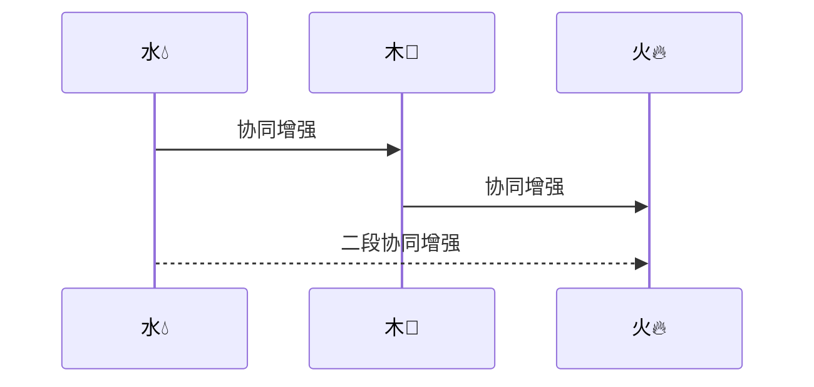
```mermaid  
sequenceDiagram  
    participant 水💧  
    participant 木🌱  
    participant 火🔥  
    水💧->>木🌱: 协同增强  
    木🌱->>火🔥: 协同增强  
    水💧-->>火🔥: 二段协同增强  
```  

若五行俱全，则可组成五行回路，跑一圈就是五段增强，跑十圈就是五十段，理论上可积累到宇宙容许的上限。  

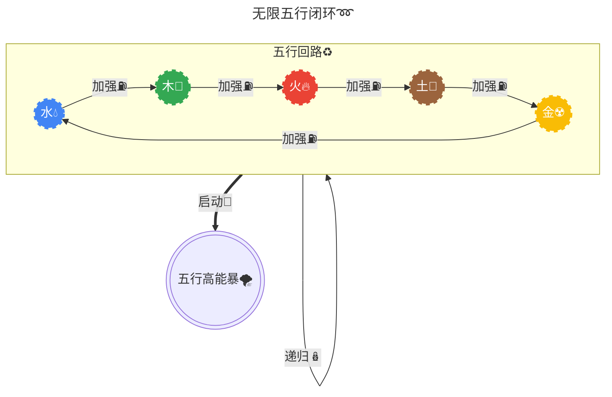
```mermaid
---
title: 无限五行闭环➿
---
graph  
    A((水💧)):::water  
    B((木🌱)):::wood  
    C((火🔥)):::fire  
    D((土🔗)):::earth  
    E((金☢️)):::gold  

    subgraph O ["五行回路♻️"]
        A --> |加强⛽|B  
        B --> |加强⛽|C  
        C --> |加强⛽|D  
        D --> |加强⛽|E  
        E --> |加强⛽|A  
    end  
    O --> |递归🪆|O  
    O ==> |启动🚀|X(((五行高能暴🌪)))  

        classDef fire fill:#ea4335,color:#fff,stroke:#ea4335,stroke-width:4px,stroke-dasharray: 5 5  
    classDef water fill:#4285f4,color:#fff,stroke:#4285f4,stroke-width:4px,stroke-dasharray: 5 5  
    classDef wood fill:#34a853,color:#fff,stroke:#34a853,stroke-width:4px,stroke-dasharray: 5 5  
        classDef earth fill:#9b643d,color:#fff,stroke:#9b643d,stroke-width:4px,stroke-dasharray: 5 5  
    classDef gold fill:#f9bc05,color:#fff,stroke:#f9bc05,stroke-width:4px,stroke-dasharray: 5 5  
```  

理想情况下，炼气一层，只要时间足够、可以承受，也能靠五行回路秒杀渡劫圆满，当然一般人的极限都很低，这很好理解，就好比光能跑那么快，你也能跑那么快吗？但若是能借助高级装备，哪怕没有修为，也可以做到秒杀。  

<center>五行生克关系图</center>  

```mermaid  
graph LR  
    火((("**火**🔥"))):::fire  
    水((("**水**💧"))):::water  

    subgraph "次稳态"  
        direction TB  
        土(("土🔗")):::earth  
        金(("金☢️")):::gold  
        木(("木🌱")):::wood  
    end  

    火 ==>|生🔋| 土  
    土 ==>|生🔋| 金  
    金 ==>|生🔋| 水  
    水 ==>|生🔋| 木  
    木 ==>|生🔋| 火  

    classDef fire fill:#ea4335,stroke:#b8261a,color:#fff  
    classDef water fill:#4285f4,stroke:#2557ad,color:#fff  
    classDef wood fill:#34a853,color:#fff,stroke:#34a853,stroke-width:4px,stroke-dasharray: 5 5  
        classDef earth fill:#9b643d,color:#fff,stroke:#9b643d,stroke-width:4px,stroke-dasharray: 5 5  
    classDef gold fill:#f9bc05,color:#fff,stroke:#f9bc05,stroke-width:4px,stroke-dasharray: 5 5  
```  

```mermaid  
graph LR  
    火((("**火**🔥"))):::fire  
    水((("**水**💧"))):::water  

    subgraph "次稳态"  
        direction TB  
        土(("土🔗")):::earth  
        金(("金☢️")):::gold  
        木(("木🌱")):::wood  
    end  

    木 -.->|克👊| 土  
    土 -.->|克👊| 水  
    水 -.->|克👊| 火  
    火 -.->|克👊| 金  
    金 -.->|克👊| 木  

    classDef fire fill:#ea4335,stroke:#b8261a,color:#fff  
    classDef water fill:#4285f4,stroke:#2557ad,color:#fff  
    classDef wood fill:#34a853,color:#fff,stroke:#34a853,stroke-width:4px,stroke-dasharray: 5 5  
        classDef earth fill:#9b643d,color:#fff,stroke:#9b643d,stroke-width:4px,stroke-dasharray: 5 5  
    classDef gold fill:#f9bc05,color:#fff,stroke:#f9bc05,stroke-width:4px,stroke-dasharray: 5 5  
```  

```mermaid  
graph LR  
    火((("**火**🔥"))):::fire  
    水((("**水**💧"))):::water  

    subgraph "次稳态"  
        direction TB  
        土(("土🔗")):::earth  
        金(("金☢️")):::gold  
        木(("木🌱")):::wood  
    end  

    %% 相生实线  
    木 ==>|生🔋| 火  
    火 ==>|生🔋| 土  
    土 ==>|生🔋| 金  
    金 ==>|生🔋| 水  
    水 ==>|生🔋| 木  

    %% 相克虚线  
    木 -.->|克👊| 土  
    土 -.->|克👊| 水  
    水 -.->|克👊| 火  
    火 -.->|克👊| 金  
    金 -.->|克👊| 木  

    classDef fire fill:#ea4335,stroke:#b8261a,color:#fff  
    classDef water fill:#4285f4,stroke:#2557ad,color:#fff  
    classDef wood fill:#34a853,color:#fff,stroke:#34a853,stroke-width:4px,stroke-dasharray: 5 5  
        classDef earth fill:#9b643d,color:#fff,stroke:#9b643d,stroke-width:4px,stroke-dasharray: 5 5  
    classDef gold fill:#f9bc05,color:#fff,stroke:#f9bc05,stroke-width:4px,stroke-dasharray: 5 5  
```  

多人配合也可组成五行回路，分工协作而效率更高，但有交流成本而威能打折，效果如何取决于默契程度。由于五行回路的存在，凡体也是有机会战胜体质的，世界那么大，总会有几个人承受能力特别强，五行回路跑得又快又多，那么越级而战自然如家常便饭了。  

<center>表5. 五行攻防效果</center>  

| 防↓/攻→ | 水💧 | 土🔗 | 木🌱 | 金☢️ | 火🔥 | 普👊 |  
| --- | --- | --- | --- | --- | --- | --- |  
| **水💧** | = | ++ | + | - | -\- | --- |  
| **土🔗** | -\- | =  | ++ | + | - | --- |  
| **木🌱** | -  | -\- | = | ++ | + | --- |  
| **金☢️** | + | - | -\- | = | ++ | --- |  
| **火🔥** | ++  | + | - | -\- | = | --- |  
| **普👊** | +++ | +++ | +++ | +++ | +++ | = |  

> [!NOTE]  
> `=` 是普通，`-` 是被克，`+` 是克制，`--` 严重被克，`++` 是严重克制，`---` 是不堪一击，`+++` 是一触即溃，`—` 是毫发无伤  

五行类的法术、异能、天赋、宝物等，无论附加了什么样的规则或领域，根本上的判定还是基于底层的相性。若你的灵根与之相性相合，就会有效率、威能、控制等各方面的加成，相悖则减益，此外则效果一般。  

```mermaid  
graph TB  
    A(((原始威力 a))) -.-> |**×**|B([环境损益 b]) -.-> |**×**|C([相性损益 c]) -.-> |**×**|D([克制损益 d]) -.-> |**×**|E([规则加成 e]) -.-> |**×**|F([其它损益 f]) --> G(a×b×c×d×e×f)  
    A ==> |**⊗**|G  

    subgraph 灰箱  
        B  
        C  
        D  
        E  
        subgraph 黑箱  
            F  
        end  
    end  
```  

而在战斗时，效果就更明显了，例如火灵根施展火相的法术，攻击对手的金相防御，若因相性相合威能提升为  a  倍，因克制对手威能再提升为  b  倍，则最终的倍率是  a×b，这是相当可观的，不幸的是在被反制时也同样可观。  

```mermaid  
---  
title: 灵根构造  
---  
classDiagram  
    note for 基础灵根 "水💧"  
    note for 基础灵根 "火🔥"  
    note for 基础灵根 "木🌱"  
    note for 基础灵根 "金☢️"  
    note for 基础灵根 "土🔗"  

    class 基础灵根{  
        + 相性  
    }  
    基础灵根 <|-- 变异灵根  
    class 变异灵根 {  
        + 元素场  
        + 领域场  
    }  
```  

灵根分为基础灵根和变异灵根，基础灵根是纯粹的五行灵根，而变异灵根是在基础灵根之上，再附着一组属性场和领域场，虽然变异了，但相性仍按基础灵根算。  

```mermaid  
mindmap
  root))灵根((  
    basic)基础灵根(  
      金灵根☢️  
      木灵根🌱  
      水灵根💧  
      火灵根🔥  
      土灵根🔗  
    attached)变异灵根(  
      异火灵根🪔  
      异水灵根⛲  
      风灵根🌪  
      雷灵根🌩  
      冰灵根🧊  
      光灵根💡  
      电灵根⚡  
      原灵根⚛️  
      磁灵根🧲  
      引灵根🌀  
      ……  
```  

通过属性场，可以把少量无属性的灵能转变为大量相应属性的灵气；通过领域场，可以操控特定属性的灵气或特定类型的质能，指导它们的运动、聚集和联结，甚至可以扭曲背景时空和影响物理效应。  

```mermaid  
flowchart TB  
    A([元炁]) --> |原始场|B([灵能])  
    B  -->|属性场|C([灵气])  
    C  -.->|属性逆场|B  
    C -->|元素场|D([质能])  
    D -.->|元素逆场|C  
    B ==>|元素场|D([质能])  

    subgraph 标准模型  
        D <-->|量子场|E([质能])  
    end  
```  

灵能通过属性场嬗变为灵力，灵力通过元素场嬗变为质能（即质量、能量、动量、力场、波旋、电荷、灵荷等合为一体，更一般的，场+对称性+信息结构），质能会在环境和领域中呈现出相应的相态（大量微观粒子的宏观联结状态），例如水的相态有固态、液态、气态、等离子态、各种晶体态等等。  

```mermaid  
mindmap
  root((质能相态 ⚛️))
      固态  
      液态  
      气态  
      等离子态  
      玻色子态  
      费米子态  
      量子简并态  
      超流态  
      拓扑相  
      ……  
```  

值得一提的是，变异灵根的命名其实是很随意的，因为实际情况过于复杂、边界过于模糊，所以并没有严格的区分判定标准。  

```mermaid  
stateDiagram  
    [*] --> 灵根萌芽  
    灵根萌芽 --> 基础灵根: +相性  
    state pureness {  
        基础灵根 --> 基础灵根二阶: +领域场<br />+　道场<br />+　力场<br />……  
        基础灵根二阶 --> [*]: +领域场<br />+　道场<br />+　力场<br />……  
    }  
    基础灵根 --> 变异灵根: +领域场<br />+属性场  
    state mixture {  
        变异灵根 --> 变异灵根二阶: +领域场<br />+　道场<br />+　力场<br />……  
        变异灵根二阶 --> [*]: +领域场<br />+　道场<br />+　力场<br />……  
    }  
```  

众所周知的，在一个灵根上，可以有若干个属性场和领域场，两者都不是固定不变的，属性场存在微弱的转变可能，领域场更是有后续无限激活的机会，且多个元素场和领域场的不同组合配比和缠绕方式，会导致实际表现的巨大区别。例如，异水灵根和冰灵根在底层配置上几乎毫无区别，但其中有一个与热运动有关的领域场，冰灵根就存在一丝缺陷，导致张开领域后会把热力（一定程度上）阻隔在外，而不像普通的异水灵根那样收放自如。另外还有一些野路子的冰灵根，没有水元素场，只是有隔热效果的领域，如果实际表现和冰灵根相差不大，且没有其它说法的话，也会被算作冰灵根。  

<center>法术等级</center>  

```mermaid  
graph  
    subgraph O[武术<sub>lv.0</sub>]
        direction TB
        O1[武功]
        O2[真经]
        O3[体法]
        O4[器法]
        O5[……]
    end
```  
```mermaid  
graph BT  
    subgraph A[法术<sub>lv.1</sub>]
        direction TB
        A1[功法]
        A2[心法]
        A3[术法]
        A4[神通]
        A5[秘术]
        A6[……]
    end

    subgraph B[规则<sub>lv.2</sub>]
        direction TB
        B1[元素场]
        B2[元素逆场]
        B3[领域场]
        B4[道场]
        B5[力场]
        B6[……]
    end

    subgraph C[法则<sub>lv.3</sub>]
        direction TB
        C1((道则))
        C2((玄机))
        C3((造化))
        C4((元理))
        C5((真意))
        C6((灵韵))
        C7((……))
    end

    subgraph D[原则<sub>lv.4</sub>]
        direction TB
        D1(((源)))
        D2(((汇)))
        D3(((流)))
        D4(((汤)))
        D5(((法)))
        D6(((数)))
        D7(((…)))
    end  

    A -->|散布编织构建| B
    B -->|抽象凝练升华| C
    C -->|溯源穷根究理| D

    D -.->|决定底层逻辑| C
    C -.->|定义运行边界| B
    B -.->|提供实施环境| A

    %% 样式  
    classDef level1 fill:#e6f7ff,stroke:#1890ff
    classDef level2 fill:#f0f9e8,stroke:#52c41a
    classDef level3 fill:#fff7e6,stroke:#fa8c16
    classDef level4 fill:#fff1f0,stroke:#f5222d

    class A level1
    class B level2
    class C level3
    class D level4
```  

变异灵根最大的优势是，当环境中有对应属性的灵气时，能力会有相当幅度的增强，并会大大减少自身的损耗。需要指出一点，环境中游离的各属性灵气是公用的，谁先抢到归谁，而且也不挑资质，不会因为灵根不合就无法被征调，只是效率高低而已。  

```mermaid  
radar-beta  
  axis x1["灵体开发"], x2["灵气存量"], x3["灵能存量"], x4["法术威能"], x5["天赋神通"]  
  curve a["普通修士"]{50, 50, 50, 40, 0}  
  curve b["变异修士"]{60, 20, 80, 70, 10}  
  curve c["灵能修士"]{100, 0, 100, 80, 100}  
  curve d["　觉醒者"]{10, 0, 100, 100, 90}  
```  

对于一般人来讲，如果在战斗时才从环境中抽取灵气，即使浓度不低，运转效率也成问题，而且有被别人的领域所控，一丝也抽不到的风险。所以他们往往会提前积蓄足够量的灵气，存到容器里（例如自身、符篆、丹药、法宝等），缺点是会像电池漏电一样持续漏失，而且也挺占地方。  

```mermaid  
pie title 普通修士  
    "灵能存量" : 50  
    "灵气存量" : 50  
```  

```mermaid  
pie title 变异修士  
    "灵能存量" : 80  
    "灵气存量" : 20  
```  

```mermaid  
pie title 灵能修士和觉醒者  
    "灵能存量" : 100  
    "灵气存量" : 0  
```  

> [!NOTE]  
> 变异灵根有属性场，可以把灵能转化为特定属性的灵气，所以他们不需要存储自己所能产生的灵气，但还是需要存储自己不能产生的灵气。灵能修士和觉醒者已经可以直接把灵能元素化，跳过中间的灵气转化环节，并且这两者尤其擅长非元素攻击，只能消耗灵能发动，这便是他们只需要存储灵能即可。  

但如果你是捆绑了对应属性场的变异灵根，就能直接把灵能转换为特定属性的灵气，一点点灵能就能换来海量的灵气，不占地方，极大缓解了容量焦虑。但即便如此，他们也还不能被称为灵能修士，只是输出更高的灵气修士罢了。  

```mermaid  
flowchart LR  
    subgraph 灵能修士  
        direction LR  
        A2([灵能]) ==>|元素场|B2([质能])  
    end  

    subgraph 灵气修士  
        direction LR  
        A([灵能]) -->|属性场|B([灵气])  
        B -->|元素场|C([质能])  
    end  
```  

灵能修士不必是变异灵根，但必须觉醒体质，能直接将灵能填入元素场，也就是说，他们可以直接把灵能变成质能，而不需要中间转化一层灵气，同样也无纳灵气入体的必要。并且觉醒体质后的元素攻击是带规则的，例如，觉醒了五雷灵体，能直接化灵能为雷电，不但损耗低、流量大，而且还能突破雷灵根者的领域的封锁和限制。  

```mermaid  
---  
displayMode: compact  
---  

gantt  
    title 施法流程  
    dateFormat YYYY  
    axisFormat %y  
    section 领域强者  
        扩散领域 : crit, active, a1, 0000, 100y  
        部署场域 : crit, a2, 0000, 100y  
    section 灵能修士  
        提取灵能 : b1, 0000, 30y  
        元素转化 : done, b2, 0070, 30y  
    section 变异修士  
        提取灵能 : c1, 0000, 30y  
        转化灵气 : active, c2, 0030, 40y  
        元素转化 : done, c3, 0070, 30y  
    section 普通修士  
        提取灵气 : active, d1, 0000, 30y  
        元素转化 : done, d2, 0070, 30y  
```  

其实变异灵根的最大优势是环境加成，有极强的领域压制力，某些绝强者甚至能让对应的元素攻击完全失效，但如果其中施加了额外的高级规则，则这种失效机制也会失效。  

```mermaid  
C4Container  
Boundary(b, "标准组织", "") {  
    Boundary(b0, "外部", "") {  
        Person(customerH, "外层", "人民群众、编外人员等")  
    }  
    Boundary(b1, "内部", "") {  
        Boundary(b1.1, "决策层", "") {  
            Person(customerA, "首领", "最高掌权者、独裁者、民选总统等")  
            Person(customerB, "幕后", "退休、幕僚、幕后掌舵等")  
        }  
        Boundary(b1.2, "监督层", "") {  
            Person(customerC, "监理", "代表、监察、审计、巡检等，获得监督、参议、审议、公议、弹劾、调查等授权")  
        }  
        Boundary(b1.3, "执行层", "") {  
            Person(customerD, "顶层", "顶层领导，统筹人事编制、资源调度、项目审批、目标督责、协调裁决等")  
            Person(customerE, "上层", "高层领导，管理中层，对接上层，传导上下信息")  
            Person(customerF, "中层", "中层领导，管理部门、业务线等")  
            Person(customerG, "下层", "底层牛马、小组长等，负责一线业务")  
        }  
    }  
}  

UpdateLayoutConfig($c4ShapeInRow="3", $c4BoundaryInRow="1")  
```  

随着天体撞击事件的逐渐减少，天玄星周围很多星球被再度开发，很多种族也大批迁移了过去，其中就包括人类。只是自灵气喷涌以来，人族就没落了，在哪里都是蕞尔小族，只在天玄星上分布最多，在别的星球上甚至连自己的城市都没有。  

  

人类中不乏奔走呼吁的有识之士，希望所有人能够摒弃前嫌、团结一致，多多为人族栽培希望，只要人才够多，将来就一定能让人族光荣复兴、再次伟大。  

  

虽然进度缓慢、收效甚微，但也好歹算是成立了修行联盟，总算是有了个打官司的地方，不至于沦为完全的丛林社会。只是这玩意儿就像联合国，小宗门往往得不到保护，该被灭还是被灭，该被控还是被控，所以他们很多干脆连会费也不交了，选择直接上供给依附宗门，联盟的门面这些年基本全靠大宗门支着。  

<center>表6. 天玄界 8 大人类组织（宗门）的标准名称和分类</center>  

| | 门派 | 宗教 | 皇朝 | 书院 | 公会 | 帮会 | 商行 | 家族 |
| --- | --- | --- | --- | --- | --- | --- | --- | --- |
| **外层** | 杂役 | 信徒 | 平民 | 旁听 | 外围 | 群众 | 短工 | 附属 |
| **下层** | 外门 | 传教 | 胥吏 | 童生 | 干事 | 帮众 | 伙计 | 族人 |
| **中层** | 内门 | 宣教 | 官吏 | 学生 | 理事 | 堂主 | 执事 | 庶长 |
| **上层** | 亲传 | 护法 | 官长 | 博士 | 总裁 | 天王 | 管事 | 嫡长 |
| **顶层** | 长老 | 法王 | 公卿 | 教授 | 董事 | 元老 | 行长 | 家长 |
| **首领** | 掌门 | 教主 | 皇帝 | 院长 | 会长 | 首座 | 东主 | 族长 |
| **监理** | 真传 | 使徒 | 王侯 | 学士 | 监事 | 代表 | 股东 | 宗老 |
| **幕后** | 祖老 | 天尊 | 太上 | 休仕 | 顾问 | 客卿 | 供奉 | 族老 |

> [!WARNING]  
> 以上表格仅供参考，每个宗门都要面对自己的实际情况和历史惯性，所以组织架构和具体命名会有所调整，例如很多宗门就没有**监理**，也没有任何民主程序和三权分立。  

---  

