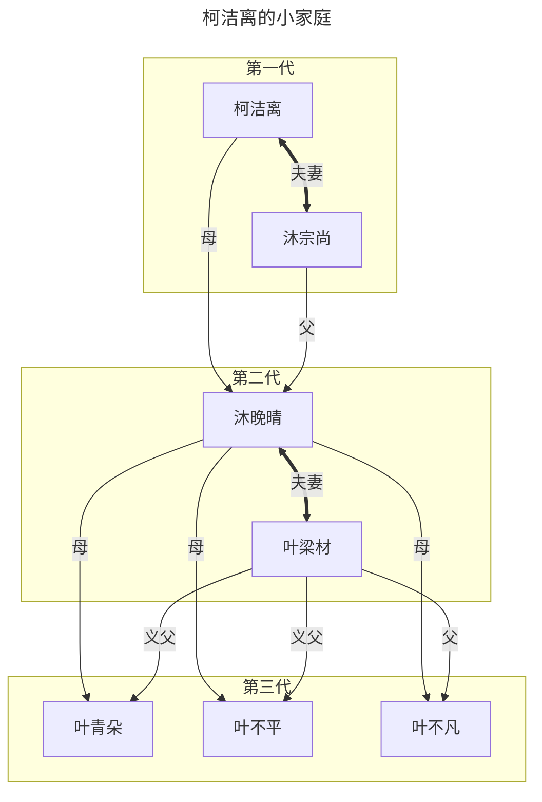
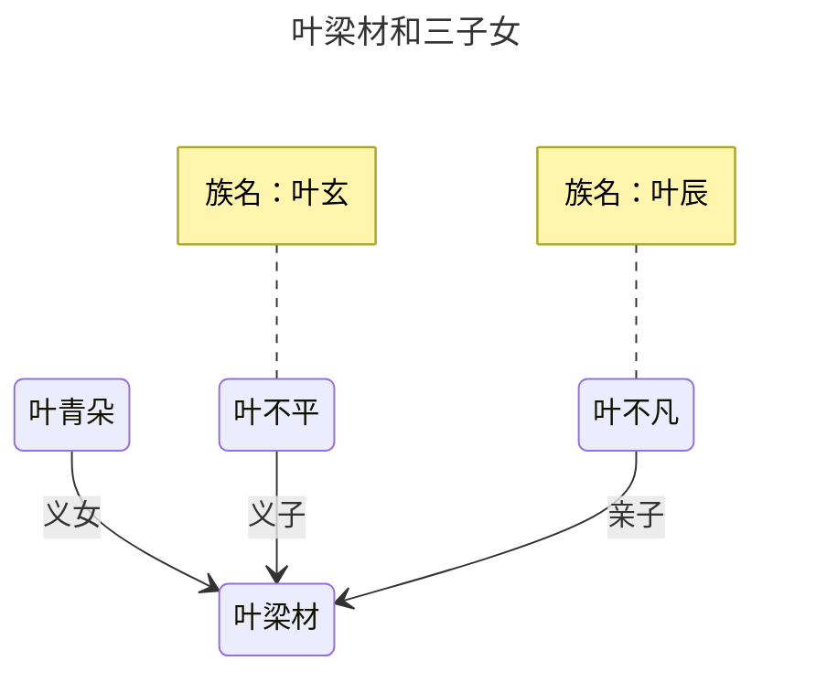

  
<audio src="https://life.115.com/imgload?h=3325B52989FB33752997F44F2B69A28778D24AC9&i=0&t=0&ss=1d8b89dab372a5b4347eae8dcf94a58e863e2db8&tt=1789450335" controls loop>情歌 - 梁静茹.flac</audio>  

## 😱 吓坏的归元化 

  

米珍珠被归元化这突如其来的飞身暴起和气势反转弄得莫名其妙，但她知道现在不合适开口问，不然显得漏怯。  
本着‘输人不输阵’的原则，她双臂一抱，脖子一梗，直接嘴硬怼了回去：“老娘还能是谁？不是望月派的弟子，还能是你爹啊？”  
“成天就是老娘你爹的，素质呢？！”归元化满脸凶煞，横肉扭如虫爬，右手狠狠往下一拍，地面瞬间炸出一个大洞：“还不老实交代？！我最后一次请你把身份令牌拿出来，只要让本座验明真身，确认你是某个大宗门弟子，你便可去留随意！”  
“验令牌？凭你也配验老娘的令牌？！”米珍珠眼珠子一瞪，摆出一副被冒犯到的极度愤怒与傲慢，“怎么？你哪只狗眼看着老娘不像望月派的人？！”  
归元化被气得眼角抽搐，阴鸷的眼神再次在她身上来回打量，但语气却带了几分迟疑与挣扎：“没有哪里不像，但我只认令牌。你区区一个炼气一层，光身上这件法袍就足够买下我整个常山宗，即便你不是望月派的，也一定大有来头！可你刚刚那一番言行……有些地方未免太违和、太荒诞了，简直就是在戏弄我！”  
“你知道就好！还以为你长能耐了，敢跟老娘翻脸了！”米珍珠一挺胸膛，下巴抬得老高，语气嚣张至极，“我当然不是什么阿猫阿狗，实话告诉你，我就是柯长老的孙女！识相的就赶紧给我滚开，被撞死了我可不负责埋！”  

| 姓名 | 年岁 | 灵根 | 体质 | 境界 |  
| --- | --- | --- | --- | --- | 
| 柯洁离 | 275 | [金]毒灵根⚕️ | <kbd>炼血霸体</kbd>3308 | lv.5化神 |
| 沐宗尚 | 366 | 水灵根🧊 | <kbd>清泠灵体</kbd>2656 | lv.5化神 |
| 叶梁材 | 41 | 金灵根☢️ 木灵根🔗 水灵根🧊 火灵根💥 土灵根♻️ | 无 | lv.2筑基 |  
| 沐晚晴 | 40 | [火]暗灵根🌑 | <kbd>太阴道体</kbd>9999 | lv.4凝婴 |  
| 叶青朵 | 22 | [水]冰灵根🧊 | <kbd>凌寒灵体</kbd>32349 | lv.3结丹 |  
| 叶不平 | 19 | [水]燚灵根🔥 | <kbd>元阳霸体</kbd>15 | lv.3结丹 |  
| 叶不凡 | 16 | 金灵根☢️ 木灵根🔗 水灵根🧊 火灵根💥 土灵根♻️ | <kbd>太灵道体</kbd>60 <kbd>天女净体</kbd>1 <kbd>九灵祟体</kbd>23 <kbd>对待实体</kbd>25 <kbd>源流虚体</kbd>26📎 <kbd>**五行灵体**</kbd>1⇒<kbd>**五德道体**</kbd>0 | lv.1炼气 |  

归元化豁然开窍、骇然失声道：“你……你是叶青朵？！”  
然而，这个名字刚脱口而出，归元化的大脑就猛地转过弯来。他脸上的震惊瞬间荡然无存，取而代之的是一抹极其讥诮而揶揄的戏谑：“呵……小丫头片子，你看本座长得很像傻子吗？！狐假虎威之前，为什么不先做好功课？叶青朵是什么修为，你又是什么修为？你要真是叶青朵，至于和我废话，一掌就能把我拍成肉泥了！”  
他又散掉罡气罩，指着自己的胸口嚷嚷道：“来来来，朝这来，本座敞开胸膛任你来！你要是能把本座一掌拍死了，那也是本座倒霉活该！更何况……柯大长老并不喜欢叶青朵，怎么可能安排她来经手，给叶少配送物资？所以我很疑惑，你到底是谁？装腔作势的在我这啥都不顶，请不要再浪费你我时间，赶紧把你的身份令牌掏出来！”  
米珍珠撇了撇嘴，不慌不忙地伸出右手，装模作样地在衣服口袋里好一通翻找，最后双肩一耸、两手一摊，光棍无比道：“不好意思，没带！”  
“你特么说掉了我也信啊！”归元化彻底气急败坏，面色涨成猪肝色，指着米珍珠的鼻子疯狂咆哮，满嘴脏话眼看就要喷薄而出。  
可米珍珠接下来轻飘飘的一句话，如同一盆冰水瞬间浇灭了他的怒火，让他所有的垃圾话硬生生冻在嗓子眼。  
米珍珠翻了个白眼，好整以暇道：“我说大叔，你脑子是不是轴啊？我一定非得是她亲孙女吗？我难道就不能是她孙子的女朋友吗？！这样论起来，我跟着喊她一声‘奶奶’，有什么问题吗？”  
“额，倒是也行，就是太巧！”归元化一愣，感觉这话逻辑没有问题，硬生生又把满嘴脏话咽回了回去。  
他再次眯起眼睛，狐疑地上下打量着米珍珠——这姑娘身上的衣料确实非同凡响，而且脸上隐隐笼罩着一层看不真切的缥缈雾气，这手段确实不一般！这么一想，印象中被大宗少爷包养、仗势欺人的娇纵小女友形象，居然和眼前这人重叠了！  
归元化的语气又收敛了几分，态度多了几丝客气：“不知……您是哪位少爷的女朋友？不管您是哪位的‘跟’，还请拿出能证明您或怹身份的东西，谢谢配合！”  
“会不会说话啊，你才是‘跟’！”米珍珠呼吸一噎，像是被戳到了什么痛处，神色变得极不情愿，支支吾吾地嘟囔道：“烦不烦啊，人家还想低调呢，叶不凡他……”  
然而，‘叶不凡’这三个字刚一出口，就好像触发了某种禁忌诅咒，仿如‘伏地魔’一样不可宣之于口！  
归元化的身躯猛地剧烈一抽，脸色毫秒间惨白如纸，体内灵气竟脱出神识掌控，犹如火山爆发，轰然失控。  
浩荡灵气进入环境后瞬间化作狂风暴雨，以其身体为球心，汹涌向四面八方，把猝不及防的米珍珠浇了个透心凉，波及范围竟达方圆百里。天上云彩和地上的气雾被扫荡一空，月辉星光径直落洒，亮度倍增，下方的大地被犁出一个深不见底的碗形巨坑，雨水通过渗透和汇流很快就畜起一汪深潭。  

## 👹 柯老祖的故事  

  

妈妈的妈妈叫什么，妈妈的妈妈叫姥姥。  
但叶不凡的妈妈沐晚晴，不是传统意义上‘嫁入’叶家，叶家和沐家存在一种两头婚姻关系，即‘互娶’。理论上，这种婚姻模式确保了双方家族的平等地位和血脉传承。  
因此，<u>叶不凡</u>也名为<u>沐不凡</u>，他除了是叶家的嫡系子孙外，同样还是沐家的嫡系。见到柯洁离，喊的都是‘奶奶’，而不是‘姥姥’。如果他不慎叫错，那位雷厉风行的‘面嫩’老太太，会当场雷霆大怒！  
望月派柯洁离，人送外号‘铁血凶离’，是一位能让人闻风丧胆，让小儿止啼，却又让人又不得不溜须拍马的存在。这个名字在望月派，周边各大高低级宗门，乃至整个东青域，都代表着绝对的实力、铁血的手段和无上的权威。  
柯洁离打小就是宗门里的一个‘传奇样本’，她不仅靠天赋碾压同辈，还凭借着远超常人的心性和狠辣磨灭掉他人的竞争之心。她的人生信条就是事事争先，样样压人。无论是修炼速度、实战比斗、还是门内考核，她永远是那个让同辈感到绝望的‘第一名’。  

> [!NOTE]  
> 册婡妩和册娜娘与柯洁离不是同一辈人，勉强和叶不凡或者沐晚晴算是同一辈的。不妨做一个思想实验，若是册家两姐妹在凝婴及以下境界，与柯洁离发生对战交锋，参照既有的历史数据来看，大概率会败于柯洁离。  
>> [!NOTE]  
>> 自晋升化神境以来，柯洁离就不再有公开的参战记录，而是把时间全投在经营和管理工作之上。  
>> 在望月派中，lv.7返虚境的太上长老已不参与排位，目前lv.6出窍境以下（含）的最强者是lv.5<kbd>亚㵲湘</kbd>人族，她曾一度是柯洁离在战斗方面追赶和超越的目标之一。直到柯洁离率先突破lv.3结丹境后，才首次超越她，并在之后维持了很长时间。  
>> 后来亚㵲湘以lv.4凝婴境初期击败凝婴境圆满的柯洁离，才把排位再次调转过来。自此之后，柯洁离就退出排位赛了，也不代表宗门出外作战。而亚㵲湘则一直稳扎稳打，目前虽只是lv.5化神境初期，但已经打遍门内出窍境以下无敌手了，是实至名归的大师姐，并挂有`真传弟子`身份。  
> 
> | 姓名 | 年岁 | 灵根 | 体质 | 境界 |  
> | --- | --- | --- | --- | --- | 
> | 柯洁离 | 275 | [金]毒灵根⚕️ | <kbd>炼血霸体</kbd>3308 | lv.5化神 |  
> | 亚㵲湘 | 281 | 金灵根☢️ 木灵根🔗 水灵根🧊 火灵根💥 土灵根♻️ | 无 | lv.5化神 | 
> 
> 从修炼资质上来看，柯洁离虽然天赋惊人，但并不是册婡妩和册娜娘那种令人绝望的天才。但战斗不是纸面数据的比大小，而是各种天赋、丹药、法宝、符阵等的组合，且是各种本能、技巧、手段和心性等的综合，不仅要看天赋和装备，还要看训练和发挥。而柯洁离的炼血霸体又有极大的前期优势，不仅自身输出又快又猛，还能不断从别人身上吸血自补，甚至还能将人拍成血雾后凝炼血丹，持久能力极强，只要防御能跟上，哪怕万军丛中持续打上一年半载都不会累。  
> 册家姐妹在化神境以前（不含）的输出效率并不算太高，只要柯洁离舍得花钱，多买一些自己当前境界能调动的防御装备，就能轻松将两人的体力耗竭。不过到了化神境以后（含），若选择淘汰肉身，则可以抛弃气血，这时柯洁离就无法从对方身上吸血了，炼血霸体也就没那么可怕了。  
>> [!NOTE]  
>> 肉身寄寓魂灵的最佳同时也是天然场所是头部灵台，在此可修神魂识海。但修士可通过后天定向修炼，将魂灵转移至所开辟的腹部丹田，在此可修储物空间。  
>> 这个丹田和修武者的丹田其实是一个东西，只是档次高低不同，后者不能储物罢了。修丹田空间虽能省却储物法宝，但却会导致魂灵和肉身纠缠过多，若丹田被破，则修为也大多被废，只有晋升到出窍境后才能有所克服。而灵台却破不了，就像抽刀断水、挥拳打气，此时只能杀人不能废人。故修丹田往往是不得已而为之，大多是因为买不起储物袋。  
>> 炼血霸体若对上丹田修士，由于对方不能淘汰肉身，吸血优势还能延续到化神境，甚至一些较弱的出窍境。不像册家姐妹修炼只需打坐，柯洁离的青少年时期是从尸山血海中淌过来的，手下亡魂不计其数，清宗灭族更是如家常便饭。而她这些竟全是宗门任务，斩首目标后顺手屠杀也并未超出自由裁量权，所以从未被限制，甚至还被鼓励斩草除根。  
> 
> 不过作为天玄界最知名的创新型炼药大师之一，柯洁离虽然修为境界并不惹眼，作为炼药师的品级也不够高，但是捞钱能力却无与伦比！她就靠卖着需求量最大的中低级丹药，以微副作用收取极高溢价，挣得盆满钵满，还硬生生将望月派抬进了人族宗门财富榜第 30 位。虽然身份上她只是望月派的一位堂口长老，但整个宗门都把他当财神菩萨供起来，简直到了一言九鼎、说一不二的地步。  

如今的柯洁离，不仅是一位五级化神境圆满的顶尖强者，距离六级出窍境也只差临门一脚，还是一位巅峰的六级炼药师。  
修仙界的炼药分为九级，每一级对应着能稳定供应的修仙者境界。六级炼药师能够稳定炼出六级的丹药和制剂，可供应六级的出窍境强者。可即便是供应给七级的返虚境强者，她也有一定把握，只是良品率还不达标，成本居高不下，目前也只有少量出货，远不足以推出拳头产品。  
出窍境强者在高级宗门中已经是中流砥柱了，而能稳定提供六级丹药的炼药师，在整个修仙界都稀缺无比，可谓凤毛麟角。更可怕的是，望月派的多位老祖——那些通常闭关不出的宗门守护者，大多是她的柯姓家族长辈，望月派几乎是柯姓的家族企业。  
柯洁离在望月派的超然地位，甚至还在宗主之上，很少有人能忤逆她的意思。宗门里其实还有两个六级炼药师，以及若干较低级的炼药师，不过都是她手底下的打工仔，完全俯首听命，看她脸色行事。  
凭借着柯洁离发明并引入的流水线炼药工艺、高效萃取法、无火练药法和其他各种科技狠活，望月派的丹药产量高得吓人，不仅垄断了人族的中低阶高品丹药市场，还远销到天玄界各族。财富犹如百川归海般涌入，不仅老祖们再也不必为修炼资源发愁，境界如火箭般蹿升，还将柯洁离的地位抬升到老祖之下第一人，过去那个宗主就是因为顶撞了柯洁离一句，就被废掉修为监视居住，现在这个宗主就很老实了，没事就到炼药堂请安，恭顺地听候柯洁离的指示和安排。  
柯洁离本身战力就很高，但她并不需要靠实力压人，只要用丹药资源便能控制宗门内外的出窍境以下的修士命脉。她手中的丹药，就是维持宗门运转、保证高层战力的核心筹码。在望月派，哪怕是诸位老祖，也没有谁能够做到像她这样一呼百应、一言九鼎。  
但若将时钟拨回到一百多年前，这位丹药界的巨擘竟也曾面临过严重的个人问题。  
随着柯洁离的修为和权势的日渐增长，年龄也跟着悄然攀升。尽管驻颜有术，一直维持着十八岁，但周围的闲言碎语，还是开始在望月派这座巨大的宗门里悄然滋生，并逐渐多了起来，甚至越传越离谱。  
大家给她起了很多个背后的外号，最深入人心、朗朗上口的，还得是‘柯老祖’。人们在背后议论这位强势到令人望而却步的‘柯老祖’是‘老姑娘’，甚至还带着几丝幸灾乐祸的嘲讽笑话她是‘没人要’。没想到长大后，别人家的孩子，竟成了别人家的笑话！  
闲话最终还是传进了她的耳朵里，这对于一生要强、不甘人后的柯洁离而言，简直是致命的羞辱。她可以接受任何挑战，却无法接受这种基于性别和年龄的价值贬低。这是她有生以来，第一次真正感受到众口铄金、人言可畏，那一晚，她竟然第一次哭了！  
迫于家族和社会的压力，也为了堵住悠悠众口，柯洁离还是同意去相亲了。但她的暴躁易怒、绝对强势的性格，是她道侣之路上最大的障碍，导致她的‘强’迟迟没来。  

  

仗着当时的凝婴境界修为和越级战斗能力，她对男子的要求极高且不容挑战。很多和她谈恋爱或试图结为道侣的男修，都被她的强势和火爆所震慑。一旦对方流露出一丝对她的不敬、对她地位的挑战，或者言语上的轻慢，她便会毫不留情地动手。很多时候，给她介绍对象就是个得罪人的脏活，不仅吃力不讨好不说，可能还会沦为杀人作案现场，不用柯南就能断案的那种。  
在她长长的恋爱名单中，竟有数百位男子被她当场拍死或重伤至残！这些‘战绩’不仅让她本人臭名昭著，还给望月派惹来了大量的麻烦和官司。在她恋爱的那几年，宗门一直不断地为她的事情擦屁股，甚至为此还成立了大型的公关部门。宗门不停地付出巨大的资源和人情想要摆平公众怒火、堵住家属嘴巴，但转眼风波又起。不过相比于她挣到的，花出去的只是九牛一毛，长辈们也是睁一只眼闭一只眼，让她开心就好。  
尽管柯洁离的脾气恶名远扬、行事乖戾放纵，但她并不是个不知轻重的傻子，倒也没有招上惹不起的人，犯下压不住的官司。  
那些消息灵通的大家族子弟，只要一听说是和‘柯老祖’相亲，早就撂杆子跑路了。他们可不愿意将一生的幸福牺牲在一位暴躁女魔头的手中，甚至连恋爱的边都不想沾上！  
柯洁离的地位、实力和脾气，反倒成了最有效的‘避雷针’和‘劝退符’，让她在情感之路上，始终保持着孤傲清高的强者姿态。甚至有人说她天生自带‘绝男圣体’，虽然不会被爱，但也不会被渣，一般人想要都没机会。  
一般来讲，像这种声名狼藉的‘老姑娘’，保媒拉纤的都会敬而远之，毕竟他们全靠成功撮合后拿红包，做这种根本看不到希望的媒不是让他们喝西北风吗？可是柯洁离虽然脾气不好，但遍地朋友，很多人为了巴结她，投其所好之下也会上赶着给她做介绍，不管成不成柯洁离都会有所表示，这里的社交逻辑已经异化成了，别人给柯洁离物色少男，而柯洁离给他们辛苦费的程度，简直离谱。  
可是谁能料到事情的转机竟会出现得那么突然，有骗子盯上了她，竟成功将她骗到了。  
不知从什么时候开始，有一位舔狗出现在柯洁离的视线中，怎么羞辱驱赶都是一脸深情，这位舔狗就是沐宗尚。他虽然是沐家的嫡子，位列家主继承序列，但仅排在第五顺位。原本只要不出意外，家主的位置铁定与他无缘，可是人生总是充满惊喜和意外！  
偶然听说了柯洁离的故事，英俊潇洒的沐宗尚觉得自己的机会来了，迅速地切割掉众多女朋友后，毅然决然地追逐起了柯洁离。故事的发展很快，柯洁离最终同意了他的求婚，虽然她并不懂什么爱情，但满脑门子生意，眼前的废物虽说中看不中用，但或许能当个不错的挡箭牌，自己虽然不靠男人，但也要向人证明：老娘我也是有人要的！  
柯洁离指示沐宗尚，让他在一个万众瞩目的场合，向她公开求婚。宗门对此颇为上心，不断加码升级，不仅遍邀各路亲旧、名流和攀附前来吃席，还支付巨款请来天王巨星登台演艺，并买下天穹广告位以做直播，就是要给柯洁离带来难忘的一天。  
不过终是应了那句古话，‘有多大脸，现多大眼’，万万没想到，居然在沐宗尚这个环节掉了链子。这小子就是个拿不出手的货色，从来没见过这么大的场面，事前柯洁离又拒绝彩排，临场时沐宗尚竟然吓成一滩烂泥，甚至要靠别人用法术操控才勉强完成仪式。可是这种滑稽玩法毕竟破绽百出，让人疑窦丛生，交头接耳怎么猜测的都有，私底下都在笑话望月派这是在强抢良家夫男，不要脸到居然连这种破事都还要摆大排场，简直是钱多没处去了。话说，这男的谁啊？  
柯洁离也是气大伤身，差点被一口气送走。她无数次举起颤抖的右手，恨不得把沐宗尚拍成血雾，但一想到眼前这种场合，又颤抖地把手放下了。她这辈子就没丢过这么大的脸，又不好解释，会被当成掩饰，便强撑姿态，与沐宗尚故作恩爱，接吻许久，甚至还宣布当场结婚，送入洞房了。    
靠着柯洁离的扶持，沐宗尚很快就坐上了家主的宝座，还是老家主主动‘禅让’的。由于柯洁离工作繁忙，很少回沐家，来了也是睡一晚后丢下资源就走，这让沐宗尚产生了错觉，还以为柯洁离根本不会管他。  
于是他的那些前女友，包括后续的新女友，也全都相继找来了。沐宗尚还是改不了花心的毛病，他只是想给更多女孩一个家！  
柯洁离一直看不上沐宗尚，甚至不叫名字叫他‘喂’，但作为女人也是有需求的，而她的思想又非常传统，每个月都会回一次沐家找沐宗尚行房，非常有规律，但大部分时间其实是待在望月派的。可是有一天柯洁离因为其它事情回到沐家，打破了这个规律，竟亲眼看到沐宗尚和多位女友的现场直播，甚至还亲耳听到沐宗尚慵懒地邀请她一起，暴走之下竟直接把床上的女人们拍成血雾。  
沐宗尚还没反应过来，就被打成重伤，赤身裸身地摔在演武广场上动弹不得，接受周围族人震惊的目光。公公和婆婆闻讯赶来，跪在地上就是磕头如捣蒜，希望能高抬贵手放过沐宗尚，婆婆甚至还说出是自己没教好，实在不行可以被休弃。  
柯洁离一向来觉得公婆太小家子气，不配和自己扯上关系，现在还听到这种话，更是气不打一处来，下意识就要直接掌毙他们。要不是看到有围观群众，而且哪怕全部杀光也瞒不住外边人，毕竟一本族谱不可能说空就空了，眉头皱展数次后，方才作罢。  
沐家是四级家族，有两位化神境老祖坐镇，但是发生了家主裸身被打这样大的事，竟都像死了一样不敢出来。不要说柯洁离背后的望月派他们招惹不起，就是柯洁离本身他们也碰瓷不了一点，这可是一位越级战斗如吃家常便饭的猛人啊！沐宗尚只是个靠丹药堆到结丹境的小白脸废物，再怎么样都不足为虑，没有柯洁离他们连看他都不愿多一眼。更何况自家人知道自家事，这种‘闲事’他们要是敢乱管，就算是比柯洁离高一个境界，大概率也不过是让小柯稍微多费点时间。  
柯洁离终究没有处理沐宗尚，反而是给他穿上衣服，并带到了望月派。这倒不是她要把沐宗尚拴在身边看管起来，而是她快要突破到化神期了。也不是她要靠双修来提升修为，而是要抓住最后的生育窗口期。  
原来在这个世界，男女要生育后代，所提供的精子和卵子里还要附着各自的魂灵种子，不然生出的后代没有魂灵，而灵根长在魂灵之中，没有魂灵就没有灵根，也无法修仙。虽说不是无路可走，但如果孩子只能做个贴地武夫，会让柯洁离脸面尽失，这就和生了个脑瘫儿一样，完全无法让她接受。  

> [!TIP]  
> 即使是最平凡的自然生物，也有魂灵。有了魂灵，才会被赋以灵根。克隆生物虽然样样正常，也有大脑和认知能力，但是没有魂灵，也就必然没有灵根。如果没有灵根，就不能走修仙之路。  
> 但是克隆生物若是能多繁衍几代，也是有机会自然生成魂灵的，只是生成的魂灵可能非常怪异，属于是完全随机不可控，变成什么样的怪物都有可能。在叶不凡的前世，克隆虽未被公家禁止，但也被严格管控，每一个克隆体都要造册登记，责任到人，并禁止民用克隆体二次繁殖，出现问题监管人必然会被严厉追责，罚到倾家荡产，甚至承担刑事责任。  
> 凡人、修武者和基因觉醒者无法提升魂灵的生命层次，唯有具灵根的修仙者才有机会。  
> 炼气士修气旋，每多一个气旋就升一层；筑基之时凝气成液；结丹之时凝液成晶；凝婴之时碎晶成件，此境界后续的修炼主要是通过拼搭零件构造魂体；化神之时魂体初成，只是显现时有些虚幻，但已经可以承载记忆和感知了，肉体上的神识也进化成了魂灵上的灵识，此时即使撇去肉身也不会死，因为大脑的职责已经由魂灵接管，生命层次完成一次跃迁，大脑的信息传输从依靠化学神经递质到多路光量子信号，就像从卡片微机搬迁到量子电脑。  
> 只是化神境若抛弃肉身便不能升级，灵能还会逐渐溃散，魂体衰败后也会死掉，必须等到出窍境后才能独立。而后续修炼都在升级魂体，破界飞升也只是魂灵穿越到另一个宇宙，肉体是万万带不过去的，毕竟两个宇宙的物理物质基础还是存在显著区别的。这就是为什么，只有修仙者才能破界飞升，而基因觉醒者哪怕再强也会被关在一个宇宙里面，你必须先有一个能被两个宇宙都接受的载体，才能完成从一个到另一个。  
> 值得一提的是，破界飞升是等维同构宇宙间的迁移，但实际上非等维同构的宇宙，很多相互之间也是底层兼容的。人们之所以过不去，很大原因是魂体被自己特别搭建过，并没有做出适配多个不同宇宙的设计，当然一般人也想象不出来那种东西，如果硬要去往非等维同构的宇宙，魂体就会被强行兼容改造，结果就难以预料了，大概率会被捏成奇形怪状的几何图形，哪怕还能保有记忆和认知，可能也像块石头一样有心无力了。  

生殖细胞上的魂灵是由亲代提供的，直接从他们的魂灵上分裂而来。在化神境以前，分裂出带魂灵的生殖细胞是非常容易的，因为那时候魂灵还无知无觉，分出点魂灵就像被剪了根头发或被砍了条树枝，可以说一点感觉都没有。但到了化神境，魂灵就有感觉了，修士产生生殖细胞由自己控制，而基本没有人能承受主动的分神裂魂之苦，除非有罕见的特殊体质，这也是为什么化神境及以上修士很难产生后代。  
那些凡人却是想生就生，如果不管优生优育，肚皮不闲，一年就能生三十胎，人口量就和斐波那契的兔子数列那样爆炸。  
柯洁离把沐宗尚带去望月派，有空了就双修，没空也会找空，总之一点都不怜惜沐宗尚，各种操作非常狂野粗暴。这也给沐宗尚造成了巨大的心理创伤，哪怕后来被打发回家，也不想再找女朋友了，甚至一度只要听到看到‘双修’字眼就过敏昏厥。  
柯洁离知道自己随时会突破化神，一旦水到渠成是不破也得破，半点不由人做主。所以争分夺秒造人，根本不在乎沐宗尚吃不吃得消，已经彻底违背夫男意志，在法律上绝对属于是婚内强奸了。反正看到不行了就猛灌补药，反正她自己就是炼药大师，各种效果的药自己就能做出来，做不出来也能当场设计，就当做实验了。  
得天之幸，还终于让她及时怀上孕了，受精卵刚形成没多久甚至还没着床，她就因为心境一松原地突破了，简直是生死时速。不过既然上岸了，以后就只需要安心养胎即可。  
考虑到这应该会是她此生唯一的孩子，任何供养胎儿的宝贝不要钱的上，硬生生堆出了个‘早产儿’，三个月就把女儿给生下来了，正常起码得两年，把请来的一众专家惊得目瞪口呆，直呼看不懂有钱人的世界。  
不过检查过后发现婴儿完好，有一条暗灵根，还早早就觉醒了<kbd>太阴道体</kbd>9999。这可把围观的柯家长辈们乐坏了，暗灵根可不是风雷冰汽那种烂大街的货色，太阴道体又是修炼毫无瓶颈的道体。极大的利益驱使之下，他们完全不顾沐宗尚在场，强行要让孩子姓柯，要不是柯洁离反对，并亲自取名沐晚晴，可能这孩子就归入柯家族谱了。  
他们当然可以不在乎沐宗尚，但是不可能不顾财神菩萨柯洁离的意思。柯洁离可比一般的道体牛逼多了，道体啃老的故事多得是，但柯洁离却能直接让家族致富，人人起飞，这怎么选连傻狗都知道。  
有了孩子以后，柯洁离每天的日子都过得像蜜一样甜，总觉得好日子还在后头，明明才出生几天，就把小孩的未来安排地明明白白。只是当他看到沐宗尚每天的哭丧脸，就气不打一处来，怕自己忍不住把人一巴掌拍死，索性给他一大袋子钱和各种资源，让他从哪来就回哪去，爱找谁找谁。  
柯洁离此时也想通了，对男人也不想管了，只要不离婚、不整出大新闻，就怎么样都好，而且她也怕人们说出太多令她难以承受的话来。还有自己以后可能也不会再做爱了，就让他自己去瞎搞吧，藏好别丢她脸就行。只要生活过得去，头上哪能没点绿？  
柯洁离虽然不管沐家的事了，但沐家人对她反而更加恭顺了。每次只要她回沐家，上至老家祖，下至刚会走，都会站成两排分列左右，一直拍手直到她走进家门。  
对于一个不管事、不揽权的当家主母，就像儒家的孔子、基督的耶稣、清真的安拉和皇家的先帝，人人把她当精神图腾，没有人会不喜欢她，在她面前一个个都是俯首帖耳、低调做人，但走出门去无不把她挂在嘴边，有事没事就要提一下，装作无意间透露出与她的关系。柯洁离只要一回家，必定会散财，就连公公婆婆都会第一时间赶来给她请安，来得晚了好东西就被别人先领走了，毕竟柯洁离对谁都一视同仁，先到先得。  
沐晚晴作为柯洁离膝下唯一独苗，原本是柯洁离自己带在身边的，就希望她耳濡目染，能从小培养起来。可是柯洁离身边不是数据报表就是实验仪器，那需要很多专业知识，小孩子的智商根本理解不了，各种各样的人还时不时过来汇报工作，说话全是一板一眼生怕说错，甚至她在旁边故意闹出动静都目不斜视，一点儿都不好玩。  
一岁的小晚晴就已经会流利说话，甚至之前还在地上爬的时候，就已经会飞了。走路需要学习，但飞行却是本能。  
她并不想被束缚在柯洁离身边，承受不堪重负的管教，经过多次哭闹打滚，哄都哄不好的那种，柯洁离实在是一个头两边大，就找来几个小弟子，让她们陪沐晚晴出去玩。  
可是这几个小弟子也不知道说错了什么，让沐晚晴有了爸爸的概念，就一直哭着闹着要找爸爸，柯洁离觉得孩子可能确实需要父爱，再听监视的弟子汇报说沐宗尚回家后似乎清心寡欲成了和尚，就带着沐晚晴回家一趟，把一些长辈介绍给她后，就放心大胆地把她留在了沐家。  
沐晚晴作为沐家嫡女，不仅是爷奶的心头肉，还是备受整个沐家上下宠爱的小公举。几乎是人见人爱，花见花开，车见车爆胎。  
后来柯洁离还试图带走过她，可是每次她都要哭闹着回来，回到沐家，她就像回到自己家一样，不好意思，这确实是她家😄。在这里，她才能露出真心的笑容，大家都是人才，说话又好听，她超喜欢这里der~~  
沐家虽然比不得望月派和柯家，但是并不卷，大家活得都比较松弛，她无论做什么大家都夸，让她非常有归属感和安全感。  
只是最让柯洁离不愿意面对的事情最终还是发生了。  
沐宗尚自从经历了那段被柯洁离强做种马的时光，就对做爱这事产生了极大的心理阴影面积，别人在他面前连‘双修’都不能提，一提必发精神病。而她的那些红颜知己倒也真心爱他，即便知道前面几位被柯洁离拍成血雾，即使有的已嫁作人妇，依然还来结伴找他，甚至还带来未曾交流过的新人，先到的还会对后来的说，你来的正是时候。  
那些人来了也不干什么好事，也不避着小孩，上来就是一顿言语招呼，里面夹杂着各种双修词汇，先把沐宗尚吓瘫在地。然后几个人再不紧不慢、乱中有序地把沐宗尚抬上床，直接就是宽衣解带，吃起了自助餐。沐宗尚虽然有 PTSD，但是基本的功能并没有坏掉，那里受刺激后还是会像正常男人有生理反应。就算坏掉了，那些人也能把他当成道具，吃得津津有味，并且她们还会互相取悦，把这里当成发泄情绪和欲望的娱乐场。  
沐晚晴就在旁边目不转睛地看着她们做游戏，沐宗尚偶尔清醒过来就会哇哇大叫，马上惹得沐晚晴哈哈大笑，屡试不爽。  
人有的时候真的是个贱种，好的学进不去，坏的学倒挺快，可能是因为有趣吧。  
沐晚晴耳濡目染之下，就接受到了一些不太健康的思想，不仅出口成脏、言必双修，还把远未成形的三观直接干穿，什么‘为了爱情，可以不顾爹妈死活’，‘只要能给我钱，我管他是老公还是公公呢’，‘你们男人能三妻四妾，我男朋友多点怎么了’……  
沐晚晴甚至还加入她们，学着把沐宗尚当成玩具，不过好在沐宗尚还有基本的廉耻心和强烈的求生欲，即便旁边人一直用‘双修’这个词刺激他，他就是硬挺着不晕厥，拼死抵抗，没有让沐晚晴得逞，走出那不可挽回的一步。不然不仅自己要成飞灰，连带着沐家所在的爻州都要被柯洁离打成白地。  
此事之后，沐宗尚立即躲了起来，并支吾着传讯让柯洁离来接人。幸好柯洁离并不知道发生了什么，沐宗尚只是说孩子可能养废了，不能在家里面再待下去了。  
柯洁离接到孩子后，也觉得这小孩变得傻乎乎的，不仅说话毫无逻辑，还总蹦出一些让人听不懂的词汇，其实全是双修圈子里的黑话，幸好柯洁离没有接触过，要不然又要死很多人了，谁来也罩不住。  
这时候，沐晚晴也五岁了，修为已到炼气七层，完全符合太阴道体不修炼情况下自动增长的速度，但柯洁离明显不满意，想她当年五岁时，连引气入体都没有，就已经能开炉炼出一品丹药了，这熊孩子除了天赋高了点，长得好看了点，简直是一无是处。  

## 😣 沐晚晴的坠落  

  

柯洁离于是狠下心，托关系、送厚礼，绕了九曲十八弯，打点了无数往来，花了小半年时间，才终于摸到一个愿意接受这么小孩子的九级宗门。也就是我们的老朋友，素以‘清贵’闻名的广寒阙，师从册婡妩的太奶，人称`导引良师`的lv.8<kbd>聂士萍</kbd>人族。柯家虽然够不着册家，但和聂家还是有七拐八弯的关系，不过聂士萍和柯洁离的关系已经远到了只能靠各论各的才能理顺的程度。  

> [!NOTE]  
> `导引良师`<kbd>聂士萍</kbd>是一位即将 60 万岁的修仙界老前辈，她出生在地源星，亲历过`灵能潮涌`事件，二十多岁时随丈夫兼师兄一起被发派到天玄星工作，没想到两人竟因此保住了性命。    
> 起初<kbd>聂士萍</kbd>和丈夫<kbd>册那</kbd>都是地源星<kbd>昆仑派</kbd>的底层小道士，由于没有背景，所以才被选上了`道场际联合开拓项目`，说白了就是星际开荒，不过<kbd>册那</kbd>是一支天玄星开拓小队的队长。  
> 坐着飞船来到天玄星后，很长一段时间，人们只能生活在基地中，外出就要穿防护服。不过由于天玄星特别大，从其它星球搬过来的人就非常多，哪怕建了再多基地，很快就不够住了。虽然天玄星的重力特别大，气压更是地源星的数千倍，但却是普通人的天堂，毕竟物理的压力根本敌不过生活的压力，哪怕会被压成畸形，也不断有人趋之若鹜，经过一代代的适应和筛选，人和兽们已能褪去护具、健步如飞了。  
> 60 万年前，`灵能潮涌`事件开始，伴随着天体撞击逐渐升级，持续了大约 10 万年，包括天玄星在内的所有行星全被砸成了熔岩球，留在上面的物种基本全部灭绝。但是相比而言，天玄星受到的损伤算是特别小的。第一是它的窗口期很长，别的星球快的几天就毁了，慢的也就几个月，但天玄星却给了上千年时间，留给了物种们充足的修炼时间；第二是天玄星外围可以暂住的小行星特别多，无论何时都能给人和兽们留有一片安全的区域，只是需要经常迁徙罢了；第三是兽们的崛起，出了很多巨型怪兽，主动拦截和导轨小行星，让天玄星被撞击的烈度不至于太大，要是没有它们，天体撞击不可能 10 万年就被降频。  
> 广寒阙其实是<kbd>聂士萍</kbd>和<kbd>册那</kbd>唯一的儿子<kbd>册佬</kbd>和他媳妇儿<kbd>汤菩识</kbd>在四十五万年前创立的，而丈夫、儿子和儿媳早已破界飞升，就留下<kbd>聂士萍</kbd>和一众孙子孙女还在这个宇宙。丈夫<kbd>册那</kbd>早在五十万年前就已飞升，甚至还是很多超级怪兽的主人，和它们一起清扫小行星近十万年，默默地守护着整个恒星系。风隼一族之所以庇护人类，也是由于<kbd>册那</kbd>的关系，只是现在的人基本不知道，而<kbd>聂士萍</kbd>也低调不讲。  
>   
> 
《聂士萍的家庭两代人简介》
  
> 
> | 姓名 | 年岁 | 灵根 | 体质 | 境界 |  
> | --- | --- | --- | --- | --- | 
> | 聂士萍 | 59,9999 | 金灵根☢️ 木灵根🔗 水灵根🧊 火灵根💥 土灵根♻️ | 无 | lv.8合体 |  
> | 册那 | 60,0001 | 金灵根☢️ 木灵根🔗 水灵根🧊 火灵根💥 土灵根♻️ | 未知 | lv.9渡劫（已飞升） |  
> | 册佬 | 59,9975 | 金灵根☢️ 木灵根🔗 水灵根🧊 火灵根💥 土灵根♻️ | 未知 | lv.9渡劫（已飞升） |  
> | 汤菩识 | 59,9975 | 金灵根☢️ 木灵根🔗 水灵根🧊 火灵根💥 土灵根♻️ | 未知 | lv.9渡劫（已飞升） |  
> | 招芘荄注1 | 39,1688 | 金灵根☢️ 木灵根🔗 水灵根🧊 火灵根💥 土灵根♻️ | 未知 | lv.9渡劫（已飞升） |  
> | 聂士苔注2 | 295享年 | 木灵根🔗 | 未知 | lv.2筑基 |  
> **注1**: <kbd>招芘荄</kbd> 是 <kbd>汤菩识</kbd> 飞升后，<kbd>册佬</kbd> 的续弦，同时也是其入室大弟子。  
> **注2**: <kbd>聂士苔</kbd> 是 <kbd>聂士萍</kbd> 的堂弟，也是柯洁离七拐八弯的老祖宗。  
> 
> 合体境一般可以活六千万年，渡劫境甚至可以破十亿，但近 60 万岁的<kbd>聂士萍</kbd>几乎已经是修仙界仍在世的最古老的那一批人了，不愧为修仙界的活化石。为了给聂士萍庆祝 60 万岁生日，广寒阙联名望月派已经筹备了四年多，望月派赞助了超过九成资金。  
> 
>  
《修行各境界的预期寿命》
  
> 
> | 修士境界 | 预期寿命 |  
> | --- | --- |  
> | lv.0凡人 | 40注1 |  
> | lv.0宗师 | 128注2 |  
> | lv.1炼气 | 256 |  
> | lv.2筑基 | 384 |  
> | lv.3结丹 | 2⁹（512） |  
> | lv.4凝婴 | 2¹⁰（1024）注3 |  
> | lv.5化神 | 2¹⁴（1.6×10⁴+）注4 |  
> | lv.6出窍 | 2¹⁸（2.6×10⁵+） |  
> | lv.7返虚 | 2²²（4×10⁶+） |  
> | lv.8合体 | 2²⁶（6.7×10⁷+） |  
> | lv.9渡劫 | 2³⁰（10⁹+）注5 |  
> **注1**: 凡人极限可活近 128 岁，但多数因灾病而亡，平均来看大约只能活 40 岁，相当于地球上的 200 岁。  
> **注2**: 修武者百病不侵，容易活到生理极限，若能吃到延寿药或回春药，还可逐次延长大限以至无限。修士也有相应的延寿药或回春药，甚至还有延寿或回春功法，但随着修为提升，档次也会要求更高。理论上可以做到毫无毒性、毫无耐药性，但实际却仍有毒副作用存在，并不能完美。其中延寿是用各种手段延长寿命，不仅是修复老零件，甚至还包括换血换器官，而回春是把自身变回年轻，返老还童，所以回春比延寿高级太多。    
> **注3**: 从凝婴境开始，提升修为所扩展的寿命将大大延长，若突破前垂垂老矣，则破境后还能返老还童，模样直接从八十变成十八。无论是何修为，理论上都有相应的永生办法，化神境之前（不含）只要修补肉身，化神境之后（含）需要填补魂灵，魂灵内包裹着一点真灵，真灵不灭魂灵不死。有些游离魂灵（鬼👻）掌握了有限的修复之法，只要待在合适的地方，甚至能想活多久活多久。凝婴境以下（含）肉身尚够养魂，如果在老死前把魂灵转移到自己的年轻克隆，并把记忆完整复制过去，再销毁原身，每倒腾一次就相当于`回春`，或者说未到化神境的`自身夺舍`，只是这个除了极大的技术难点外还要解决克隆体打架问题，毕竟没了魂灵的身体就像没了孩子的妈妈，原身的本能抵抗反应会极度剧烈，甚至会原地自爆。除非先把人杀掉，再进行手术，但死后医生不给复活怎么办？毕竟高阶魂灵浑身是宝，稍微处理一下就可卖高价，远超诊费！另外，克隆复活是违法的！  
> **注4**: 化神境开始主修魂灵，肉身已不够承载魂灵所需的存储和算力，所以只能由魂灵自己承担。魂灵其实并不容易湮灭，死人的魂灵如果运气好，没被吸收同化，无知无识之下甚至能飘荡到宇宙毁灭。其实只要把魂灵打成无意识体，任何一个魂灵其实都没有区别，哪怕再健康也不过是一团营养物质，可以被别人一点点分解摄食。一个化神境以上（含）修士由于有自主性，任何主动和本能行为都会消耗魂灵，肉身的养魂速度根本不够魂灵的消耗速度，往往只能坐看灵魂一点点残破老朽，最后真灵泄漏直接被宇宙背景所抹平同化，真正魂飞魄散了。常规的延寿办法就是对别人抽魂炼魄后当饭吃，或者修炼特殊功法陷入龟息沉眠，非主流的还有把魂灵寄宿在隔绝宇宙射线的养魂道具中，但契合的自体肉身往往才是最好的养魂道具，养魂木和异体夺舍之类的大多只能减缓而不能填补魂灵耗损。  
> **注5**: 作为一个宇宙中修士修为的顶点，渡劫境至少可以活十亿年以上（相当于地球的五十亿年），而且每一层突破都有回春效果，运气最佳时甚至能直接回到 0 岁。只是渡劫需要冒险，也有一定的死亡概率。特别是五行灵体，由于有无数小境界，只要运气够好，就能无限续命。但劫难烈度根据实力定锚，又有随机的正负差移，时间越久便越有可能撞上大的，超出个体上限就只能  game over 了。若借助科学手段，由于渡劫境魂灵的生理系统极度复杂，其实远比凡人更难永生，毕竟后者只需修复细胞端粒即可。渡劫境只有去吃其它渡劫境的魂灵，才有明显的养魂效果，但吃同境界魂灵又有被意识冲击的风险，可能反被洗脑夺舍或意识溃散。其实最好的续命手段是破界飞升，首先是劫难烈度有限，对谁都一样，不会因为你实力更强就更为难你；其次是换个宇宙必能从 0 岁渡劫初期开始，还能再修一遍渡劫境，一路回春。高灵能浓度的异宇宙中渡劫境的寿命大限肯定更高，而且实力还能有所增强，普遍强于该宇宙土生修士，所以并不太危险。唯一需要担忧的是，穿越时若不小心碰上宇宙裂隙则会被抹灭，实力多高都没用，或者说你在一个宇宙中在自然的框架内修行，你也不可能高到能违背它，人定不能胜天。  

那还是三十五年前的广寒阙，远没有现在这么牛逼，册家三姐妹的老大册嫪嫫还是个和沐晚晴同龄的小女孩，甚至比沐晚晴还要小上几个月，册婡妩此时还在她妈妈肚子里。  
这位聂老师也是位传奇人物，虽然自己天资有限，前不久才磨破八级合体境的门槛，对于渡劫境可能是此生无望了，但是她带出来的学生就没一个简单的，甚至连渡劫境都有不下十指之数。后来册婡妩和册娜娘从婴儿开始的培养也是她在抓的，从灵根养护、体质觉醒到异能开发，全都是她的手笔，完全震惊了修仙界，其中有很大一部分钱还是柯洁离投献的，这直接让柯洁离搭上册家三姐妹，这几年生意做得顺风顺水、肆意铺张，规模膨胀速度简直就和滚雪球一样。  
可即便有着取之不尽的资源和天下顶级的良师，自己还是暗灵根加太阴道体，沐晚晴还是辜负了柯洁离和聂士萍的期待，甚至可以说，沐晚晴是聂士萍教育生涯中唯一的败笔，而且败得简直莫名其妙。  
沐晚晴进入广寒阙后，一开始还能和册嫪嫫等人，跟着聂士萍好好学习，而聂士萍其实也不是那种死逼学生的。她惯于循循善诱，让学生自己试着发现问题并解决问题，而且还不是孔子那种‘举一隅而不以三隅反，则不复也’，她总是不厌其烦地回答学生问题，鼓励学生的信心和热情，为他们点燃心中的那团火苗，并努力不让它熄灭。  
可沐晚晴似乎天生是一个斜落胚，那团火死活也点不起来，没多久就厌学了。别人学得津津有味，讨论得热火朝天，而她却心不在焉，总是和别人格格不入，完全无法入脑、入心、入魂。即便如此，聂士萍也没有放弃她，只是觉得这孩子闪光点很多，可能天赋不在学习上。她并没有因为这孩子的学习进度落后而放弃她，把她退回家，仍旧尽心尽力地疏导，希望有一天这孩子能自己开窍。  
沐晚晴无疑还算是幸运的，能被大师收为亲传弟子，进学徒小班，也没受到什么苛待。广寒阙可不是什么温情的地方，和其它九级宗门一样非常内卷、非常讲规矩。走公开普招路子的弟子，进来都得从外门做起，无论你是什么天赋，除非被长老收作亲传。平常还得做任务累绩点，抢位子上大课，一周一小考，一月一大考，一年大乱斗，淘汰率高得吓人。据说只要连续三次月考不合格，就会被降级直到退宗，内门分十级，外门分十级，外门到内门还会有另外考核。亲传弟子可自由选择是否参与考核，若考核多次不通过，是否劝退完全由授业老师自行斟酌，宗门无权自行处置。沐晚晴这种状态要是走大堂课，估计根本通不过三次月考就得被退回家，说不准她自己就先崩溃了。  
沐晚晴就在广寒阙里，从五岁混到了十八岁，从十四岁开始就谈起了恋爱，把好多内外门的天骄带进沟里，后来甚至还扩展到亲传，明明自己根本不缺钱，还总是爆他们金币，耽误他们进步。光投诉电话就把聂士萍烦到心力交瘁，打又打不得，说了又不听，只能通知柯洁离打钱来给人家的损失补上。  
十八岁以后，沐晚晴更是变本加厉，已经开始和男生们玩成人游戏。她要是能有定性，只找一个男朋友，宗门还不会管，但是她一找就是一大群，鱼塘里全是鱼，挑长得帅的就给，长得丑的就捞，甚至连某几位长老都被崩了老头，吃亏后一点不敢声张。  
沐晚晴青春期发育后，简直一天一个大变样，到最后的成年体更是美若天仙，很多人认为稳压册嫪嫫一头，被票选为‘宗花’（册嫪嫫是第二名），曾短暂入围过人族绝色榜，只是名声太臭后来又被评委拿掉了。  
沐晚晴的长相属于是甜美清纯型的，声音更是柔美动人，非常具有迷惑性，不像米珍珠一看就是不好惹的，只是人不可貌相，玩起来简直比合欢宗的都要野。  
随着时间的流逝，沐晚晴惹出的事越来越多，越来越大，甚至连很多外宗弟子都被她迷住，而她只是不咸不淡地撩拨几下，就让人要死要活的，非要对她掏心掏肺。宗门的长辈们不止一次测过她的体质，永远都是太阴道体，完全看不到任何妖体或者其它阴坤体质。太阴道体是带阴，但此阴非彼阴，这是阴阳斡旋的阴，可不是什么阴阳和合的阴，完全是两套概念体系，可不能和纯阴圣体和初阴霸体那种不要脸的玩意相提并论。  
执政长老们一致认为，要是让沐晚晴再继续待下去，这广寒阙就不用办了，哪怕柯洁离使了很多钱，聂士萍把口水说干，宗门还是把她驱逐了。但也并没有把话说死，让她退宗什么的，只是要她离开一阵子，只要她能按照要求整改好，通过长老团的审查，还是可以再回来的，不过沐晚晴再没有回来过。哪怕到了现在，沐晚晴的学籍档案还留在聂士萍那里，名义上还是广寒阙的亲传弟子，和册婡妩等人师出同门，从未被移除。    
老头子们愿意和她拉扯这么多，其实已经很给聂士萍面子了，这时候册婡妩和册娜娘还没开始修炼，和叶不凡之前那样还在培养灵根，他们三人用的其实是同一套烧钱方案。  
宗门冷酷无情，或许也就只有聂士萍才真正爱惜她，其他人不是嫌她麻烦，就是馋她身子，或许她早该离开，要是一开始能进合欢宗，说不准现在已经混成合伙人了。  
接到聂士萍的那通电话，还没等人家开口安慰，柯洁离就眼前一黑，差点晕倒在地。原以为这孩子会是自己的希望，没想到这么不省心，简直是来讨债的。要不是自己就生了这么一个，不然肯定要出手打死她。  
沐晚晴这种戏剧性的‘坠落’，带给家族长辈们无尽的遗憾，带给柯洁离无尽的羞辱，却给自己带来难得的自由和轻松，从此以后她是彻底放飞自我了。  
她从五岁开始就被寄送到广寒阙，入门就是亲传，师从可能是目前人族水平最高的老师，要资源有资源，要培养有培养，她的起点是绝大多数人永远够不着的终点，几代人都未必能有这个福气，但她就是不快乐，也没有前进的方向和动力。  
柯洁离认为沐晚晴是身在福中不知福，是宠不起的阿斗，要是自己当年有这个机会，绝对会尊师重道，一门心思扑在学习上，说实在的，其实册家姐妹和她才是一类人。  
沐晚晴的心性确实存在严重的缺陷，若深挖下去，很快就能发现，这完全是她扭曲的幼年生活经历造成的。在婴儿时期待在柯洁离身旁时，她就经常看到柯洁离动辄发飙，骂人就像机关枪扫射，而且她越喜欢的人越骂，骂你其实是对你有期待，要是哪天不骂了，你就可以回去收拾包裹了。后来在沐家待了四年，全家都是躺平党，沐宗尚更是躺得要多平有多平，女人们坐她身上还得自己动。然后就是沐宗尚那群不请来的红颜知己，言传身教了沐晚晴整整四年，全是辣眼睛不该看的内容，污言秽语从不带停的，大人们总是会说你以后长大了自己就懂了，但沐晚晴遇到的事情正常人就算老掉牙了也体验不了一回，根本懂不了一点。  
再后来被送去广寒阙，让她感受到了被抛弃的无助，从而心生怨怼，故意不学习或许也有报复柯洁离的意思。哪怕聂士萍从不给学生压力，但修仙者既不过年，也不放假，小孩的功课天天不断，也让从沐家出来的她难以适应。其实照沐晚晴这心态，什么宗门都适应不了，毕竟心态崩了最难收拾，修仙界目前就不存在没有残酷竞争与严苛淘汰机制的宗门，温情只给有条件、花大钱的人。   
另外，也不是每个人都适合拔苗助长，在本该调皮捣蛋的年纪还是得和同龄孩子们一起玩，不是每个人都能早早承受夜以继日的知识冲刷，忍受日复一日的枯燥磨砺，要是心中的星火早早燃尽，后面再怎么添柴加油都无济于事，灰烬本就是极好的阻燃剂。  
说起来，沐晚晴确实没有正常和同龄孩子玩耍过，来到广寒阙遇到的册嫪嫫等人，在她看来都太幼稚，远不如老爸那些情人们懂得多，自己和这些小孩简直鸡同鸭讲，完全交流不了一点，和他们说‘性’还以为是吃的。  
被沐晚晴伤得最深的无疑是柯洁离，沐晚晴的不争气绝对是她心中一根永远无法拔除的刺，那是她倾注了所有心血和希望，却被女儿亲手摧毁的荣耀，从小顺风顺水的柯洁离第二次感受到强烈的挫败。像她这样优秀且高傲的人，经过她的努力很少有办不成的事，但她竟然在沐宗尚和沐晚晴这对父女身上各栽一次大大的跟头，这简直让她无法容忍，赶紧飞到沐家抓起沐宗尚就狠狠暴打一顿，完全不顾对方盈泪无辜的眼神。  
她是想破脑袋也想不通，明明女儿有着尊贵的出身和强悍的天赋，沿着规划的路线前进必然一片坦途，哪怕遇到困难也是要钱有钱、要资源有资源，没资源就用钱买，路不通就请人疏通，怎么会连挪都不肯往前挪一下？自己平时工作多得要命，也没怎么管教她啊，怎么就能逆反成这么个样子？  
对柯洁离产生强烈逆反心理的沐晚晴，并没有听从母亲的安排返回望月派潜修，而是选择了离家出走，去‘混社会’。她甚至故意丢掉通讯器，随机乱窜，目的就是要让人定位不到，完全无视可能的危险，身上也没留任何保命的法宝，她怕其中有追踪的记号。  

> [!NOTE]  
> 这里的‘混社会’，是指她彻底抛弃了修仙者的身份和矜持，在凡人世界和低级修仙坊市中放纵自我、释放压抑。  
> 她以自己的绝顶容貌和放荡不羁，肆意挥霍着青春和自由，行为举止已然脱离了名门嫡女的轨道，也令母校广寒阙蒙羞，更是某些批评人士攻击聂士萍教育理念的一个常举案例。  
> 这种叛逆和放纵，彻底把沐家的颜面往地上踩，最终引爆了家族的滔天怒火。不过却并没有对她的沐家继承人地位有任何影响，因为她的地位是由她的唯一嫡出身份所赋予的，背后是一套修仙界运转了无数年的系统，早在人类还在地源星时就已经存在了，并不来源于她自身的天赋和前途。只要沐宗尚还是家主，只要柯洁离还能扶他，只要他俩没有其他可选的嫡系子孙，沐晚晴的地位就稳如泰山。  
> 而她在‘混社会’期间，竟然还未婚先孕，这对于传统的柯洁离而言，是绝对的伤风败俗。她已经接受了女儿的离经叛道，但打死想不到居然到了肆无忌惮的地步。她这时才有些后知后觉地想到，这极有可能是女儿在沐家那几年被人带坏的，被管教太严最多叛逆，但连廉耻意识都没有，貌似也就合欢宗的男女修士能做到。对此我只想说，猜得没错，不过太晚了！  

社会可不是什么规矩森严的大宗门，没人会和她讲法律，社会走的都是没有明写的潜规则，社会经验都是吃亏吃出来的，小宗门其实也一个样。既没有单纯的天骄给她钓，也没有有钱的老头供她崩，况且就算是有这样的货色，今天她敢只拿钱不交人，明天就能碎块出现在下水道，社会就是这么凶残。  
而她的修为不过是虚浮的筑基圆满，实际战力连强一点的炼气都不如，要是遇上米珍珠这样的，恐怕很快就被打得连妈都认不出来了。并且她长得实在太过漂亮，上过绝色榜的能是一般长相吗？可她一点也不遮掩低调，还处处流露出草包气质，夹着香烟路过的可能都怕一不小心把她给点了。  
她打扮招摇、花钱铺张，简直是行走的诲淫诲盗，很快就被人盯上了，虽然还不至于别人随便问几句就交代老底，但别人都是光脚的，有三分把握就敢杀人越货，更何况还是这么漂亮的，这已经远远超出‘牡丹花下死’的程度了，有什么险是他们不敢冒的？  
很快她就遭遇了人生的第一次强奸，还是被轮的，甚至因此还怀上了。要不是叶梁材对沐晚晴一见钟情，过于着迷，像个痴汉一样偷偷尾随跟踪，但只敢远远观望以解相思，还发现不了沐晚晴的险情，以后估计就只能在梦里思念了，傻傻还以为是佳人已走，其实是佳人已逝。  
本来叶梁材都要走了，就算再漂亮的女人，不属于他还是看看就好，到时间了还是得优先回家吃饭，但几个彪形大汉举止有异，让他有了不好的猜想。  
既然发现不对，那就偷偷跟上，很快他就目睹了令他彻底心碎的一幕，他躲在草丛里死死捂住嘴巴，不敢发出一丝声音，只敢在心里偷偷心疼姑娘。趁那群人玩累了，精神松懈下来后，叶梁材才偷偷的想要撤走，尽力让闹出的响动符合自然的节律。但他站起身，却怎么也迈不动腿，因为他看到沐晚晴蠕动的小嘴，怎么看都像是在向自己求救。  
叶梁材的内心天人交战，本质上他是个好人，如果他不挺身而出，沐晚晴还不知道要遭受多少个非人的夜晚。  
其实他的这种担心纯属多余了，这些强奸犯可不会玩那么久，尝过一两次鲜后就会把人处理掉，毕竟时间拖得越长越危险，下半身快乐过后就会进入贤者模式，大头战胜小头后，理智占回上风，他们可不想死得太早。  
叶梁材就继续趴伏着，等到深夜，全部都睡下后，他才蹑手蹑手摸出去。可当他的手刚碰上沐晚晴，对方就剧烈挣扎起来，和第一次被人侵犯时一样。有个较近的大汉被惊醒，忙问他怎么了。叶梁材随机应变，说感觉又来了，得再玩一次。大汉说年轻真好，注意身体，就又呼呼睡去。  
叶梁材借助黑灯瞎火的掩护，拎起人飞快就跑，大汉们三秒后才反应过来，却已追之不及了，路都看不清，还怎么追啊？  
他们很快就一哄而散，反正过足了瘾，也不亏了。只是叶梁材还傻乎乎地一路奔逃，专走密林茂草，跑了几十里地才敢停下。  
其实那些壮汉最强的不过炼气五层，要是摆开架势一个个来，沐晚晴能杀穿一个球队。但社会人不讲武德，居然玩赖偷袭，几招就把她运到一半的灵力打散，随手就束缚住了。要是知道这是一位筑基圆满强者，打死他们也不敢动手。假使让叶不凡和叶梁材易地而处，首先他压根不会躲起来，其次他只会喝茶看戏，压根不会考虑英雄救美，长得漂亮的他前世见得多了，沐晚晴这才哪到哪啊，要是这些屌毛不长眼敢干叶不凡，来再多都是他随眼一激光的事，不行就再来一记。就算被束缚控制，他随便就能解开，不解开身体也会本能破开，都混到打野战的程度了，这些散修能是什么好材料，全是废物罢了，能看他们一眼都是恩赐了！  
叶梁材放下沐晚晴后，沐晚晴就站了起来了，她并没有对叶梁材说谢谢，反而是一脸警惕地盯着他，一步步地后退。  
叶梁材感觉很受伤，自己虽然长得不帅，但却是老实本分的外貌，这年头修仙界的女修都不懂相面了吗？  
沐晚晴不学无术，自然不懂这个。他脑子里全是那些扭曲的价值观和对母亲的怨恨，这次遭受的不法侵害并没有让她感到多痛苦，她又不是没做过爱，只当是被狗舔了。唯一让她感到恶心的是，那些壮汉都长得太丑了，身上还臭，有一个像头牲口一样折腾不停，其他几个却是兴奋到没进去就缴械了。  
叶梁材看着沐晚晴清纯的面容，还以为人家是乖乖女，不停地出言宽慰。沐晚晴这才搞清楚对方是来救他的，有一搭没一搭地和他聊着天，其实主要是叶梁材在那老太婆念经一样哔哔个没完。  
聊着聊着，叶梁材就成了一尾自己入塘的小鱼，舔得极其卑微而真心，也不知道是中二病犯了，还是自我代入了什么角色，张口就是要保护沐晚晴，无论如何都不会嫌弃她，就算不能做情侣，只要能多见到她，每天就是好心情。这下限低得连叶不凡看了都想打人，他会说这样的残花败柳你也要？  
沐晚晴其实也无处可去，大清早就跟着叶梁材回家了，父母看到儿子领回来这么漂亮的女孩子，也是满意一笑。大哥叶栋材拍拍他的肩膀直夸他有本事，大嫂也来拉着沐晚晴的小手闲话家常。但是聊着聊着，大嫂就感觉出太多不对劲了，这姑娘她不老实啊。  
大嫂于是私下拉住叶梁材，一条条地给他分析，最后苦口婆心地对他说：“梁子啊，这次你得听嫂子的，赶紧断了。咱们家招惹不起这种奇葩的存在，真没见过这么会吹牛逼的，简直就像亲身经历一样。别怪嫂子说话直，你也就长得一般，这么漂亮的你把握不住，稍有不慎就会惹来灭门的祸事！”  
叶梁材早就被迷得神魂颠倒，鬼使神差地回复：“她这么善良，说得肯定都是真的！”  
大嫂恨铁不成钢地捶胸顿足，质问道：“你哪只眼睛看出她善良了？长得好看就善良，那长嫂子这样的不得坏事做尽啊？！”  
“嫂子，你知道我不是那个意思。”叶梁材一脸委屈，但还是争取道，“但她真的很不幸了，和家里闹翻了才离家出走，游荡到了这里又举目无亲的，我们不帮她谁帮她？要不我们再好好问问她，偷偷联系上她家人过来，再送她走也不迟。”  
“随你！”大嫂眼看劝不了也就不再劝了，好言难劝该死的鬼，摆摆手就走开了。  
中午吃饭，除了二姐已嫁作人妇，还有两个妹妹仍待字闺中，上午一直在忙家中生意，到了饭点才回来。  
看到沐晚晴，两人就像发现了新大陆，叽叽喳喳地围着沐晚晴说个不停，她们也从未见过像沐晚晴这么漂亮的女人，当从大嫂口中得知这是老三带回家的，都开心地不得了。  
沐晚晴自此就暂住在了叶家，白天出去瞎逛，晚上回来睡觉，她早已筑基根本不用吃饭。几天后，她再次碰上了那伙强奸犯，上前就把他们拦住。其实那几个家伙，除了那个头头，其余全是渣渣，虽说自己被他们轮了，其实进去的只有领头那一位。这并不意味着除了一个全是阳痿，真相是因为她实在太漂亮了，他们根本控制不住就先射为敬了，只有老大不愧为老大，能这么从容。  
大汉们感到非常奇怪，难道这是寻仇吗？怎么还是一个人，难道不怕被抓起来再轮一遍？沐晚晴回应他们的只有果断出手，这一次直接打得他们连妈都叫不出来。  
现在那伙汉子再傻也搞明白了，沐晚晴实力明显比他们高，估摸着至少得有炼气七八层的样子，上次不知道什么原因发不了功，才被他们捡了便宜。  
汉子们也挺硬气，知道这修为差距有些巨大了，又是坏人贞洁的死仇，无论如何不能幸免，一个个挺起胸膛，尽皆作出一副要杀要剐悉听尊便的架势。沐晚晴却不动手，竟开口和他们聊了起来，后来甚至席地而坐，和他们并挨着唠嗑，最后居然还交上了朋友，相约每天出来炸街，简直有些相见恨晚。  
沐晚晴从此就成了他们的老大，她在时她就是老大，她不在时别人才是老大。  
虽然当面‘老大老大’的叫得好听，可是等沐晚晴回家去刚走远，他们就迫不及待地啐出一口不屑的陈年老痰，本以为把人轮了，会是不死不休的死仇，他们也有了视死如归的觉悟，可没想到峰回路转，长这么清纯脱俗的女人居然会是个骚货，很多三观连他们听了都要下跪，这人到底哪长起来的？  
自此沐晚晴才初步混起了社会，因为舍得撒钱，身后的小弟越来多，有些长得妖里妖气的男人也成为了她的入幕之宾。  

## 👩‍👦‍👦 叶不凡和他的哥姐  

  

沐晚晴的游荡范围一直局限在爻州境内，虽然她已远离沐家所辐射影响的区域，但也不算山高皇帝远。  
几个月后，就有沐家外出人员目击了沐晚晴招摇过市的场面，挺着个孕肚简直辣眼睛。他赶紧上报家族，家族那边马上转报柯洁离，柯洁离顿时晴天霹雳、怒不可遏，女儿未经允许私自与人‘苟合’且怀有‘野种’，这简直是对家族门风和她的权威的公开践踏！  
柯洁离立即以最快速度飞到事发地点，就在那位沐家办事员发出消息的几分钟后，简直把他给看跪了：这还是化神期吗？这么一看，自家老祖怎么慢吞吞的。  
柯洁离直接落地到沐晚晴面前，眼神复杂地看着她和她的排场。由于柯洁离的动作太过浑然天成，乍一看还以为刚从旁边窜出来。沐晚晴吓了一跳，一看清来人，立刻就本能地缩到了旁边大汉的背后。  
大汉看到柯洁离，也是眼前一亮，吹了一声口哨后，就色眯眯地转头问沐晚晴：“你的姐妹找来了？不得不说，你们家的基因可真不赖啊，虽然比起你还差一点！”  
到底还是凡俗修士，美到一定程度就脸盲，在正统的修仙者眼中，这所谓的一点实际上是 60 分和 99 分的差距，少给 1 分是因为要给更美的留下评分空间。  
柯洁离指着沐晚晴那高高隆起的肚子，冰冷的目光如利刃般扎向大汉，不疾不徐地问出两个字：“你的？”  
大汉斜搂着腰，摊了摊手，脸上挂满无赖与轻佻：“也许吧！谁说得准呢？我不知道！”  
“不知道？”柯洁离双眼微眯，眼底爆出一抹阴狠的精光，感觉这信息量有些大了。  
“既然你不确定，说说吧，你觉得这肚子里种，还可能会是谁的？”柯洁离也不急着动手，只是饶有兴味地问道，露出了鼓励的笑容，态度竟和蔼了许多。  
还没等大汉开口，叶梁材满脸涨得通红，嗷地一嗓子就跳了出来：“我的！我的！孩子是我的！有什么冲我来！”  
现场气氛陡然一寂，观众们都不敢随便说话，怕有影响听不清接下来的剧情。   
柯洁离并没有立即关注叶梁材，而是瞬间探出灵识采集他的生物信息。下一秒，她嘴角一扯，给出了一番冰冷而权威的评判：“瞎凑什么？和你有毛的血缘关系？你小子至今还是个处男，跑出来乱认什么盘子？！知不知道等下可是会出人命的？滚一边儿去！”  
“噗，哈哈哈——！”  
此言一出，四下里的人群仿佛被瞬间点燃，围观者无不哄堂大笑，指指点点，肆无忌惮的议论声几乎要把沿街的铺面都给掀翻，街面上顿时洋溢着一股快活的空气。  
叶梁材被戳穿了底裤，整个人烧得像块红铁，呆立在原地眼如死灰。  
柯洁离收回目光，眼神陡然冷了下来，如看死人般盯着那大汉，沉声道：“说说吧，除了你，还有谁？”  
大汉毫无惧色可言，甚至还被周围的笑声刺激得愈发亢奋，嬉皮笑脸地转身半周，朝前方环拱了一下手，满脸豪放：“哎呀呀，这你可就难为我了！人实在太多了，我知道的、不知道的……嘿！你看这前边站着的，有一个算一个，估计和这肚子里的种，多多少少都有点关系吧？哈哈哈！”  
围观人群笑得更加猖獗，好些混混甚至吹起了尖锐的口哨。  
“哦？大家都有？”柯洁离的眼眸瞬间掀起滔天血海，那残忍的凶光几乎要溢出来！她陡然拔高了声调，厉声断喝：“不过……老身说这野种是你的，它就是你的！不要质疑老身炼药几百年的专业判断！”  
“是吗？我不信！”大汉几乎要笑出声来，根本不知自己已死到临头，还在那玩世不恭：“你个小姑娘，跟我摆什么老太婆的谱！你看起来有我大吗？即便如此，那又如何？是我的我就要认吗？再说了，难道凭你一句话，老子就要给这不知哪来的野种当爹吗？老子是出来混社会，不是出来做窝囊废，‘喜当爹’的活你得找那小子！”  
“很好，我没有问题了！”  
话音未落，柯洁离就悍然出手，微秒间一只玉手就出现在壮汉头顶，然后他就化为血雾，走得非常突然，没有任何痛苦和哀嚎。  
而这仅仅只是杀戮的开端！  
随后她的手出现在谁头上，谁就会化为血雾。她把周围的人全部雾化了一遍，只留下沐晚晴、叶梁材和那个沐家办事员。  
一息不到，街道上原本的喧嚣声还未散，人却已经空了，柯洁离甩甩手，自言自语：“这一波只收走了 5678 人，再远的我就不杀了，做人还是要善良一点！”  
柯洁离边拍边收，并没有让血雾自由飘散到空气中。不过是转瞬之间，五千多人的血气就被生生凝炼压缩，当她摊开左手掌心时，赫然躺着一粒黄豆大小的暗红色小丹丸。  
随后她拔地而起，直冲云霄。悬于万丈高空之上，她双指轻轻捏着那粒血丹，如鹰隼般的灵识向着四面八方轰然扩散！不过闭眼感知了数秒，她就凭着血丹中刚才和沐晚晴一起的那些人的基因信息，锁定了方圆十亿公里内，炼气境及以下，血缘为直系血亲或三代以内旁系血亲的 35,4623 人。  
然后她以这些人为圆心，一公里为半径，轰然倾泻出九万多道（有些人是待在一起的，有些地方需要多炸几下）精确调整过威力和范围的球形法术，只要在爆炸范围内，普通的凝婴境也触之必死。  
这些灵球如流星雨般绚烂，在远方的城镇与山村中炸裂，升腾而起无数的冲天蘑菇云，顷刻间便将那些黄毛的亲属隔邻和宗族宅邸之所在轰出大洞。  
这种无差别的轰炸自然会有误杀，但死了也是白死，谁叫他们挨得太近！柯洁离的灵识扫过，精确地统计出了死亡人数，大概是目标人数的三千多倍，还是地广人稀了啊。  
可这般令人发指的狠辣作风，在柯洁离的日常生活中，不过是平平无奇的基本操作罢了。那些被误杀的凡人和修士，在她眼中与抬脚走路时踩死的微小细菌并没有任何区别。这等视众生为刍狗、动辄连坐兼带的狠绝风格，恐怕连魔道巨擘亲临现场，都得甘拜下风，垂手躬身叫声姐！  
难道她就不怕造杀孽吗？不好意思，那是佛门拿出来哄人了，他们还说‘放下屠刀立地成佛’，放下的前提是我得先拿起啊！修仙界并不存在杀孽这种东西，但实际却有‘冤冤相报’，所以面对惹不起的人物，我们一定要保持低调，但惹得起就别委屈自己了！  
清理完那些黄毛的亲邻近属之后，柯洁离就轰然落地了。她脸色铁青，白嫩的手指几乎要戳到沐晚晴的鼻子上，歇斯底里地咆哮道：“你这不知廉耻的孽畜！你应该庆幸我这辈子就只有你这么一个，要不然今天你也会像刚才那些不知天高地厚的垃圾一样，被我化成一摊脓血！”  
柯洁离此刻对这个女儿已经是失望透顶了，以前把她当希望，现在只求她别再丢脸就足够了。柯洁离从小接受的教育皆是正大光明的煌煌正道，一生行事坦坦荡荡，根本无法理解世上怎么会有人能自甘堕落、下贱成这副令人作呕的样子！  
可眼下最让她感到头疼欲裂的，是沐晚晴肚子里那个来历不明的野种，究竟该如何处理？要不要用药给它消了？  
她从小所受的教育，并不支持她堕胎，但若是把人带宗门或者沐家去，让人看到说闲话，她的面子怎么办？想着想着，她那双冰冷阴鸷的目光，竟鬼使神差地扫到了旁边茫然无措的叶梁材身上。  
“有了💡！”  
柯洁离原本狰狞的面孔瞬间舒展开来，并且主动散去了身上的凶威，对着叶梁材招了招手，语气充满了和蔼和慈祥：“好孩子，你过来……你愿不愿意叫我一声‘妈’？如果你愿意，我——”  
还没等她说完，就看到叶梁材‘扑通’一声跪倒在地，根本不带半点犹豫，扯着嗓子便高声大喊起来：“妈！妈！妈！孩儿愿意！孩儿一万个愿意！”    
“不错，是个好孩子，我果然没有看错你！”看到这小子如此顺从听话，柯洁离那冰封的心底也不禁泛起一丝于心不忍的涟漪。  
她叹了口气，唏嘘道：“难为你小小年纪，就甘愿做接盘侠，你这么好，她不配！唉，也罢也罢！老身也不用你这孩子入赘了，从今往后，你就是我柯洁离正儿八经的女婿！只要你认下这个野种，老身绝对不会让你白白受这份委屈！日后定会给足你难以想象的天大好处，对得起你喊老身的这几声‘妈’！”  
叶梁材一听这话，整个人幸福得简直要晕厥过去，他早就迷沐晚晴，迷得连自尊和底线都不要了，沐晚晴去约炮他还帮守门，弄完后连卫生都是他给搞的，沐晚晴叫唤时他还抱着柱子哭：“弄轻点，我说你们弄轻点，她还怀着孕呢！”  
他满脸堆着比阳光还灿烂的傻笑，一边疯狂给柯洁离‘咚咚’磕头，一边跟疯了似地继续爆喊：“妈妈！谢谢妈妈！我一定会对晚晴好的，她要干什么我都会理解并支持她！”  
“倒也不用这样，要是她做出什么辱没门楣的事，你必须第一时间告诉我，你打不过她，我替你收拾她！”柯洁离一脸便秘地说道，粉圈捏得‘嘎嘎’响。  
柯洁离带着阳光灿烂的叶梁材，拎着失魂落魄的沐晚晴，径直横空踏入了叶家大门。  
面对这位根本认不出境界的大能，最高修为不过筑基境的叶家上下全都吓得战战兢兢，连头都不敢抬。柯洁离没有半句废话，将几袋沉甸甸的高阶灵石与数十件散发着猛烈威压的高级法宝轻轻放到堂桌上，然后朗声通知：“我欲指婚小女沐晚晴与叶家三郎叶梁材，双方各自嫁娶，结两头婚姻，不知叶家诸位长辈意下如何？”  
叶家老祖腹诽道：你都这样说了，我们反对还有用吗，再说谁敢反对？  
但嘴上却极为恭敬：“固所愿也，不敢请耳，只是请大仙见谅，我们叶家可能回不出什么好的彩礼！”  
柯洁离摆摆手，非常客气地说：“不用，随便拿点东西意思一下就行，三天后婚礼就在你们家办，之后新人也住你们家。”  
说三天就三天，这办事效率快得简直令人发指。不过是短短三天，定亲、置办、嫁娶一气呵成。结婚吃席那天，柯洁离根本没通知其他人，只是把沐家那群族人全部运来充数，虽然沐晚晴丢尽了沐家脸面，但大家还是喜气洋洋地来了，毕竟来了就有钱拿。  
红烛摇曳，拜完高堂，柯洁离甚至连眼皮都没抬一下，更没有对沐晚晴嘱托交代半句，只是留下几个结丹境的监视人员，随后便化作一道惊虹，匆匆赶回望月派了。  
沐晚晴这下彻底沦为囚鸟了，柯洁离临走前下了死命令：在野种生出之前，严禁沐晚晴踏出叶家大门半步！  
要不是听叶梁材说起，柯洁离做梦也不会想到，沐晚晴的性欲能那么强，这还是一位十八岁的少女吗？为了断绝这位性瘾患者大着肚子跑出去败坏门风的可能，柯洁离也不得不先把她关在家里。  
十三月怀胎，一朝分娩。  
当产房内传来一声嘹亮啼哭，女婴呱呱坠地之后，沐晚晴只是神色厌烦地扫了一眼，仿佛排泄掉了一块毫无关系的赘肉。可房外的叶梁材却如获至宝，竟喜极而泣！他捧着一本早已翻烂的笔记册子，像个献宝的孩子一样兴高采烈地凑到产床前，眼巴巴地要和沐晚晴一起给孩子定名字。  
沐晚晴连眼皮都懒得抬一下，极其敷衍地打了个哈欠，冷冷撇过头去：“生这逼玩意儿累死了，现在我要睡觉。这种没名没堂的小事你自己定吧，定好了也不用告诉我。”    
叶梁材被兜头泼了一盆冰水，一脸讪笑地败兴而回，抱着孩子跑去和叶家众人围坐在一起选名字。  
叶家长辈们面面相觑，气氛颇为微妙——大伙儿心知肚明，这孩子跟叶梁材没有半毛钱血脉关系，唯有叶梁材两个天真烂漫的小妹还在那兴奋地叽叽喳喳。最终，幺妹提议的‘叶青朵’三字获得了最高票数，这小野种的名字便就此敲定。  
不幸中的万幸，叶青朵虽然只是叶梁材强行认下的‘喜当爹’结晶，但小女孩粉雕玉琢、可爱至极，叶梁材视若己出、用心呵护，甚至连叶家上下都打心底里疼爱这个无辜的小生命，养恩大于生恩，我们叶家认定你了！  
唯独沐晚晴除外，她恶心死这小逼崽子了，连奶都不愿给她喝一口，叶梁材把孩子递给她抱，她反手就把小孩扔在地上。在她眼里，这种玩意想要就能再生，并没有任何技术门槛，要是嫌烦直接丢了算了，不然在旁边哭个没完，还让不让人活了？  
修仙者不用坐月子，野种卸货，圈禁解除，可沐晚晴的周身依然时刻笼罩在望月派暗卫那令人窒息的严密监视之下。她每天正事不干，满脑子全是跑路计划。  
终于，老天给她送来了一个绝佳的机会。  
那是一天上午，沐晚晴像往常那样去河边散步，偶然抬头，正巧看见天际划过一道极为炫酷的遁光——她马上认出那是她还在望月派时追逐过她的一个外宗舔狗。  
那一瞬间，沐晚晴眼底爆发出嗜血般的狂热！她完全不管不顾，发了疯似地催动周身灵力腾空而起，冲着天空歇斯底里地高喊：“成博！快来救我！成博！”  
凭她那点三脚猫功夫自然追不上天骄的遁光，可那位成博的感知特别敏锐，听到那个日思夜想的熟悉声音的同时就立即刹车。  
那些望月派监视人员很快就追上沐晚晴，凌空出手，将她束缚成了粽子！  
沐晚晴早已豁出去了，她挣扎着披头散发，哭得声泪俱下，冲着天空凄厉嘶喊：“救命啊！我被恶人抓住了！成博，快救我啊！”    
成博远远地定睛一瞧，下方撕心裂肺惨叫的果然是昔日心头念念不忘的女神！  
念念不忘，必有回响！  
热血瞬间涌上天灵盖！小伙子脑子一热，根本顾不上分辨真伪与细节，拔剑长啸一声，化作惊鸿俯冲而下！一招猛攻强行将暗卫撕开一道缺口，一把拽起沐晚晴横抱在怀，御剑拔地而起，疯狂遁向天际！  
几名暗卫气得面目峥嵘，但也没敢追杀过去。在这儿不明就里，人家或许会慌逃，但跟着他跑远了，他就不会顾忌有埋伏了，反手就能把他们当大白菜砍了。万一人家来头很大，他们几个小卡拉米死了也白死，暗卫头子挠挠头：“算了，算了，咱先汇报吧，没有功劳应该也有苦劳，至少把那小子的面貌照下来了，让柯老祖自己去交涉吧！”  
三年后，柯洁离终于又找到了沐晚晴，这三年她并没有投入多少资源，只是例行公事，甚至有些听天由命了。只是没想到几个天骄争风吃醋，竟会把坐标传递给她。  
不出意外的还是出意外了。  
当柯洁离赶到时，首先引入眼帘的是沐晚晴再次高高隆起的肚子，比上次的还要大得多，看上去都快要分娩了，而她身边的排场，更是辣眼睛到了丧心病狂的地步——十几名仙风道骨、容貌绝世的大宗天骄簇拥着她，侍奉左右。这群天骄身后的背景盘根错节，底蕴深不可测，档次比上次那些街头黄毛高出了不知多少个量级！  
这一次，甚至连柯洁离这种杀人狂魔都有些投鼠忌器，不敢再像上次那样挥手全给雾化了。这群小子背景太硬，点子扎手，自己不一定都打得过，而且随便弄死一个，引来的老家伙搞不好能让望月派当场灭门！  
所幸这群天骄虽然道德底线极低、争着抢着来当‘备胎’，但到底是从小受正统规矩熏陶的大宗核心，见化神长辈亲临，倒也不敢放肆忤逆，规规矩矩地侧身让开，不问不答。柯洁离黑着脸，轻易就把沐晚晴从这群天骄人堆里给拽了出来。  
其实沐晚晴这个容貌，属于是‘天边富贵花’类型，去凡俗底层被人轮，不过是牛嚼牡丹，他们根本分不出啥好赖，只知道漂亮罢了。就好比大学基础数学和菲尔兹奖数学，在某些人看来都一样，反正给自己的感觉都是难，至于后者其实比前者难亿万倍，就完全没有概念了。只有真正懂行能欣赏的才会知道，沐晚晴这容貌气质到底有多么仙气飘飘，这里面可有太多门道说头了。  
扯远了拉回来，这次柯洁离竟没在那群人当中感测出这野种的野爹，或许是自己水平有限不能穿透对方的伪装法宝，不过也有可能是亲爹确实没在这堆人里。  
柯洁离闭眼细细感知，只觉得这胎儿的血脉极其古怪高级，甚至隐隐散发着非人族的蛮荒气息——这特么搞不好还是跟某种没有生殖隔离的异族乱搞出来的杂交怪。那就玩得太野了点，简直比乱伦还丧心病狂！  
柯洁离气得差点一口老血喷出来。上一次好歹是个‘野种’，这一次直接快进到了‘杂种’！照这堕落速度，下一次是不是要跑去配个外星人回来才算过瘾？！  
柯洁离越想越绝望，人彻底麻了。她甚至不敢去深究这消失的三年里，沐晚晴是不是还在外界生过其他野种。反正都是乱七八糟的孽障，她也懒得管了。  
为了暂绝后患，柯洁离再次把沐晚晴押回了叶家。这一次，她不仅砸下海量资源给叶家大阵升级，更是下血本直接请动了一位七级返虚境的老祖坐镇，彻彻底底绝了沐晚晴任何逃跑的希望。  
走的时候，柯洁离顺手把蹲在地上傻乐的叶青朵给拎走了。她随手将这可怜的丫头丢给了一个附属的四级小宗门，冷冰冰地吩咐了一句“随便养着，别死就行”，那态度跟送出一只无关紧要的小猫没有任何区别。  
一个月后，孩子呱呱坠地，取名叶玄，搬去常山坊市后改名为叶不平。  
这一次沐晚晴倒是不摔孩子了，甚至破天荒地主动解开衣裳给孩子喂奶。  
……  
又平平淡淡过了两年。  
当柯洁离再次降临叶家时，灵识一扫，发现叶梁材这小子居然至今还保持着童子之身，当场就坐不住了！修仙界可不兴童子功！  
老太太直接脾气爆发，我说怎么不下蛋呢，原来是存心没想让我抱孙子啊！于是直接动用蛮横手段，强行给沐晚晴和叶梁材下药配种，根本不管他俩是否感到快乐。  
其实，自从当年沐晚晴冷血把叶青朵扔地上的那一刻起，叶梁材就已经对她彻底祛魅了。再怎么清纯脱俗的皮囊，也掩盖不住她那颗肮脏恶毒的内心！以前爱得有多深，现在恨得就有多切！长得清纯不代表真的清纯，他现在天天看着这张风华绝代的脸就直犯恶心，甚至心底埋怨柯洁离为什么非要将这蛇蝎女人抓回来——要不是这女人，他亲手养大、视若珍宝的小女儿青朵又怎么可能会被硬生生送走？！  
可形势逼人，强行交配后，沐晚晴再次怀上了。这怀孕能力真的简直了，就没见过这么好生养的，可屁股也不大啊？！  
怀胎期间，柯洁离每天都亲自飞来叶家一趟，像个监工一样，亲眼看着沐晚晴将她带来的顶级养胎宝药一滴不剩地喝下去。  
一年后，孩子顺利降生，取名叶辰，搬去常山坊市后改名为叶不凡。  
因为这是柯洁离最看重的嫡系纯正血脉，且是在她完全掌控下受孕生产的，老太太直接将其视为自己唯一的亲孙子！最神奇的是，叶不凡出生时便肌肤如玉、眉眼极尽灵秀，完全没有一般新生儿那种皱皱巴巴的丑态，明眼人都看得出，这孩子以后的颜值碾压沐晚晴绝对是没有任何悬念的。  
而向来冷漠的沐晚晴也一反常态，对叶不凡喜爱到了骨子里，母爱爆发。  
然而柯洁离压根不给她机会，粗暴地将叶不凡硬生生带走。她绝不可能允许自己的宝贝孙子被这种三观尽毁的唬烂女人带坏。至于喂奶？老太太如今的家底，随手买到的顶级灵乳不比母乳高级上亿倍？谁还稀罕喝她的奶？！  
母乳是个什么垃圾玩意儿，也配给我乖孙吃？  

> [!NOTE]  
> 柯洁离的公开职务是望月派的炼药堂主理长老，但是在她的经营和革新之下，炼药业务的收入目前已占宗门总收入的 99.99+%。在这种极度不平衡的收入结构之下，宗门的组织架构也做出了相应调整，服务于炼药业务的需要，连宗主都沦为了一个联络办事员。上一任宗主就曾因不甘心权力流失，联合其它堂口出手打压过炼药堂，当时炼药还只占 70%，但没想到卡住炼药堂就是卡住现金流，直接让宗门的收入出现膝盖斩，而那些只知争权夺利的各部长老，自己又没能力填补这个缺口，几个月后连宗主一起被联席会议以投票表决下岗。  
> 柯洁离也是知道轻重的，受打压那段时间，她还特意退居二线，成天躲在实验室里面，就是为了避免冲突升级。她本也不喜欢经营，只喜欢搞研究，当年她的修为其实不够堂主标准的，是老祖们非要将她提升，强行说她论战斗力已经达标了。  
> 一直以来，直到现在，虽然宗门也想扶持其它业务，也不是没有其它六级炼药师，但他们的产品虽然也有市场竞争力，但却没有柯洁离那么离谱的溢价，而且柯洁离并不需要特别好的材料，所以炼药成本极低，别人非千年萝卜不炼，柯洁离只要市场上一年的，还说东西越久毒性越大，你说气不气人？柯洁离虽然战斗天赋极高，但比起她的经营和科技才能，就完全不值一提了。在神隐的那几个月，她仿佛受到了仙人指路，重大的理论突破接踵而来，简直堪比牛顿和爱因斯坦的那几年。虽然她总会时不时带来一些不可思议的理论创新和巧夺天工的工具发明，但那几个月却是母理论的创新，没有那些，现在的一切都无从谈起。那段时间的老本，即便是吃到现在都还有剩的，甚至有些东西太过超前，恐怕只能期待将来了。  
> 在柯洁离的童年时期，望月派才是一个刚完成提升的四级宗门，后续多年也是四级宗门里最垫底的那一档存在，主营占卜，兼营造器画符，连年收支紧凑，偶尔入不敷出，连弟子都不敢多收，毕竟大部分人连培养成本都收不回来。  
> 柯洁离从小百艺兼修，是个全能多边形战士，并且每一样都收获了师长们不错的评价。后来柯洁离 9 岁时觉醒了<kbd>炼血霸体</kbd>3308，可以靠激烈打斗促进血气循环从而加快修炼进度，故而经常战斗负伤。可是宗门炼药堂的丹药质量低劣，又没钱外买，和其他人不一样，柯洁离竟想要颠覆这个现状。她将老祖宗传下来的那些医书不是筮书的玩意儿遍览了一遍，逐个实验、逐个纠错，竟像拉马努金一样看着垃圾书就能自学成才，传说她捧着医书摸着材料只是眉头皱几下就能把里面的所有不合理、不完美之处全部改正，人们常说就因为柯洁离智商太高了，所以沐晚晴智商才低了，因为两个脑子全长柯洁离头上了！  
> 柯洁离甚至还把炼药硬生生做成了自动化流水线，把本以炼丹工艺为主的炼药做成了以萃析工艺为主，她的工厂里根本没有传统丹炉设备，她最基本的手法是从材料中萃析出各种有效成分后，再经过一定的化工合成得到更强的成分，最后裹入灵米粉做成点心卖，简直又好吃又离谱！  
> 宗门里的其它炼药师受到柯洁离的帮助和指点，以及所提供的萃析原料，丹药品质也是大幅领先别家同行了。很多顾客宗门的传统思想包袱太重，接受不了吃流水线批量的丹药点心，但又需要大批量高品质丹药，就由其它炼药师接单后给他们手工制作，在底料上加入有效成分揉成丹丸子后，再在鼎炉里面烧一烧，弄出点炉气。  
> 其实望月派的其它业务做得也并不差，就算拿掉炼药，它们也能支起一个六级宗门的摊子，只是差不多也就这样了。虽然炼药堂带来了几乎所有收入，但由于专业要求高，自动化泛滥，根本吸纳不了多少人，甚至是人数最少的堂口。如果拿掉柯洁离，可能这部门就会回归正常，既不会掩盖其它部门的光芒，也需要招足够的人来做杂活。由于激励机制存在，柯洁离一个人就要卷走她为宗门所带来的利润的一半，所以她才能富可敌宗，甚至就流动资产而言，说她现在是人类首富也不为过。多宝阁虽然最有钱，但他们的节点极度分散，少任何一个人都不会影响整体业务，但望月派没了柯洁离就等于天塌了。  
> 望月派的高品丹药虽然成本极低，但价格极其黑心，早年柯洁离是想卖得便宜些的，广告上就写：让人人吃得起低价好药，这世界上只有一种病，那就是穷病！但老祖们可不会让她做这个药神，先不论那些泥腿子们配不配吃好药，也不说这样会少挣多少钱，但你这样坏行业规矩，把同行饭碗全砸了，哪怕望月派是九级宗门都不够人家合起来灭的！  
> 后来望月派还是形成了垄断，但却是在中低端次品市场上，通过倾销效果较差但毒性几无的低价次品丹药，席卷了底层修士钱包。近十年来由于有了册婡妩和册娜娘的撑腰，灭了很多玩不过竟下黑手的对手宗门，就更加肆无忌惮了，推出了好多种低价的中高品丹药。但为了避免商业纠纷和维护同行关系，抛弃了传统的丹药样子和命名，做成点心、水果、茶饮甚至身体乳，搞得很多人不明所以就当成奢侈消费品来买，或者包成礼品送人也有面子，结果体验甚佳后，一些有钱人也顺利转变成高频日常复购。  

起初，柯洁离是打算自己亲自带着叶不凡的。但她作为望月派的顶梁柱、事实上的宗主，每天处理的都是些极度纷繁复杂的宗门事务，而她也控制不住自己，经常会对来请示汇报的人破口大骂，小不凡待在这种环境里总是咯咯啼哭。柯洁离深怕重蹈沐晚晴的覆辙把孙子养废，不敢留在身边；至于沐家那个烂透了的地方更不能去，思来想去，只能再次‘寄养’在叶家。  
抱着叶不凡回到叶家后，柯洁离做的第一件事，就是雷霆出手，全功率催动自己的毒灵根，直接废去了沐晚晴的生育能力！  

> [!TIP]  
> 不要看到毒灵根就觉得这是个阴损的玩意，毒就是药，药也是毒，是药三分毒，毒药不分家，任何事物都有其两面性。  
> 实际上，成为一个炼药师的门槛并不太高，毕竟社会分工细化，你完全可以专攻炼丹、制剂、炮药、萃析等工艺中的某一方面，然后做到熟能生巧。但如果想要成为大师，就必须融会贯通炼药相关的各个方面，那么拥有一条毒灵根，往往比拥有一个相关体质更有助力。  
> 毒灵根能让人对毒性药理有更高的领悟，更容易研发出毒性较低、有效成分较高的药品，就算是一样药效的制品，毒性若能低一点，价格往往能翻上一番。  
> 望月派之所以能把其他炼药宗门打得找不着北，就是因为产品的药效好而副作用却很低，根本不用和人打价格战，有些产品成本和别家相同但盈利却是别家的万倍，如此想不富都难。  

随后，她甩下一大笔灵石与资源，冷酷地赶人：“拿上东西，赶紧滚，不够再来找我！记住了，以后若想来看孩子，一次停留绝对不得超过十二个小时！”  
沐晚晴哭得梨花带雨，抱着柯洁离的大腿死活不肯走，甚至跪下求柯洁离给个重新做人的机会，她就想要带着儿子。  
柯洁离冷冷地说：“那挺好，你把叶玄带走吧，顺便带着去找他亲爸过！”  
沐晚晴抹了抹泪，一脸真诚：“不，辰儿更小，更需要妈妈！”  
可柯洁离哪敢再相信她？再说有了此孙，自己可谓后继有人，还能再被她抱走？直接吩咐老祖把人传送走，所有消耗她五倍报销。  
自那以后，向来工作狂的柯洁离一改往态，隔三差五就往叶家跑。每一次来，她都会推掉所有的宗门传讯，甚至不接任何紧急电话，摒退一切繁杂事务，只为了在庭院里陪着小小的叶不凡玩足一个小时。  
至于旁边的叶不平？老太太全然把他当成空气了，目光连扫都懒得扫到一下。直到后来，她注意到宝贝孙子似乎特别黏这个哥哥，在爱屋及乌及其它重重顾虑之下，才冷哼着赐下了一些资源给叶不平，甚至破例将他归入沐家族谱。  
只是，天下没有不透风的墙。  
不知从何时起，风言风语在街坊邻里和周边宗门间疯狂传开。大家都知道了叶青朵和叶不平根本不是叶梁材亲生的，甚至是连亲爹是谁都搞不清楚的野种！到了后来，就连叶不凡都被人在背后指指点点、怀疑身份。  
毕竟……叶不凡长得实在是太好看、太完美了！叶梁材虽然也算得上仪表堂堂，但在叶不凡那惊世骇俗的颜值面前，只能说‘货比货得扔’，砢碜得简直没眼看，任谁看了心里都会犯嘀咕、打问号。  
为了逃避那些如芒在背的流言蜚语，叶梁材咬咬牙，带着叶不平、叶不凡搬离了原生家族，在常山宗山脚下落地扎根。  
叶梁材没敢和柯洁离说真话，不然照柯洁离的性子又要大开杀戒了，他只是解释说自己想要走出去做点生意。柯洁离对叶梁材的人品还是相信的，所以也没有反对，甚至还拨付了一笔创业启动资金。  
柯洁离在叶不凡小时候倒是经常往常山宗跑，可等孩子到了十岁、确定三观和底子都没有长歪后，便极少露面了——这几年靠着册婡妩等人的庇护，老太太在望月派的生意盘子越做越大，实在是抽不出半点时间。  
至于沐晚晴，偶尔也会偷偷摸摸跑回来看一眼叶不凡，但最近的一次，也已经是五年前的事了，可能爱也是会消失的。  
唯独可怜的叶青朵，从小娘不疼、姥不爱，孤苦零丁地留在附属宗门。好在叶梁材虽然不是亲爹，但却重情重义，隔三差五就带着两个儿子跨越山海去看望她，送去吃穿用度；而小小的叶不凡更是懂事得让人心疼，每次都会偷偷扣下柯洁离给自己的绝顶资源，塞给姐姐，人家伸手接得也挺快🤣。  
这两年，叶不平拜入了宗门苦修，叶梁材为了讨生活终日奔波，看望叶青朵的重任便全落在了叶不凡肩上。  
每月一次，风雨无阻。叶不凡总会带着大把大把的顶级丹药与宝物跑去看望姐姐和哥哥。毕竟柯洁离砸在叶不凡身上的全是这世上最顶尖的资源，随便漏出指甲缝里的一点点，就够他们吃饱喝足好几年了！柯洁离也不反对叶不凡拿资源收买人心，甚至对叶不凡拿来的清单有求必应，虽然她对那两个野种毫不关心，但叶不凡还得和那俩接触呢！  

> [!NOTE]  
> 这里有一个细节，叶不凡当时虽然尚未踏上修行路，但身边还是有狠家伙的。不仅是他储物袋里有超高级法宝，他身上还住着好几只伙伴精怪。  
> 伙伴精怪可不是御兽，背后的种族都不是人类所能招惹得起的，它们全是因为喜欢叶不凡才陪着他，没有契约关系，这件事连柯洁离都不知道。  
> 目前唯一在人前出现过的，就是跟叶不凡最早、战力最强的风隼玛丽。入伙前她是个孤儿，连修为都还没有，倒在草地里奄奄一息，是叶不凡出于对这只会说话鸟儿的好奇捡回家养起来的，这姐们儿现在虽然只有凝婴初期但应该能和化神圆满的柯洁离五五开，要是没有她，叶不凡也无法月月去给姐姐和哥哥送温暖。  
> 搞笑的是，虽然玛丽在叶梁材、叶青朵和叶不平面前出现过，但他们根本不认识风隼，也不知道人族是依附于风隼族的，只当是柯洁离送给叶不凡的御兽，这话幸亏没让玛丽听见。  

> [!NOTE]  
> `冬青域` `爻州` `多珍县`的lv.1<kbd>叶家</kbd>是一个绵延了数千年的小家族，供奉的太祖牌位记录的修为也只到筑基境，此后几千年也没有人能突破到结丹境。  
> 通过不完整的历史资料得知，太祖早年还是位朝不保夕的散修，经过前面数代先人的省吃俭用、不断积累，到他这一代时，兄弟姐妹几个终于凑足了供金，这才成功注册了一级的宗门组织，正式名称为 `边叶家族`，从此在册于修仙联盟，有了基本的法律保护，不再活在黑暗丛林。  
> 一级家族必须有二级筑基境的在籍在世人员，虽然家人们因为先天基因和后天资源所限，不能更上一层楼，但一直以来都同时有不少于一位筑基境长者，所以从未因筑基境断代而被除名。这其实就是大多数作为一级宗门的家族的常态，很难提升，却又绵延不绝。而以非家族形式存在的，例如门派、帮会、商行等，倒闭新开就频繁多了，一大群人凑钱推举一位筑基就能开宗立派，但筑基死掉或离去架子就倒了，绝大多数都撑不过百年。  
> 叶家作为底层小家族，生活颇为艰难，族内只要有‘冗余’的修士就会面临上级宗门的各种义务征召，虽然立功会有奖励，但立功极难，绝大多数只会过劳和枉死，导致几千年来一直人丁不旺，很难有所发展。  
> 但自从二十年前，叶梁材请求岳母lv.6<kbd>望月派</kbd>柯洁离对叶家的特殊关照后，叶家才免于各种危险征召和沉重贡赋，有了独立自主的发展权。  
> 若要严谨讲究起来，叶不凡其实还得优先算作其母沐晚晴所在lv.4<kbd>沐家</kbd>的唯一嫡系继承人。  
> 而lv.1<kbd>叶家</kbd>目前还是爷爷叶楚当家，大丈夫三妻四妾、开枝散叶，所以婆姨和子女众多。叶楚名为族长实为皇帝，还特别爱在领地内选秀，再加上近二十年来只进不出，人口迅速膨胀，只是资质普遍很低。  
> 叶不凡虽是大房奶奶的第二嫡子叶梁材的亲子，但前面还有大伯叶栋材家的叶凡、叶素、叶天和叶真兄弟四人，并且肯定还会有新人插队。  
> 叶不凡目前勉强算是孙子序列中的第五顺位，若叶栋材接班，叶不凡连嫡系都不是了。但同样的，他也没有什么需要承担的义务，有也优先是叶梁材的干活。而且倘若叶不凡也与叶青朵和叶不平一样进入宗门，则档案直接转到宗门，和家族就更没关系了。  

> [!NOTE]  
> 由于饱暖思淫欲，再仗着有人撑腰，叶家人这些年来愈发嚣张跋扈，奸淫掳掠事件曾出不穷，甚至连叶栋材的老婆都养起了面首，玩死了不少小鲜肉。还给世俗国家做起了大哥，甚至连遥远的李唐皇朝都进贡过十几趟美女，若是米珍珠没有偷渡跑，八皇子又得不到她，没准就会暗箱操作把她拉进贡女清单，成为叶楚的玩物。  
> 在叶家的多座宏伟地牢里，海量铁链女、铁链男简直人满为患，圈禁规模 ≫常山宗 但 ≪李唐，不过周转效率第一。各种裸身吃屎的精神病人拥挤在一起，连狱卒都能吃饱喝足，不嫌脏洗洗就能玩，但玩死得赔偿，赔不起就赔人，不管是自己还是家人。  
> 由于和李唐皇朝玩在一块，还学做起了凡人生意，圈良为娼、贩卖人口、活摘器官、鬻售人肉等等，全是邪修路数。很多时候抓来的货物被看顺眼或不顺眼，反正还没建档入库，经办人员自己（男）挑杆或（女）扒洞就干了，如果一不小心玩死了也能切割卖肉，一点也不浪费，比狱卒还爽。  
> 也得亏李唐皇朝自己就是个狮驼岭，消费极旺，再大的量也吃得下，不然叶家就得建一些化尸池了。李唐以前其实也是个民殷国富的普通地方，先皇平庸不爱折腾，虽然也摘器吃肉，但并未破坏生态平衡。也就是最近两个皇帝发扬光大传统文化，也就几十年时间，人口竟有被吃灭绝的迹象。要不是为了税收徭役的可持续，才不舍得掏灵石矿从叶家采买呢！  
> 李唐境内探明有大量灵石矿坑，全是当年`灵能潮涌`时期作为陨石下来的，虽然品质很低，但量大管饱。采挖灵石矿非常破坏生态，还会有致命辐射，一般需要低阶的炼气修士穿着防护、运用法术，并且还得抽丝剥茧、小心翼翼，不然可能还会爆炸。然而李唐皇帝可不管这些，炼气修士雇不起，直接用免费的凡人和廉价的武道宗师顶上，没有防护就是咔咔猛干，工人残废率几乎达 100%。  
> 李唐境内很少有用灵石矿交易的，一方面是因为面值太大凡间的绝大多数生意用不上，另一方面是因为需要专门存放，不然会持续散失灵气，失去价值。不过这玩意儿在底层修仙界却是硬通货，修士有各种办法让它们保值，甚至还有人将自身的灵气充进去的。米珍珠手上那几块黑石头就是最下等的灵石矿废料，灵气几乎散完了，只剩石料还有些许提炼价值，去当铺大概还能换几两金子吧。  

## 🦍 归元化的纠缠  

  

米珍珠冷眼瞧着面前这位似已全无神魂的归元化老祖，哪怕她浑身湿透、冻得直打哆嗦，但因为害怕引出不必要响动，她竟未敢调动灵力将水分蒸干。  
她凝气于足，步履轻点，意在趁这老匹夫神志未复之际遁离此地，未敢有须臾停歇。  
孰料，那归元化的丢魂儿只是表面，魁梧的身形一点都不慢，一个闪烁，眨眼就怼在了米珍珠跟前！  
嘭――！  
米珍珠躲闪不及，前额硬生生碰上了归元化坚实的胸膛。她只感觉撞上了一堵铜墙铁壁，眼冒金星，整个人如同一颗皮球，被狠狠弹飞了开去。  
“哎呦……”米珍珠揉着红肿发烫的前额，面容因剧痛与暴躁交织而显得有些扭曲，“老东西，你都害怕成那样了，反应居然还这么敏感！到底是脑子里哪根筋搭错了，为何非得死缠着本姑娘不放？总不至于这么快你就成了叶不凡的狗，还没给你许骨头，你就主动屁颠颠来监禁我是吧？”  
归元化浑身犹自不可抑止地战栗着，连连摆手，眼底尽是难以掩饰的惊悸：“不不不，可不敢这么说！叶少……您，您当真是叶少的女朋友？！”  
“问问问，就知道问，这么明显的事儿，你除了会问还会干什么？头上长的那玩意难道是摆设吗？不会自己看，自己判断吗？”米珍珠一看这老小子吃这套，立马来劲了，小胸脯一挺，鼻孔朝天地骄横道，“要本姑娘说几遍你这狗脑子才听得懂啊？你若再这般不懂事、不开眼，逼急了老娘一个短信，就将叶不凡那尊凶神唤来收拾你！”  
“哦，那可太好了！”归元化听了不仅不害怕，反而还跟打了两斤鸡血似的猛吼一嗓子，面泛红光、声如洪钟的样子，反倒把米珍珠吓得娇躯一震，“叫！赶紧叫！只要姑奶奶您能帮着牵个线，让叶少赏脸光临，小人必有孝敬给您奉上！”  
“这……我看要不还是算了吧！”米珍珠看这老小子精神状态不太对，感觉事情有点脱轨，“那货脾气爆得很，我怕他过来直接把你这身老骨头给拆了。”  
“那就让他来，给他拆！”归元化豪迈地大袖一挥，一脸舍得豁命，“您只管呼唤，后果如何我都承受！哪怕要我这条命，我也可以当场送，他愿意要都是看得起我！”  
米珍珠跟看傻逼一样看着他，一脸无语：“你特么是皮紧了犯贱，非得找他来给你松松皮才舒坦是吧？”  
“叫他来！叫他来！”归元化表现得一脸狂热与崇慕，“若能攀上叶少，老夫乐意当狗，你管得着吗？！难道老夫不知叶少尊邸就在这常山脚下坊市？若非柯大长老事先申敕，严禁我宗无干人等擅自叨扰叶少安宁生活，你当老夫会放着这根擎天巨腿不抱？要知道，如今老夫这宗门都快被别人给……咳，老夫同你这小丫头说这么多干什么？！”  
“快怎么了？快被骑头灭门、断绝香火了是吧？”米珍珠捧起肚子、嗤笑连连，“哇哈哈，你也就这点出息了！”  
“修仙者的事，怎么能叫‘灭’？灵……灵活边界罢了！”归元化被戳中了痛处，老脸瞬间涨得紫红，额头和脖颈青筋暴起，拉起嗓门强辩道，“你经营过一个宗门吗？你遭受过围攻吗？……什么都没经历过就不要瞎说，现在的小宗门很难的！三十年河东，三十年河西，莫欺小宗穷！不要废话，给句准话，你就说能不能连通叶少吧？该不会……只有在叶少那方面有所需要之时，才会偶尔想起你这小婢吧？！呵呵，你又有多少出息，现在是连你这根小葱也配笑话我了是吗？！”  
“呵呵，本姑娘和他好着呢，看到我这身行头了吗，怕我出门吃亏，他硬要给我穿上的。他对我可谓用情至深，岂容你这老狗在此嚼舌！”米珍珠美眸微转，斜眼戏弄道，“联系得上如何？联系不上又如何？”  
归元化的脸色陡然一沉，一股狠劲儿涌了上来，眼中精芒逼人：“急了！我看你是急了！哼😤，您要当真确凿是叶少的枕边红人，小人当然确实万万招惹不起，哪怕有几百颗头都不够砍的。可若你真有通天门路，烦请替老夫捎上一句投诚至言——只要叶少肯不吝垂怜点拨，老夫这常山宗方圆万里的山门基业，拱手相送又何妨？！”  
“你可得了吧，不知道的还以为你是把天大的好处拱手让人了呢？！”米珍珠不屑地啐了一口，毫不客气地讥讽道，“以后少往自己脸上贴金！他肯定是看不上的，才跟我分析过，说你这一坨，纯粹就是个救不活的烂摊子，劝你还是趁着散伙前多捞点，不然黄摊子后可没地供你捞了嗷！”  
“你又知道了？你都能替他做决定了？”归元化被呛得语塞，老脸一阵青一阵白，好半晌才酸溜溜地憋出一句话，“你倒是知根知底，还真挺像，不知道的，还当你是叶少男扮女装，跑这儿来演老子呢！”  
接着两人相顾无言，气氛竟诡异地凝滞了起来。  
默然对瞪了一分钟，米珍珠先不耐烦了，见这老小子没了下文，便暗涌灵力，身形如离弦之箭般再度爆飞而出。然而残影未消，归元化那庞大的身躯就已再度横亘在前，如张大网般不可挣脱。  
米珍珠急了，乱飞乱窜，东突西闪，可不管往哪冲，归元化总能及时精准拦截。米珍珠咬牙心一横，索性直接一头撞进他怀里，双手死死抱住他的虎背熊腰，扯着嗓子撒泼叫唤：“救命啊！老不修非礼啦！”  
归元化面如霜铠，稳如磐石，任由她生拉硬拽，连眼皮都不曾耷拉一下。  
“老菜帮子，识相的赶紧死开！”米珍珠松手后退，但已彻底失去耐心，赤目圆睁，“不然，定叫叶不凡灭你全宗全族！”  
归元化冷笑一声，眼中泛起几分审视：“小丫头，戏演过头了。老夫适才定下神来思量，叶少是何等人物，早已与豪门定下婚约。凭你的修为和谈吐，总不可能是那位贵不可言的轩辕敏旋少主吧？”  
米珍珠满脸看破诡计的鄙夷：“少在这儿装神弄鬼！什么旋的，我不认识，也不想认识！少拿些不知从哪听来的破名字诈老娘！再说了，我管她是谁？未婚妻算个屁，没公证就是名份未定，说的好像老娘是毁人姻缘的小三似的！”  
归元化目瞪口呆，就像听到了什么离经叛道的歪理邪说，脚步连连后退：“这……这特么还不算小三？！难道现在年轻女孩子的三观已经快进到如此伤风败俗的地步了吗？！知三当三还挺光荣是吧？臭不要脸！”  
米珍珠双臂环胸，下巴一抬，充分发扬厚颜无耻：“能咋地？！能咋地？！陈规陋习，凭啥都得守你的破规矩？家里有了未婚妻就不兴外面有女朋友了？！”  
归元化假装满脸崇拜，伸出大拇指👍抖了抖，试探着吐出一个名字：“那老相好……亚㵲湘你认识不？”  
“好像听过，肯定不熟，没有一起挽着手上过厕所！”米珍珠眉头紧皱，极不耐烦地挥挥手，“别再扯些有的没的，赶紧给个痛快话，究竟要留下什么买路财，你才肯放本姑娘离去？”  
“我看你是不用走了！”归元化长出了一口气，四肢和眉头尽情舒展，脸上重新露出了自得的狞笑，“说自己是望月派的，结果连亚㵲湘都不知道！有趣！有趣！骗到我头上了！你还是乖乖留下吧！我给你机会，你要是真能叫来叶不凡，随便你叫！他要是真为了你这小泼妇想弄死老子，老子认栽！”  
米珍珠小脸拉得老长：“怎么？赌老娘叫不来？老娘掌握的秘密岂是你能比拟的！我还听他亲口吐露，他早被那家给退婚了，不过他说有我就够了！”  
“还有你就够了，哈哈哈！”归元化直接仰天狂笑，眼泪都飞出来了：“退婚？亏你编得出来！他会和你说这个？小丫头，你别是被哪个路边野汉子给白嫖了吧？！”  
米珍珠恼羞成怒，尖声娇叱：“多嘴舌噪的旧时代老狗，关你屁事！圆溜地回你坟头缩着喝茶去！”  
骂完，她转身又要暴起遁窜。  
归元化眼疾手快，双臂一展，猛地跨步上前，竟像老鹰抓小鸡般毫不客气地径直把米珍珠强行搂在怀中，那双粗粝的大手毫无顾忌地在她后腰与娇躯上游走抚弄起来，甚至连掐带抠，神情放浪肆无忌惮。  
米珍珠如遭雷击，在他怀中剧烈挣扎，吓得吱哇乱叫：“老王八蛋！你疯了不成？！明知死到临头，干脆破罐子破摔了是吧？！”  
归元化附在她的耳畔，语气显得极度兴奋：“老子算是彻底瞧明白了！就算你是叶少的露水红颜，他恐怕对你也没啥印象！我看你充其量不过是个，不知道从哪偷听来俩名字的野丫头！我现在给你科普一下，人家叶少就没订过婚，我就诈你一下，竟没想到你还能顺着接出个退婚梗，要不要莫欺少年穷，以后再给叶少安排装逼打脸的戏份？现在，要么你自己乖乖剥个干净，要么由老夫亲手帮你撕个干净，你选吧！”  
“我选你奶奶个腿！”米珍珠目眦欲裂、几欲喷火，“赶快给老娘撒开，否则后果你承受不起！”  
啪――！  
归元化抬手对着米珍珠的浑圆翘臀就是重重一巴掌，发出清响：“这荒草野地，天地不应，老子有什么承受不起的？你要真有什么响亮底牌，都沦落到被老子任意揉捏了还不祭出来？可别拿你家里那些老家伙说事，我可不怕，毕竟远水救不了近火！”  
由于两人贴得极近，米珍珠身上那股若有若无、诡异迷人的淡淡幽香钻入归元化鼻孔直冲他脑门。这老痞夫邪火顿冒，下半身瞬间起了反应，那粗壮的铁棍隔着衣裤，结实地顶在了米珍珠柔嫩的肚皮上。  
米珍珠吓得亡魂皆冒，浑身寒毛倒竖，拼尽全身力气歇斯底里地破音尖嘶：“叶不凡——！！叶不凡——！！有人要对你的女人捷足先登，抢先给你戴绿帽子啦！！”  
这声耳边的尖锐啼叫犹如雷霆轰在归元化灵台之上，吓得他浑身猛地一哆嗦，下意识地松开了双臂，连棍子都软掉了。  
米珍珠见机极快，双腿一蹬，如泥鳅般滑脱束缚，一个倒翻飞出十米开外，满脸警戒与杀意地死死盯着归元化。  
归元化此刻浑身剧颤，冷汗涔涔而下，忐忑地东张西望，连声调都变了，他怕死，更怕求死不得：“瞎……瞎叫唤什么？！你了解叶少的底细吗？知道他是何方神圣吗？胆子大兮兮，以……以后可别乱碰瓷了！话说，你特么到底是谁啊？”  
“说不怕原来都是假的，至于本姑娘何许人也，难道还要向你汇报？反正我和叶不凡就是男女朋友关系，他来了我也这么说！”米珍珠满脸又是自鸣得意又是幸灾乐祸，“老家伙，你惹大祸了！本姑娘可刚被叶不凡抱过，如今又沾上了你的秽气，你自己好好琢磨一下他的心理吧！我本以为那贪玩的狗东西刚才急匆匆地跑掉是为了躲你，如今看来你畏他如神明，那哪是什么‘急匆匆’，分明是‘兴匆匆’才对！我丝毫不怀疑，那狗男人此时此刻指不定正藏在哪个阴暗角落里，看你我激烈表演呢！毕竟他刚才都能躺在床上给人指导泥地里的爱情动作戏！呵呵……不过本姑娘现在倒是半点不带怕了，他不可能由你胡来，谁叫老娘是他的禁脔呢！”  
米珍珠故意把‘禁脔’二字咬得极重，音调拔得极高，一来借此震慑眼前的老匹夫，二来故意恶心一下暗处看戏的叶不凡，逼他忍无可忍跳出来辟谣，到时候死皮赖脸粘上他，不信他不带自己走。  
“你俩玩情趣，就拿我开涮？”归元化举目四望，心神不宁，尤其看到米珍珠那副未赢先麻的姿态，实在感觉有些把握不住了，心里毛毛的。这小辣椒虽然满嘴跑火车，但万一真跟叶少有什么说不清道不明的两性纠葛呢？光她身上那股香味，谁吸了不迷糊？  
米珍珠伸了个懒腰，看着归元化紧张的样子，唇角扬起一阵大笑：“哈哈哈，老帮菜，也有你犯怂的时候！我已经基本确定，叶不凡就在旁边看戏，不信你扫描一下，我给个温馨提示，他的修为和我差不多。”  
归元化见她这般混不吝，终究存了疑虑，当即放出神识，在天上地下寸寸搜索。细细筛查之下，还真让他发现了异常。四十公里外，有一名身着锦衣华服但面部抹满污泥的少年。那少年正专心致志于眼前，双手翻飞地操作着一块悬浮的玉盘，面前各种全息窗口飞速开关，让归元化都有点目不暇接、大脑过载，赶紧移开目光。  
归元化又去探查少年的身体，却被一层阻隔强硬拦挡，但并不影响他确认，少年真就只有可怜兮兮的炼气一层，和米珍珠一般无二，甚至不知什么原因，灵力微弱不堪，简直就像完全透支了一样。  
这两人完全可以组个 twins 团体出道，分明就是一对炼气一层境界的卧龙凤雏。不过在归元化的神识所能清晰探查的这方圆五十公里范围内，也就这小子与众不同。  
确实是个很不一般的小子，但还需更多信息才能下断言。归元化其实有些相信叶不凡就在附近了，但并不会贸然断定那位就是叶不凡——虽然，那还真特么就是叶不凡！  
归元化面色古怪至极：“约莫四十公里外确实有个奇怪小子，正运起一块玉盘不知在捣鼓什么，那是你的同伙？还是说……那一位便是叶少？！”  
米珍珠挑了挑眉，给了归元化一个鼓励的眼神：“是不是，你亲自过去问一下不就全知道了？我可得跟你声明，我只不过比你早来片刻，那小子没准才是真正淘走你家宝贝的真凶！你家宗门都要被人家洗劫一空了，还有心思搁这同我干耗呢？快过去看看吧！”  
归元化嘿嘿一声淫笑，双眼火热地盯着米珍珠，垂涎三尺道：“咱这山门破落多年，有啥宝贝老夫或许不清楚，但没有啥老夫门儿清，那小子手中的玩意儿绝无可能是我宗门之物，抢来无益、徒惹灭门。况且老夫这鼻子灵得很，气味分明就在你身上，赶紧拿出来，给我过目后就放你走，如何？”  
米珍珠满脸懵逼：“你是属狗的吗，鼻子这么灵？！急赤白脸、要死要活的，到底是个啥破玩意儿啊？！”  
归元化继续诱骗：“什么东西嘛，看过才知道。老夫是前辈，也不强行搜你身了，你自己取出来吧。若是老夫所需之物，老夫愿拿等价的天材地宝同你交换，如何？”  
米珍珠二话没说，直接一头撞向归元化：“不如何！你还是直接一掌拍死老娘算鸟！”  
归元化随手甩出一道风墙，米珍珠就跟撞上气垫床似的，被软绵绵地缓冲承垫住了。  
“唉，老夫若是强盗，弄死了你，东西不全都归我了吗？”归元化叹息一声，语气转温，指了个方位：“小姑娘，这片地界最近乱得很，你一个女孩子家家，走夜路太不安全，不如传讯叫那边那个小子过来接你。”  
米珍珠语气不善地质问道：“叫他过来干嘛，好让你把我俩一网打尽吗？我可告诉你，万一那是叶不凡，把他喊来而你却没有真正重要的事，看他怎么狠狠招呼你！”  
归元化被折腾得浑身是气，咆哮道：“叶不凡！叶不凡！开口闭口就是叶不凡！若他真是叶不凡，你更应该叫他过来，那我将你俩一起当祖宗供起来！你别是叫他不过来吧？你知道叶不凡是什么家庭背景吗，你又是什么家庭背景，你俩门当户对吗？说真话你一定不高兴，但瞅瞅你这没教养的泼妇样，叶少能看得上你？！据我两百多年人世经验，我看你纯粹是单相思犯病太久魔怔了！”  
“你又知道了，你又没见过他！”米珍珠调头就往反方向狂飙，“他啥取向用得着你来教？先管好你自己，再给人指手画脚！他就喜欢野的，本姑娘这刁蛮口味正对他的胃口，管得着吗你？！别再拦了！”  
归元化一个闪身再次把路封死，眼里闪烁着智慧的光芒：“呵呵，你说我没见过他，就说明那边那个不是叶不凡了！”  
“爱是不是！”米珍珠已经懒得管什么叶不凡还是叶非凡了，得让祸水东引，索性扯开嗓子疯狂大喊，“管他是不是，你若依旧在这纠缠不休，那小子可是会逃掉的！本姑娘了解他，他兜里的仙家宝贝多得是，至于真名叫啥我不知道，反正他自称是叶不凡！”  
归元化这下彻底胸有成竹了，冷笑道：“呵呵，连真名都不知，果然是个假货！还有你说那小子要跑，依老夫看，所谓要跑的‘那个人’，分明就是你自己吧？！”  
米珍珠掉转方向，跟发了疯似地朝着叶不凡的方位猛扎过去：“绝对不是！”  
归元化敛起笑容，不紧不慢地尾随追击，驱赶着米珍珠向着远处的少年不断地拉近距离：“深更半夜，你二人鬼鬼祟祟地潜入我宗，现在又急着脱身，若不能交代出个子丑寅卯来，我绝不可能放你们离开！除非有人能出面担保你俩，否则想走，门都没有！”  
米珍珠眼珠一转，假装无辜：“走错路了不行吗？一不小心飞进来的。”  
归元化语气愈发森寒：“我常山宗虽是小门小派，但三级防护大阵亦有警示功能。为何你二人如入无人之境，未曾触发半点警报？老实交代，你俩混进来到底什么目的？”  
米珍珠编得有模有样，甚至还做起了讲解手势：“我也是好奇，一路随着那小子屁股后面进来的！他适才掏出一块刻满诡异符文的奇怪石头，往你宗门大阵上就这么轻轻一贴，那光罩便无声无息裂开了个丈许大的破洞！他钻进去之后，本姑娘等了好一会儿，才敢顺藤摸瓜继续溜进来的！”  
归元化一口老血差点喷出来，简直在听玄幻故事：“你怎么不去写呢？还穿了个大洞！你这双钛合金狗眼还能看见阵法破洞啊？”  
“反正我就是看到了，你爱信不信！”米珍珠气喘吁吁地停下，拍着胸口嚷嚷：“反正事情就是这么个事情，本姑娘可能稍微加工了一下！听你刚才说，你是闻到什么动静才赶过来的，到底是个啥动静？你且描述一番，我看看和我感知到的是不是对得上。”  
“也不能说是动静吧，就是一股霸道绝伦的奇香！我只是闻了第一口，就感觉禁锢多年的修为瓶颈都隐隐松动了！”归元化眼中迸发出贪婪狂热的光芒，“你这丫头身上，分明就沾着那股香气！你给我解释解释？！”  
米珍珠心头巨震，暗叫不好：操，该不会是叶不凡那狗东西惹出来的异香吧？！  
归元化看着米珍珠的惊慌表情，感觉抓住了什么：“哟，你是不是想到什么了？可以跟我分享一下吗？”  
米珍珠小声嘟囔：“我明白了，你总认为是我在你这儿得了什么，却并未考虑我带进来什么，对吗？这里是你的地盘，有什么没有什么你自己不知道啊？”  
归元化挠了挠头，有点尴尬地赔笑道：“嘿嘿，这倒也是……那这样，你把兜里的东西一件件掏出来给我过目一下，满足一下我的好奇心，好不好？不然抓心挠肝的，老夫实在舍不得放你走！”  
米珍珠被整无语了，这老狗是小孩吗，好奇心这么重？她在怀里摸索半天，实在没什么值钱的，不得已只能掏出一粒散发着可口香气的丹药点心——就是得自叶不凡的巧心丹，递了过去：“是这玩意儿不？拿了以后就不能再纠缠我了噢。”  
归元化定睛一看，眼珠子险些瞪出来：“四品灵丹？！”  
他强忍着不伸手，艰难地摇了摇头：“不对，气味不对，你再找找！”  
“行吧。”米珍珠也懒得塞回去，扔进嘴里一口炫了。折腾到大半夜，她是真饿了：“唉，事已至此，先吃饭吧。”  
归元化看得哈喇子差点掉地上，咽了口唾沫：“咕咚，给我也来一颗啊！”  
“不给！”米珍珠一口回绝，“你自己说不是的，我自己都不够，凭啥匀你？！”  
随后，米珍珠就不管三七二十一，把兜里的零碎物件一件件掏给归元化看，换来的全是这老小子一次又一次失望的摇头。  
“没了！真没了！总不至于还要扒我衣服吧！”米珍珠已经把能掏的全掏了，“除了本姑娘这具娇滴滴的肉身，啥也没有了！”  
归元化并不需要人家脱衣服，只是神识一扫就确定了真话。他的眼睛一大一小，表情怪异地琢磨着，想着想着竟露出了诡异的笑容，竟然脱口而出：“小姐妹，你把帽子摘下来给我看一下。”  
米珍珠一脸不情愿，但还是摘了：“你说什么我就要照办啊？我可告诉你，这帽子我是万万不可能给你的，你也拿不起！”  
米珍珠说是这样说，但还是把帽子递了过去，但归元化并没有接，他要看的不是帽子，而是米珍珠这个人。  
就在帽子摘下的同一时刻，遮掩容貌的禁制骤然失效！米珍珠瞬间从娇俏可爱的少女变成了绝尘脱俗的仙姝，整个人形象气质巨变，并伴有仙韵缭绕！周身更是散发出一股令人魂牵梦绕的迷人幽香，简直煽惑人心！  
归元化被眼前这恍若天女下凡的景象震得大脑一片空白，双眼呆直，失魂落魄地立在原地，简直不知天地为何物。  
好在他修为不弱，转瞬便清醒过来——刚才那一瞬间，他甚至以为自己中了什么媚术，其实纯粹只是被米珍珠这惊世骇俗的绝代风姿给慑住了。要是有人趁机在他恍神那一瞬发动偷袭，他估计可以告别项上人头了。  
归元化呼吸急促，上下打量着米珍珠，目光在其完美无瑕的仙颜上流连忘返。  
帽子摘了，人变美了，那股梦寐以求的霸道奇香也跟着浓郁起来了！错不了！就是这个味儿！一样的摄人心魄，一样的迷人心志！  
要想知道归元化为何对这股香气这么似曾相识，还得回溯到一个小时前。  
当时，他已掏出了自己的‘大教鞭’，正准备在这激情深夜里，好好‘指点’一番那几位求知若渴、主动登门要求进步的女弟子。岂料刚要提枪上阵，空气中突然飘来一丝极其霸道的淡淡幽香。仅吸入一口，看着眼前那些平日里娇艳欲滴、舔狗不断的女弟子，他竟瞬间索然无味，一下子就软了。  
女弟子们即刻反思一番，找出了很多自身原因，便放得更开，更卖力表现，可谓花活尽出，十八般武艺样样精通，好不容易才让他重燃战意、重新竖立。  
结果下一秒，那丝奇香又飘了过来！归元化跟踩了电线似地蹭地弹了起来！香气一过，他又失魂落魄地跌回床上。  
如此反复折腾了不下十余次，每次都在最要紧的关头拔地而起，将几位女弟子折腾得怨声载道，最终纷纷借故逃离。  
最后，唯余归元化一人赤条条地冲出门外，跟条猎狗似的在夜色中贪婪地捕捉着那一丝丝香气，表情迷醉不已。吸着吸着，他就循着香气的源头一路狂飙而来，即便后来香气断了，他还是凭着直觉径直冲向米珍珠！  

## 👊 米珍珠，开打  

  

三月同悬，薄雾复原，月色又再度朦胧了。  
归元化贪婪地猛嗅着米珍珠逸散的体香，狠咽了几口唾沫，喉结上下剧烈地抽动着，双眼笑眯眯，却在月色下反射着瘆人的绿光：“小妹妹，身材不错，平常没少锻炼吧？”  
米珍珠横眉冷对，一双杏眼警惕地盯着眼前这头油腻老登，身位慢慢后挪，防备着他的激情犯罪：“偶尔，偶尔。有事说事，少套近乎！你就算夸得再好听，我也不会把这顶帽子给你，毕竟我还得靠它收味。你好好看看，天都快要亮了，所以早点解决，那我也能早点赶回去喝粥。”  
“急个啥劲，还早着呢！”归元化嘿嘿一笑，“吃粥多没营养，怪不得你这么瘦，不如留下了喝杯牛奶、吃点蛋糕再走？”  
米珍珠继续倒着飞：“不用，我的贱胃从小已经习惯了，拌点咸菜或者腐乳就能对付，吃太好肠道菌群反而容易闹罢工！”  
“你倒是好养活！咸菜白粥是吧，可不正好，咱这宗门食堂里杂役每天都有喝，你也不妨留下来尝点吧。”归元化看着逐渐退离的米珍珠，手指划过嘴唇，揩去嘴角口水，咧开微微一笑。  
忽的他脚下一动，身形一晃，庞大的身躯如黑熊下山般硬生生碾了过来，两人相距不足半米，一股腥臭从他的血盆大口冒出直扑米珍珠面门：“你倒是有粥喝了，可我闻着你的味道某些地方也饿了，你就说怎么办吧，要不你也泚点圣水给我喝？虽然你这身段还有待开发，但脸蛋可真是水灵啊，随便掐出点来恐怕都够我泛滥了。还有你这长相也太招摇了，啧啧，气味还这么沁人，要是让你一个人走夜路，必定会被歹人暗巷操作，还不如把这一亲芳泽的机会留给我。还有我平常都呆在峰上，没事不出门，这一趟没理由空手而归，今儿要是放你走了，传出去我还混不混了？不对……我是说，为了你的安全，你得留下来，让我来守护你一段时间！你最好乖乖的，你懂我的意思吧？”  
他一边语无伦次，一边饿狼扑食，咸猪手舞成了王八拳，上身比下身飞得都快。  
“卧槽？！你特么🤬！”米珍珠浑身炸毛，小嘴一张，鸟语花香，双手叉起防御，双脚迷踪闪躲，险之又险地避过了归元化的一套疯狂乱抓，间不容发地贴着他的指缝滑走了。  
米珍珠脑子里飞快地闪回刚才和叶不凡的故事，没想到同样的噩梦她还要再经历一遍，但眼前的局面明显更凶险得多。  
不过，想起叶不凡那张令她惊为天人的美颜，米珍珠的心底竟泛起了一丝窃喜，虽然那渣男把她的初吻给生生夺走了，但那副长相也把她的心给狠狠揪了一下。  
可眼前这是个啥？一头令人作呕、满嘴喷粪的中年老妖怪，给狗也不给他！  
米珍珠胃里一阵翻江倒海，强忍着恶心劲儿，又往后拉开了一段距离，她感觉自己以后可以去做个吃播，下了镜头只要回忆一下今天，就够她吐一辈子了。  
归元化那对绿油油的贼眼珠子，简直和徐觅的一模两样，本来那就已经够她记一辈子了，没想到竟后有来者，并且还能把前浪拍死在沙滩上！  
“还敢躲？！”归元化一击不中，再扑一击。  
米珍珠神情严肃，拧着娇躯再次险险避开。  
如此一个扑一个闪，一个再扑一个再闪，数十回合之后，米珍珠依然还活蹦乱跳。  
归元化眼珠子差点瞪出来——他现在可不仅是猫戏老鼠，其实还动了几分结丹境的真格！可眼前这只有炼气一层的小丫头怎么跟涂了猪油似的，连他居然都抓不住？  
其实米珍珠一点儿也不轻松，被这老狗死死缠着就是拉不开距离，积攒的怒火轰地一下提上了顶门杠，指着自己的脸破口大骂：“老东西，眼瞎了吗？看不见我现在的原形本相？你最怕的叶不凡，就是被我这张脸迷得神魂颠倒！你难道还自以为是无牵无挂的光脚散修？动我之前，还是先顾及一下你那堆徒子徒孙吧！可别到时候全受你牵连，不仅毁宗灭族，还连祖师的坟头都保不住！咱望月派全部都是狠角色，没有一个是你能惹的，今儿你不让老娘走，明儿你跪着送老娘，老娘都不走！如果还有点良心，就停下你的狗腿，再用你的猪脑子好好想一想！”  
“望月派？老子去他妈的望月派！”归元化彻底不装了，狂傲叫嚣，“今儿只要办了你，取了你的纯洁元阴，老子不仅能冲破瓶颈，还能提升资质！到时候舍弃下边这破宗门，老子连眼皮都不眨一下。天大地大，修为最大，有了修为何处不可去，从此就做个光脚散修，还怕他个鸟？！哈哈哈哈！”  
话音未落，归元化直接玩起了狠的，一个猛子凭空瞬移。闪烁间，两人几乎贴面而立，中间只隔着一个手掌的距离！  
归元化狂吸一口气，一顿顶级过肺🫁之后，满脸陶醉地打量着米珍珠，眼中的贪婪几乎凝为实质，狂喜尖叫：“哇啊啊，这味儿……太对劲了！你未经人事，还是罕见的特殊体质……我猜得对不对？！”  
归元化的呼气和口水化作腥风血雨朝着米珍珠迎面拍来，熏得米珍珠大脑一瞬空白，动作出现了一丝致命的迟缓！  
归元化抓住机会，一个加速，一时兴奋竟不知道该选哪摸，就像站在两堆干草间做着选择的驴子，忘了其实可以全都要！于是他不停上下晃着手，向着米珍珠的脸蛋、酥胸甚至下体掏去，擦着哪个算哪个。  
手未至风先到，感受到敏感部位的提前风压，米珍珠本能地扭身翻退，衣角贴着归元化的爪尖险险地蹭了出去。  
“哈哈哈，我又注意到一点，你一个堂堂大派子弟，出门连宗门制服都不穿，装什么微服私访？”归元化张牙舞爪，完全肆无忌惮，手上招式越来越下作，“我掏，我掏，哟嗬，还挺能躲！你不把身份玉牌摸出来给我看，是要请我动手搜你身吗？”  
米珍珠狼狈闪避，咬牙骂道：“老娘在办绝密任务，带什么玉牌？！”  
“噗嗤！”归元化笑得一口喉痰差点喷了出来，嘴里的污言秽语愈发无耻下流：“修仙界什么时候连个身份玉牌都能成机密了？瞅你这副遮遮掩掩的样儿，难道有什么见不得人的身份？在做什么任务，卧底吗？那倒确实不方便携带呢。哈哈哈，我是个卧底，请不要爱上我，么么么💋。瞧你这小小年纪，骨龄才十五吧，就要出来做任务挣钱了？身上香得有点过分了嗷，你好骚啊，怕不是合欢宗派来的肉弹吧？！有什么狐媚手段尽管使出来！对美人计老夫向来将计就计！来来来，今儿就让老夫做你第一个男人，免费帮你这雏儿好好开发开发！”  
“强奸啦！救命啊！老流氓要强奸啦！”米珍珠彻底被逼到了绝路，在漫天爪影中疯狂迂回穿梭，沿途扯着嗓子声嘶力竭地尖叫，“叶不凡！老娘知道你在看戏！赶紧给老娘圆润地出来！老娘人都已经跟了你了，你必须对老娘负责！！”  
此刻的归元化精虫上脑，早已六亲不认，哪还管什么叶不凡、叶平凡的？就算眼前这小尤物是叶不凡的女人，哪怕叶不凡此刻水灵灵就站在眼前，他都敢二话不说悍然袭杀！或者把人打废，让人亲眼看着自己的女人被 NTR，甚至再叫来几个，想想就翘棍子，刺激！至于以后是成块还是成灰，他只想及时行乐，根本不想管那么多！  
他的神识早已毫无保留地穿透米珍珠的外衣，将她那鲜嫩的娇躯内外窥视得一清二楚，清晰程度哪怕最高级的 X 光和 B 超联袂而来都得跪下称弟弟。连那道至关重要的血脉屏障他都反复核验了好几遍，确认毫无纰漏，乃是货真价实的原装尖货！  
归元化心头疯狂呐喊：叶不凡那绿帽废物小畜生居然还玩起了养成？那就别怪老夫我半路截胡、笑纳大礼了！你叶不凡出身再好、背景再强又怎么样，净瞎讲究，活该便宜了我，那我可就不客气了嗷！有一说一，真不愧是大家族子弟，眼光就是独到，这柴火小妞身段虽然纤细，前不凸后不翘似尚在发育，可这体香与容颜简直绝了，气味骚炸，脸也美爆！玩一次不过瘾，不如抓回去拴上铁链锁进密室，和那几个不听话的贱婢关在一处，供老夫日日笙歌、慢慢享用！  
说起来也有意思，米珍珠慌乱中把帽子抓在手里，待她终于想起后才手忙脚乱地扣回自己脑门。即便戴得歪歪斜斜，但那神异的遮掩效果立时生效，周身仙体光华尽敛！归元化横扫过去的神识竟瞬间被阻隔在外，米珍珠的惊世芳颜重归朴素，只显露出约莫凡俗顶流明星级别的姿容，只能和最巅峰时期的林志玲、范冰冰不相上下了。  
此时，在事发地点三十多公里外，叶不凡正遨游在知识的海洋中，心神内敛、沉浸深思，根本不会分心关注外界的喧嚣。这么远他能看见但听不见，哪怕听见了也不会注意，即便引起了他的注意，以他的脾性大概率也只会溜边吃瓜、鼓掌起哄，看热闹不嫌事大。当然，若这小丫头真要被掳走沦为炉鼎，他还是会动手干预的——毕竟他在米珍珠身身上投入还是巨大的，用掉一组五行灵珠，灌注自己的灵根本源，甚至还差点断绝自己的修行道基。若是任由这耗费巨资的‘成果’被某个老杂毛捣毁了，估计会让他本就不稳的心态瞬间失衡成反社会人格。要是米珍珠得到了这样的本钱还不能把等级练起来，打得就是他叶不凡的脸了！  
米珍珠喊得嗓子眼都要冒烟了，周遭却连半个回应都没有，气得她面色铁青，破口大骂：“死渣男！臭渣男！一见有危险溜得比狗还快！以后别让老娘再撞见你，不然见你一次揍你一次！”  
归元化拍手抚掌，笑得前仰后合：“别再惦记那窝囊废狗渣男了！乖乖投入爷爷我的温暖怀抱吧！赶紧把那破帽子摘了，没了那骚味儿，我吃着可不爽利！”  
米珍珠不想再猫捉老鼠，借着闪避的间隙厉声质问：“老东西，没完了是吗？你到底怎样才肯放我离开？”  
归元化一边随手乱抓，一边随口瞎编，连眼皮都不带眨：“留下来过一晚再走吧，你年纪尚小，深夜一个人赶路多不安全呐！”  
米珍珠晃身倒飞：“我觉得挺安全，我看这地界就属你最不安全！”  
归元化身形再截，拦住去路：“不不不，你年幼无知没经验，别和我犟，老夫说不安全就是不安全，不听老人言，吃亏在眼前！哎，小小年纪安全意识怎竟这般淡薄，可莫要轻易被渣男骗了身子，记得欢好时一定要提醒他戴上安全套！”  
米珍珠被彻底激怒了，脏话如火山喷发般倾泻出来：“戴你妈个逼！渣男你全家！有这穷追不舍的工夫，不如滚回你家祖坟去操你妈、操你姑、操你奶，操你祖宗十八代的母狗！你们修仙者寿元漫长，又不怕近亲繁殖生出畸形怪胎，说不定你太奶正风韵犹存躺床上等你这龟孙去孝敬呢！”  
“小嘴叭叭的，还挺会骂！”归元化挨了一顿诟，反而咂摸着嘴，笑得满脸褶子都堆在一起，“你研究得倒挺透彻，老夫就想不到还能这般乱伦，可见你这小丫头片子脑子里的野想法不少，是原生家庭教会了你吗？不过老夫心眼小得很，受不得污蔑，现在是真的生气了，哄不好的那种！”  
“唉，没想到从你这张吐气如兰、馥郁芬芳的小嘴里，居然能出来这般低俗下流的文字。修仙界乱伦的事自古至今司空见惯，但你自己可以选择做一个风清气正的大好青年。”他低头叹了口气，神情怪异地继续胡言乱语：“历来如此，便是对么？老夫到底还没有变态到那等地步，不管你信不信，咱不是那种人！不想你这般小小年纪，没有对爱情的渴望憧憬，却打起了乱伦的主意，也罢，谁知道你这些年经历过什么，未经他人苦，莫劝他人善，我要是你爸妈我也不管你。算了，我原谅你了，啊啊这个……哇哇那个……是吧，谁叫你长得这么好看，谁让这个世界长得好看的就有特权，柔柔弱弱的就有人保护，犯错了也没人指责，毕竟小猫咪能有什么坏心眼呢？”  
他抬起头看到米珍珠明显拉开的距离和更快的退行速度，拉高嗓门喝问：“既然你这般懂行，理论丰富，急着走干什么？这里难道不好吗？不如留在老夫胯下做一吹箫童女，夜夜笙歌岂不美哉？我可以躺下随你尽情施为、充分实践！我有点怀疑你有恋爷情结，是不是喜欢我这样的？我就知道，难怪你要来勾引我！留下来吧，这世道冰冷，但爷心火热，留下来吧，这夜里太冷，两个孤独的灵魂需要抱团取暖！”  
米珍珠啐了一口飞沫，瞋目喝令：“滚回去抱你妈的灵牌！少在这发疯发浪，赶紧开路，逼急了老娘当场废了你！”  
“来呀！来呀！来打我呀，笨蛋！”归元化闻言简直要笑死，于是极尽挑衅之能事，张开双臂尽情摇摆，“言行一致点，说打我就一定要来打我，光顾着跟老鼠似地逃命算什么英雌？老夫纵横多年，还是头一遭见你这号泼辣货！呵呵，既然你摇不来人，便说明你今日根本就是独身一人！那就永世留下来吧！哪怕你身后背景滔天，只要老夫舔干净烧透彻，做完提上裤子远走高飞，谁又能查到老夫头上，死人难道还能说话不成？！”  
说着，他还用舌头贪婪地舔了舔干裂的嘴唇，掌心暗运擒拿法印，眼神兴奋狂热到了极点，在他眼里米珍珠已是他的囊中之物。  
“不好！”米珍珠心头警铃大作，自知实力悬殊，光靠身法闪避迟早要落入敌手，必须主动打乱这老狗的节奏！  
她猛地仰起头，右臂如擎天玉柱般高高举起，一粒微小但刺目的赤红能量小珠迅速在掌心轰然凝聚，刹那间，方圆数米内的火元素如百川归海般狂暴涌动！  
“改版火球术？可是好小哦！竟从环境中直接抽取火元素，但这真的能管用吗？”归元化瞧在眼里，不禁嗤笑道，“虽然瞧着架势唬人，但凭你这点微末修为，不过是给老夫挠痒痒！还是别白费气力了，不如主动过来给爷亲一口、抱一下！合欢宗的花楼老夫我还没去过呢，对你老夫愿意破例付费，谈一桩几个亿的生意，亲嘴、口玩、双修、……，每个项目老夫都想体验一番！”  
“体验你妈逼！给老娘去死！”米珍珠暴怒长啸，掌心那粒珠子瞬间碎裂分散，数十枚如拳头大小的爆裂火球凭空生成，如同不要钱的雹子般，铺天盖地朝着归元化兜头轰去！  
“这啥玩意儿？吓老子一跳！原来当真只有炼气一层的威力呀！火球术还能这么发，也是打破了我的保守认知边界！有点意思，哦不，有点东西，但不多！”归元化撑开护罩小心翼翼地阻挡，可是发现几乎没有伤害，心下大定，负手而立，眼中闪烁着老奸巨猾的光芒，“看来你身上的确没有携带遮掩修为的法具。还纳闷呢，我就说嘛，遮掩修为肯定就掩藏到底，让人看不出究竟，哪有偏偏露出个炼气一层来玩扮猪吃虎的？”  
他从容不迫地迈近米珍珠，甚至还嚣张地撤下了护体罡气，任由那漫天火球结结实实地砸在自己身上，嘴里还不忘撩拨调戏：“你总是能让我喜欢上你，你真的好可爱，办正事之前还不忘给老夫做个全身 spa！哎，别跑呀！难道你对老夫就真的一点感觉都没有吗？老夫这心可就要碎成渣了！快停下，你快停下，我需要安慰，快来给我这老脸上香一口，不然老夫可要哭给你看了！你想看我哭吗？我只给你一个人哭好不好？”  
说是要哭，可他那张老嘴咧得几乎要挂到耳朵根上，酸臭的涎水顺着下巴淌了半尺长！最后，他甚至猖狂至极地张开血盆大口，‘嘎嘣’一声径直将一枚迎面砸来的火球吞入腹中，满脸陶醉地吧唧着嘴：“香！香极了！不愧是你这小尤物炼出来的火精，这股熟悉的香味，竟让我想起了妈妈的味道！这一口下去，堪比老夫炼化了十斤上等原石矿，大补啊，吃多了恐怕会流鼻血！往后可切莫对老夫这般好了，老夫会被你宠坏的……”  
“呕——！！”米珍珠腹中胃液翻江倒海，险些当场吐出来。活了这么大，她还是头一回被恶心到这等境界，哪怕是先前的叶不凡，段位也远不及他。  
“你这老狗这么爱吃是吧？！那老娘就再给你送一波福利，今天一定让你吃个饱！接好了你的狗粮！！”  
话音未落，周遭天地风云变色，空气狂暴奔涌，无数道肉眼难辨的森寒风刃如遮天蔽日的密集飞蝗，带着尖锐刺耳的割裂声，铺天盖地朝归元化切割而去！那风刃融于夜色氤氲之中，刁钻诡谲，竟真切切地在这老匹夫的手臂与面门上割裂出无数道细微的血痕！  
“嗯？！”归元化眼皮猛地一跳，只觉浑身刺挠，心下暗惊。小丫头这一波风刃的杀伤力竟陡然飙升了数百倍，竟隐隐摸到了筑基初期强者的战力门槛，简直离了个特朗普！  
他不敢怠慢，赶忙再次撑开护体罡罩。  
区区炼气一层，竟能越阶打出筑基初期的威能，已足以令人自傲了。但归元化向来不喜夸人，依旧沉声打压道：“这才像点名堂，不过也就那么回事，熟能生巧罢了！有点本事，但依然有限！你和老夫一样，也是变异风灵根吧？以你这点微末修为，竟能撬动这般浑厚的自然元素，勉强算个绝世天骄吧。你所修习的功法，定然是某种天阶秘典，要是我以前也有机会学这个，我上我也行！看来你确系大宗门或大家族出身，只是老夫见识少，认不出你的根脚罢了。老夫甚至怀疑你并非冬青域土著，而是来自其他大域的漂泊者。一介女流在外漂泊多危险呀，不如拜入老夫门下做个关门弟子，让师尊好好带带你、调教调教你，呲溜（吸口水🤤）！”  
听着这番强买强卖、居心叵测的收徒妄言，米珍珠只觉得胃部又是一阵剧烈痉挛。恍惚间，她竟再次想起了叶不凡——叶不凡那混蛋虽说也猥琐霸道，可一旦交流进入深水区，转眼就会端起架子，清高傲娇得很，哪像眼前这条老狗，油腻得让人恨不得自剜双目！坏了！自己为什么会多次想起叶不凡，还要拿他跟这老狗比？真是没有对比就没有伤害，古人诚不欺我！  
归元化虽然看似猫戏老鼠，但接连抓空，耐心也渐渐消磨殆尽。他的身形化作道道残影，速度越来越快，力道越来越猛！可诡异的是，米珍珠整个人就像是抹了一厚层油脂，身法滑溜得不可思议，几次绝杀抓握皆被她险之又险地滑脱！  
“想跑？没门！你今天必须给老夫留下！”归元化恼羞成怒，厉声狂吼，竟开始手握风刀劈砍追击，“老夫堂堂结丹大能，抓个炼气小辈若还让人跑了，传出去这张老脸还往哪搁？要是凡人，咱这年纪做你太爷的太爷都绰绰有余了，老夫打过的炮比你见过的人还多！今日便让爷爷手把手传授你一些真正的实战驭夫经验吧！相信爷爷，这世上再也没有比那个更神仙快活的事了！”  
污言秽语彻底突破了人类底线，这条老狗甚至完全无视了米珍珠只是个尚未初潮的未成年少女！  
米珍珠肺都要气炸了！在两次连续的侧身闪避后，借着惯性，娇躯腾空而起，用尽浑身力气一脚狠狠踹向归元化的下体命根子！  
“好快！！”归元化大吃一惊，下意识拼命催动护体光罩。‘砰’的一声闷响，狂暴的踢击轰在光罩上，波纹剧烈震荡，却未能破防。  
归元化松了一口气，蔑然冷笑道：“黔驴技穷！技止此耳！”  
“热身罢了！继续看招！！”米珍珠面无表情，声线冷如严霜，翻身快速躲过归元化的抓腿，而后再次翻身发动进攻。  
她已经明显感觉出，自己的移动速度竟在交手中疯狂暴涨，明明已经比对方快了，竟还在更快！随着她一次次激发体内<kbd>缥缈仙体</kbd>的本源潜能，她的速度正以一种极其骇人的指数增长曲线节节飙升，而对方竟一次也没打中她！其实她连个护罩都不会开，她可以打中对方无数次，而对方只需要打中她一次，可是一快破万法，对方纯粹是乌鸦追飞机！  
哗——！  
她的脚下凭空延伸出一圈玄奥法阵，随即屈膝、弯腰、前倾，然后她的身形如凭空消失般，瞬间闪烁到了对方身后！  
积攒已久的蓄力连环飞踢，如狂风暴雨般倾泻在归元化的后背光罩上！  
轰——！轰——！轰——！  
一次又一次的狂踢、反弹、翻身、俯冲，米珍珠简直就像在玩蹦床，归元化护体光罩上的波纹急剧晃动，一分钟不到，竟然‘啪嚓’一声撕裂开无数道蛛网般的裂纹！归元化惊恐地猛丢禁锢，但米珍珠的速度快到了极致，借着反弹之力和极限腾挪，竟瞬间拉开数丈，根本锁之不及！  
这样看来，米珍珠的打法竟有点儿册婡妩的感觉了，都是自己只闪避不防御，而用饱和的连击逼迫对方防御，同时持续激起自身体质，靠着越来越强的输出砸穿对方一切防御。只是册婡妩在炼气一层时启动也没这么快、加速也没这么高、攻势也没这么烈。  
“速度怎么会这么快？竟连我都感到力不从心了！而且力量还在疯狂递增！”归元化心中掀起了滔天巨浪，感觉越来越看不懂了！原本以为米珍珠的攻击，哪怕快到自己防不住，但也会弱到根本不用防。哪知道这小丫头的修为明明微不足道，可她根本不会力竭，每一击都在叠加，竟在越打越强！  
轰——！  
归元化急中生智，掐指捏出一道火流弹，凭着丰富的战斗经验打了几个阴险的假动作，成功轰中了米珍珠的肩膀！  
然而，还是太晚了，令人瞠目结舌的一幕出现了——那足以重创筑基期的火焰，在接触到米珍珠皮肤前的那一刻，竟如雪融于水般，直接被她周身流转的玄奥光华分解吸收了，这是刚刚领会的另一种体质的领域之威，目前并不弱于自己的缥缈仙体！  
“这……这怎么可能？实在是太不可思议了！”归元化眼珠子几乎都要掉出来，开始脑洞大开、自欺欺人，“还能免疫火系伤害？难道你不仅是风灵根，还是异火灵根，你竟然有变异双灵根？哼，不过是仗着灵根！哼，无论如何，今天必须让你知道，你老祖还是你老祖，请注意我要发飙了！”  
此刻，战斗已然持续到了第五分钟。  
归元化看着自己蒲扇般的大手，一次次抓空那比自己三根并摞手指还要纤细的玉腿，心中抓狂万分。他的眼珠越来越赤红，动作越来越狂暴，可就是吃不着，可急死他了。在这方圆五十万公里内，常山宗是唯一的二级宗门，他作为老祖就是高高在上的天皇老子！他可太习惯权力的任性了，那些平时给他奉茶的女弟子，哪一个是穿着裙子还敢穿打底裤上门的？比起米珍珠，虽然都是些庸脂俗粉，但量大管饱、予取予求。这一次不过是难得想吃点仙粮改善一下，怎么就这么难呢？她们不都是自己跳到碗里来的吗？  
“给爷镇压！”归元化彻底放开了手脚，全力发挥，鳞次栉比的禁锢法术成阵列地布，铺天盖地的攻击法术有意图地追，通过狂轰滥炸迫使米珍珠应接不暇，不得不掉进星罗棋布的预设陷阱当中。  
然而，诡异的事情再度发生——米珍珠虽然被漫天法术轰得狼狈不堪，但那些法术落到她周围竟像是掉进了黑洞里，还没怎么起作用就被什么东西吸走了，连半根毛都没剩下，却让归元化略微感觉到周围的空间似乎更羁縻了！只是温水煮青蛙，他没有意识到危险，而等死到临头了，他也跑不动了。  
归元化步步紧逼、费劲心机，好不容易总算把米珍珠逼进一个即便连结丹强者中招后都能锁住的禁锢光圈中，却看到米珍珠在其中如履平地，踩了就和没踩一样！  
归元化不信邪，自己也踩了一个试试，不出意外地被控了一下。这便导致归元化的禁锢法术只是丢了个寂寞，不仅不能给米珍珠造成干扰反而还给她提供保护，归元化要去追击反而还得一路拆弹，简直是作茧自缚。  
归元化在持续的疯狂输出之下，气血翻涌，额头渗出了层层冷汗，感到体力不支，才发觉自己的灵力竟隐隐有了供不上的趋势！  
“这……难道你是永动机不成？！区区炼气一层，哦不，已经临场突破到二层了，竟比老夫结丹境还要持久？！”归元化气得抓狂，陷入了与当初叶不凡类似的认知盲区，完全无法理解眼前这违反常识的怪物！  
这还得多亏米珍珠战前吞下的那粒巧心丹，以巧心丹澎湃但温和的药力，按目前的节奏，足够支撑她爆发一个小时，这才不过区区十分钟而已，请再等五十分钟！  
归元化气喘吁吁，累到不得不自行收手，对着米珍珠摆了摆手：“行吧行吧！你要走我也不留了！慢走不送，有空常来坐坐！”  
“赶我走是吧？晚了！”米珍珠的嘴角勾起一抹戏谑的弯度，咄咄逼人：“跟老娘玩这套？看得出来你是吃不消了，但我现在状态出奇得好，不如你再陪我练个把小时？”  
归元化尬笑道：“不行了，年纪大了不中用了，今天的运动量太大了。不过双修的力气还是有的，不如去我床上练？”  
米珍珠啐了一口唾沫，直接击中归元化额头：“呸！老娘可不是什么路边野狗都能上来舔一口的！今天不活活打死你这老棺材，老娘就不姓米！！”  
“哦？原来你这小辣娇姓米啊。”归元化用手把口水抹了下来，然后把手塞进嘴里品尝，顾左言他道，“你是不是和叶不凡有仇？我看到那边那小子，现在竟然在盘腿打坐，周身两圈五彩光环转得还挺像那么回事。怎么会有人心这么大捏？要不老夫替你将他抓来？就当是老夫给你的赔礼……”  
“不需要！”米珍珠握了握拳，感受着自身仍在稳步提升的实力，觉得结丹境也不过如此，皮笑肉不笑道：“呵呵，我忙了半天，对你的猎场总算围好了，你却打个招呼就想走？等老娘亲手弄死你这条老狗，自然会去找他过账！还有，估计他很快会是我的老板了，你说话最好客气点！”  
轰——！  
话音未落，米珍珠故意将周身气流轰然爆开！在漫天光华中，她竟然当场突破，一举踏入了炼气三层的境界！  
下一刻，米珍珠以更为狂暴的攻势对准归元化穷追猛打，虽然她只是站在那冷眼旁边，但火球与风刃就直接在归元化周围随机生成，就像是开启了什么风火大阵一样。  
归元化疲于招架，忙得狼狈不堪，虽然护体光罩被轰得隆隆作响，但却始终残而不破。  
米珍珠知道可以和他相持，只要耗空他的体力其势自解，本来她也是这样打算的，可突然福至心灵，她竟当场领悟出第三道神技！  
她双掌犹如抱球，虚拟的球心突然出现一点光亮随后迅速膨胀，等撑到一个篮球大小时，一道恐怖的气功波被轰然打出！  
砰――！啪嚓！！  
归元化的护体罡罩终于轰然碎裂，竟连一秒都没撑住！狂暴的气功波结结实实地砸在了他那张老脸与胸膛之上，砸得他骨骼咔咔作响，嗷嗷惨叫起来！  
米珍珠趁胜追击，持续轰了归元化足足十分钟，没想到不但没能杀掉他，反而还被撕心裂肺的惨叫吵得心烦意乱。  
“叫你妈叫，就知道鬼叫！”米珍珠的秀眉拧成一团，隔空给了归元化一个风力巴掌，竟把缩成一团的归元化扇成了陀螺。  
看着眼前死命打滚的归元化，米珍珠心想反正已是瓮中之鳖，不如停下调息恢复一番，然后直接畜起一招大的一波送走。于是玉手一松，气功波瞬间散去，不过归元化的呻吟延迟了十秒后才逐渐终止。  
趁着歇息的空档，米珍珠心念微动，尝试着将神识向外延展。以前她就是个毫无修为的凡夫俗子，何曾体验过这种不用五感就能探知天地的玄妙手段？虽然目前她的神识只能勉强铺开方圆十米不到，但她还是玩得兴致勃勃，如同凭空多了一双洞察入微的眼睛，闭眼细细感受着周围风的流动与雾的湿气。  
半分钟后，飘在百米开外的归元化喘着粗气缓过劲来，小心翼翼地偷瞄了一眼米珍珠，见她闭着眼并没有看过来，也没有在自己身边感受到窥视的神识，才长舒一口气。  
趁着米珍珠分心之际，归元化的眼珠子贼溜溜地一转，转身180°背对着她，颤抖着手从怀里摸出一只晶莹的古玉瓶。  
归元化从瓶中倒出仅有的一粒四品灵丹，满脸肉疼之色，右手升降多次，犹豫再三后，最终还是狠下心闭眼将丹药一口闷入肚中。  
精纯的药力轰然暴开，他满身的刀割血痕以肉眼可见的速度愈合复原，干涸的丹田再次灵力充盈。扭过头，看到米珍珠仍在闭目分神，归元化的眼中凶光毕露，狞笑着催动本源，欲趁其不备发动偷袭。  
他熟练地张开自己引以为傲的风灵根领域，数百风刃瞬间在周身凝结——然而下一秒，诡异的事情发生了。  
那些风刃才刚刚飞过半尺，便像是融冰入海，无声无息地消失了。但如果仔细观察的话，可以感知到虚空中被扰起的细小涟漪。  
归元化继续努力催动数次，发现只要风刃移动，就一定会有所损耗，就好比灌满墨水的钢笔，能划出的线条长度有限，除非能不时灌注。但他还发现，风刃离自己越远，补充过去的灵能在路上的损耗也越大，就好比输电时线路越长因电阻损耗的电能也越多。  
归元化咬牙心一狠，索性力合一处，捏了个巨型风刃，飞到米珍珠身前时已缩水 ¾。剩下的 ¼ 因为缥缈仙体的干扰，竟直接绕开米珍珠继续往前飞，很快也消散不见了。  
见偷袭不成，还以为是米珍珠早有防备，归元化吓得魂飞魄散，立即跪下磕头如捣蒜，可余光却瞥见米珍珠依旧闭眼，仿佛压根就没注意到他这边。  
归元化起身拔腿就逃，却感觉泥足深陷、罗网缠身，周遭的空间竟黏稠得好似沉淀了万年的泥潭。又好像掉入了万丈深渊，奋力攀爬不到十米，一个力竭就又滚回谷底。  
归元化面如死灰、骇然失声：“我和你有两个大境界的差距，但我的领域却被你的领域完全压制，这怎么可能？！”  
米珍珠听到声音，这才收起神识，睁开双眼，满脸不耐地看了归元化一眼，冷笑一声：“我还没休息够，你就急着送死？”  
“我回答不了你，因为我也不知道，可能是你太菜了吧？！”米珍珠居高临下地斜睨着归元化，暗自将这个问题记在心里，打算以后有机会找个行家好生咨询一番。  
“姑奶奶！咱不打了成吗？小人打不过你，小人给你赔偿！只要有的，要啥给啥！”归元化举起双手，毫无底线地开口讨饶。  
“可以。”米珍珠朗声应道。  
归元化闻言狂喜，可还没来得及露出笑容，米珍珠下一句毫无温度的话便如万丈冰崖轰然砸下，彻底浇灭了他刚刚燃起的希望：“那就把命赔给我吧！”  
轰――！  
米珍珠甚至懒得废话，周身威能全开！她的领域如同一座拔地而起的无形监狱，将归元化死死押在底部。漫天火球与风刃再次呼啸而至，交织成残酷至极的极刑轰炸！  
此刻的归元化宛如在炼狱中戴枷受刑。在米珍珠的领域枷锁下，归元化举步维艰，举手投足都要承受万钧重压，闪避成了奢望，反击成了笑话，只能沦为站立的肉靶子。  
他咬紧牙关硬扛着一轮又一轮断骨剥皮般的狂轰滥炸，狂暴风刃切割着他的皮肉，熊熊烈火灼烧着他的筋骨，每一分每一秒都在承受着求生不得、求死不能的痛苦折磨！  
打又打不过，逃也逃不掉，他这一生横行霸道，何曾受过这种煎熬？！  
归元化犹记得当年最憋屈的时候，还是两百多年前被师门淘汰。主要还是自己心态没有调整好，由于太过自命不凡，在宗门里大言不惭，所以才会被那些天骄们打击得体无完肤，才会感觉自己在外门永无出头之日，才会如野狗般主动出局，退出之后再想回去可就太难了。不得已，他只能灰溜溜地滚回这破落的常山宗，继承祖宗基业，而那一大笔好不容易才凑齐的学费算是彻底白交了。  
正因为当年被收拾得道心崩碎、自暴自弃，才导致后来他放飞自我、为所欲为，竟硬生生将这屁大点儿的地方治成了远近闻名的‘狮驼岭’，能留下来的尽是些见不得光的妖魔鬼怪，稍微有点正义感的不是被逼走就是被弄死，或者被压在底层永难出头。  
原本他还以为，平淡的日子能一直这么过下去，可他万万没想到，临了临了，竟然会被这么个炼气期的小丫头骑在头上拉屎，重新体验到那种绝望无力的窒息感，远甚往昔！  
从第三十分钟开始，整场战斗就已经彻底进入了毫无悬念的‘垃圾时间’。  
为了保命，归元化把毕生积攒的家底一件件地往外掏——气力匮了就嗑丹药灵果死撑，护罩破了就甩法器符箓硬顶。本想逼得米珍珠知难而退，谁能想到她的攻击无休无止。归元化又不像叶不凡，家底毕竟有限，又硬生生咬牙挨了半小时的酷刑后，终于存货告罄，到了山穷水尽。不过米珍珠也逐渐显露出吃力的样子，似乎有点儿难以为继了！  
归元化敏锐地捕捉到这一点，于是翘首以盼地提议罢战：“如今我油尽灯枯，你也强弩之末，不如握手言和，我愿意分出宗门大权，让你做太上长老，不知意下如何，不满意可以再加，务必以和为贵。”  
米珍珠只是冷笑一声，就撤下了所有攻击。归元化如释重负，正想长舒口气，再说点场面话。转眼却看到米珍珠从怀中掏出一个盒子，如点将般随机挑出一粒巧心丹丢进嘴里，细嚼慢咽。归元化立即心头一揪，预感到事情不妙，紧张得汗流浃背、噤若寒蝉。  
米珍珠残忍一笑，娇躯凌空而立，右手抓成半球，掌心开始蓄力大招。刚才高强度输出整整一个小时，她脸上竟毫无半点疲态，甚至还顺理成章地突破到了炼气五层。  
反观归元化，早已彻底沦为废人。他被完全锁死在米珍珠的领域中一个专门为他扭出的凹陷，远超出了他所能翻山越岭的极限。他皮开肉绽，浑身浴血，连骨头都不知道碎了多少根。更让他崩溃绝望的是，在这个失衡到没有天理的囹圄内，他催动法术消耗的灵力竟是正常情况下的两倍，而周围的灵能和灵气全被米珍珠的领域强行钉死，逼得他只能吃老本。他拼尽灵力轰出的每一记风刃，就像是滚不出谷底的小球，转头就变为攻击他的子弹，结实地打在他自己身上，打人就是打自己，甚至威力恰好就是原来的两倍！  
此刻米珍珠虽然停下了输出，但那右手掌间汇聚的毁灭气息，正以几何级数狂暴递增。归元化就像一只被扣在玻璃瓶里的蚂蚱，任凭他如何蹦跶也翻不了天，只能睁大眼，苟延残喘地等待着死神的降临。  
望着米珍珠手上越发璀璨的光华，归元化摸了摸怀里最后一件负隅顽抗的‘传宗宝’，内心竟第一次升起了不肖子孙的忏悔：退出师门后我回到这里，却整日浑浑噩噩、得过且过。想当年我也是爻州有数的天骄，现在的实力却连宗门底宝都无法催动，这两百年来我究竟都干了些什么？难道我就要死了吗？可我不想死啊！好想这就是一场梦，醒来后回到被萧战打断腿的那一天，给我再来一次，我一定不会做出退宗的决定！爷爷啊，我对不起你，我不能完成你临死前的嘱托了，这常山宗我是复兴不了了。祖先们，我马上就要与你们团聚了，请原谅我的不孝！萧红，如果还有来生能让我再次遇见你，我一定会早早对你说出那三个字……  
想着想着，归元化绝望地闭上了双眼，膝盖一软，直挺挺地朝着米珍珠的方向重重跪了下去。唉，怎么就这么命苦呢？不管有用没用，在死亡面前，他还想做这最后的无谓挣扎：“姑奶奶饶命，我愿受奴印……”  
米珍珠懒得听废话，如今箭在弦上，为免夜长梦多，还没等归元化磕头，她并未蓄至巅峰的大招就已然扣动扳机！  
轰隆隆——！  
那一微秒，天地失色，日月无光！  
一道刺目的炽烈光柱席卷着焚天煮海的狂暴威势咆哮而出。光柱周围的空间竟如同承受不住这股降维打击般，产生了肉眼可见的诡异扭曲与剧烈波纹。空气被瞬间排空，发出刺耳至极的音爆。那股绝对毁灭的气息，仿佛要将这片山头彻底从地图上抹去！  
就在这千钧一发之际，归元化身周竟猛地亮起了防护阵法。可惜，在那毁天灭地的恐怖大招面前，这阵法仅艰难地抵挡了一瞬就轰然破碎，但也削去了九成五威力。  
“不——！！”  
在归元化凄厉至极的惨叫声中，余下的半成依然摧枯拉朽，终归还是结结实实地轰在了他身上。怀里的宗门传承宝物在最后一刻，才触发了底层代码，终于主动护主，可就像纸糊的，只替他抵掉了 0.4 成威力便黯淡无光了。最后不到 1% 的力量总算成功抵达了归元化，但并未能将他送走。  
爆裂的余威横扫四周，清空了周围几公里的雾气。夺目的光芒散去，只见归元化焦黑如炭，浑身经脉尽碎，如同一块破布般，奄奄一息地向下坠落，连一根手指都无法动弹。  
米珍珠的眼神冷漠如冰，连眨都没眨一下，玉手凌空一划，甩出一道凌厉至极的风刃！  
咔嚓！  
风刃利落精准，转眼就让归元化尸首分离。  
鲜血喷涌，残躯与首级‘嘭’的一声砸入下方的大水塘中，激起一片高高的水花。不一会儿，尸体与断首便缓缓浮上了水面，将原本清澈的水塘染得一片刺目猩红。  
米珍珠飘身而下，悬停在离水面仅有一寸的低空，双眸如鹰眼般仔细勘详。反复直到彻底确认归元化已经死得不能再死之后，她才理了理鬓角的乱发，拍了拍衣角的微尘，化作一道遁光，飘然朝着远方飞去。  
